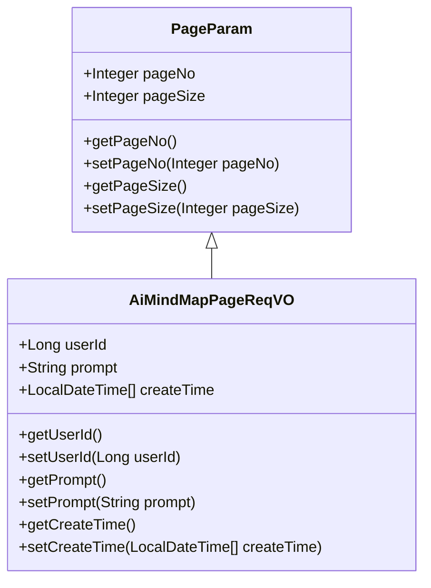
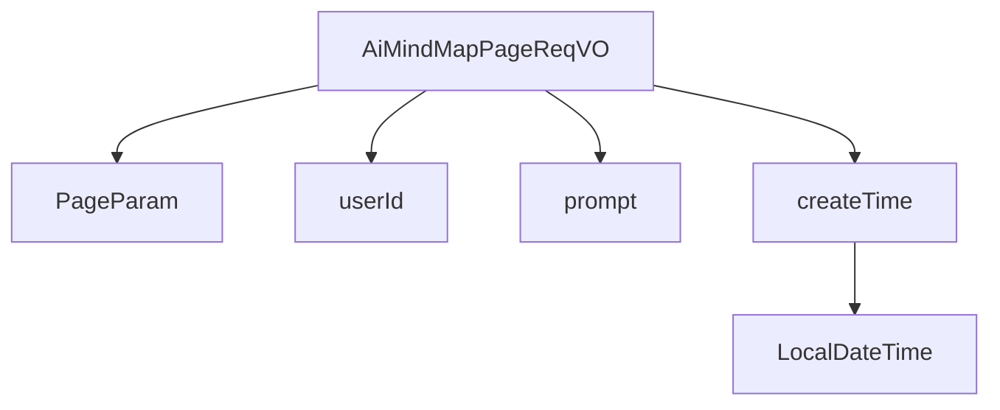

# 基础信息

|      |      |
|------|------|
| 编码语言 | .java |
| 代码路径 | yudao-module-ai/yudao-module-ai-biz/src/main/java/cn/iocoder/yudao/module/ai/controller/admin/mindmap/vo/AiMindMapPageReqVO.java |
| 包名 | cn.iocoder.yudao.module.ai.controller.admin.mindmap.vo |
| 依赖项 | ['cn.iocoder.yudao.framework.common.pojo.PageParam', 'io.swagger.v3.oas.annotations.media.Schema', 'lombok.Data', 'lombok.EqualsAndHashCode', 'lombok.ToString', 'org.springframework.format.annotation.DateTimeFormat', 'java.time.LocalDateTime', 'cn.iocoder.yudao.framework.common.util.date.DateUtils.FORMAT_YEAR_MONTH_DAY_HOUR_MINUTE_SECOND'] |
| 概述说明 | 管理后台AI思维导图分页请求VO包含用户编号（长整型）、生成内容提示（字符串）和创建时间范围（LocalDateTime数组，格式为年月日时分秒）。 |

# 说明

管理后台AI思维导图分页请求VO是一个用于处理用户请求的数据结构，主要包含三个关键信息：用户编号、生成内容提示和创建时间范围。用户编号是一个长整型数据，用于唯一标识发出请求的用户。生成内容提示是一个字符串，用于提供生成思维导图时所需的内容提示或关键词。创建时间范围是一个LocalDateTime数组，包含两个元素，分别表示思维导图创建时间的起始和结束范围，格式为年月日时分秒。这个数据结构的设计旨在帮助系统根据用户的需求和时间范围，筛选和返回符合条件的AI思维导图数据，从而支持分页展示和管理。

# 类列表 Class Summary

| 名称   | 类型  | 说明 |
|-------|------|-------------|
| AiMindMapPageReqVO | class | 管理后台AI思维导图分页请求VO包含用户编号、生成内容提示和创建时间范围。用户编号为长整型，生成内容提示为字符串，创建时间为LocalDateTime数组，格式为年月日时分秒。 |

## 类 AiMindMapPageReqVO

|      |      |
|------|------|
| 访问范围 | @Schema(description = "管理后台 - AI 思维导图分页 Request VO");@Data;@EqualsAndHashCode(callSuper = true);@ToString(callSuper = true);public |
| 类型 | class |
| 名称 | AiMindMapPageReqVO |
| 说明 | 管理后台AI思维导图分页请求VO包含用户编号、生成内容提示和创建时间范围。用户编号为长整型，生成内容提示为字符串，创建时间为LocalDateTime数组，格式为年月日时分秒。 |

### UML类图

### 描述信息：
该UML类图展示了`AiMindMapPageReqVO`类继承自`PageParam`类的关系。`AiMindMapPageReqVO`类包含用户编号、生成内容提示和创建时间等属性，并提供了相应的getter和setter方法。`PageParam`类则包含分页相关的属性和方法。

### 内部方法调用关系图

### 描述信息：
该图展示了`AiMindMapPageReqVO`类与其父类`PageParam`以及其属性`userId`、`prompt`和`createTime`之间的调用关系。`createTime`属性进一步调用了`LocalDateTime`类，用于处理日期时间格式。整体结构清晰，展示了类与属性之间的层级关系。

### 字段列表 Field List

| 名称  | 类型  | 说明 |
|-------|-------|------|
| prompt | String | 生成内容提示，示例为“Java 学习路线”，用于描述和指导相关内容生成。 |
| userId | Long | 用户编号字段，类型为长整型，示例值为4325。 |
| createTime | LocalDateTime[] | 该代码片段定义了一个名为`createTime`的私有变量，类型为`LocalDateTime`数组，用于存储创建时间。通过`@Schema`注解描述该字段为“创建时间”，并使用`@DateTimeFormat`注解指定时间格式为“年-月-日 时:分:秒”。 |

### 方法列表 Method List

| 名称  | 类型  | 说明 |
|-------|-------|------|

