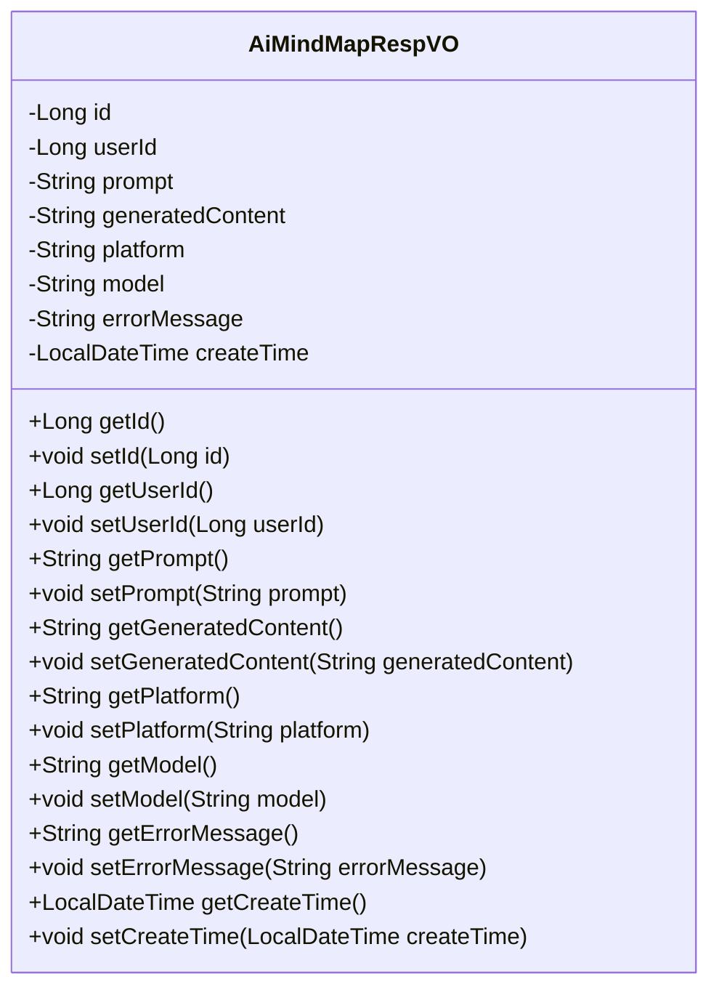
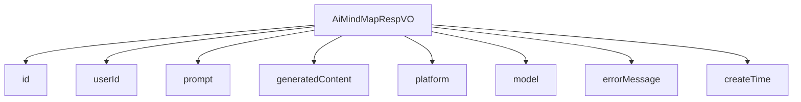

# 基础信息

|      |      |
|------|------|
| 编码语言 | .java |
| 代码路径 | yudao-module-ai/yudao-module-ai-biz/src/main/java/cn/iocoder/yudao/module/ai/controller/admin/mindmap/vo/AiMindMapRespVO.java |
| 包名 | cn.iocoder.yudao.module.ai.controller.admin.mindmap.vo |
| 依赖项 | ['io.swagger.v3.oas.annotations.media.Schema', 'lombok.Data', 'java.time.LocalDateTime'] |
| 概述说明 | AiMindMapRespVO类用于管理后台AI思维导图响应，包含编号、用户编号、生成内容提示、生成的思维导图内容、平台、模型、错误信息和创建时间等必填字段。 |

# 说明

AiMindMapRespVO 类是一个用于管理后台AI思维导图响应的数据结构。该类包含多个必填字段，以确保信息的完整性和准确性。这些字段包括编号，用于唯一标识每个响应；用户编号，用于关联生成响应的用户；生成内容提示，记录了用户输入的提示信息；生成的思维导图内容，存储了AI生成的思维导图数据；平台字段，标识生成思维导图所使用的平台；模型字段，记录生成思维导图所使用的AI模型；错误信息字段，用于存储生成过程中可能出现的错误信息；以及创建时间字段，记录了响应的生成时间。通过这些字段，AiMindMapRespVO 类能够全面管理AI思维导图的生成过程及其相关数据，确保每个响应的可追溯性和完整性。

# 类列表 Class Summary

| 名称   | 类型  | 说明 |
|-------|------|-------------|
| AiMindMapRespVO | class | AiMindMapRespVO 类用于管理后台的AI思维导图响应，包含编号、用户编号、生成内容提示、生成的思维导图内容、平台、模型、错误信息和创建时间等字段，所有字段均为必填项。 |

## 类 AiMindMapRespVO

|      |      |
|------|------|
| 访问范围 | @Schema(description = "管理后台 - AI 思维导图 Response VO");@Data;public |
| 类型 | class |
| 名称 | AiMindMapRespVO |
| 说明 | AiMindMapRespVO 类用于管理后台的AI思维导图响应，包含编号、用户编号、生成内容提示、生成的思维导图内容、平台、模型、错误信息和创建时间等字段，所有字段均为必填项。 |

### UML类图

### 描述：
该UML类图展示了一个名为`AiMindMapRespVO`的类，用于管理后台AI思维导图的响应数据。类中包含多个私有属性，如`id`、`userId`、`prompt`等，并提供了相应的getter和setter方法。这些方法用于访问和修改类的属性值。

### 内部方法调用关系图

### 描述信息：
该图展示了 `AiMindMapRespVO` 类与其属性之间的调用关系。`AiMindMapRespVO` 类包含了多个属性，如 `id`、`userId`、`prompt` 等，这些属性通过 `-->` 符号与类进行关联，表示类调用这些属性。该图清晰地展示了类与属性之间的依赖关系。

### 字段列表 Field List

| 名称  | 类型  | 说明 |
|-------|-------|------|
| errorMessage | String | 错误信息描述字段，用于存储错误信息。 |
| platform | String | 平台信息为必填项，示例为OpenAI。 |
| createTime | LocalDateTime | 创建时间是必填项，类型为LocalDateTime。 |
| id | Long | 编号为必填项，示例值为3373，数据类型为长整型。 |
| userId | Long | 用户编号为必填项，示例值为4325，数据类型为长整型。 |
| generatedContent | String | 生成的思维导图内容存储在generatedContent字段中，用于描述思维导图的具体信息。 |
| model | String | 模型字段为必填项，示例值为"gpt-3.5-turbo-0125"。 |
| prompt | String | 生成内容提示为必填项，描述为生成内容的提示信息，示例为“Java 学习路线”。 |

### 方法列表 Method List

| 名称  | 类型  | 说明 |
|-------|-------|------|

