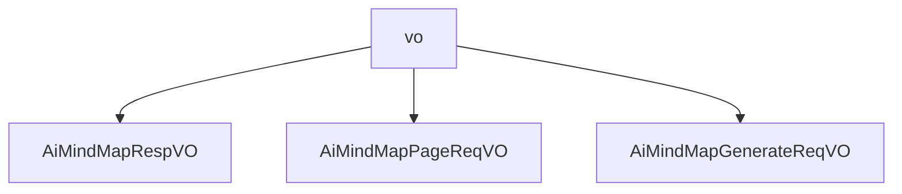

# 基础信息

|      |      |
|------|------|
| 编码语言 | .java |
| 代码路径 | yudao-module-ai/yudao-module-ai-biz/src/main/java/cn/iocoder/yudao/module/ai/controller/admin/mindmap/vo |
| 包名 | cn.iocoder.yudao.module.ai.controller.admin.mindmap.vo |
| 概述说明 | AiMindMapRespVO类用于管理后台AI思维导图响应，包含编号、用户编号、生成内容提示、思维导图内容、平台、模型、错误信息和创建时间等字段，确保数据完整性和可追溯性。管理后台AI思维导图分页请求VO包含用户编号、生成内容提示和创建时间范围，用于筛选符合条件的思维导图数据。AI思维导图生成请求VO包含必填字段“prompt”，用于指定生成思维导图的内容提示。 |

# 说明

AiMindMapRespVO 类是一个用于管理后台AI思维导图响应的数据结构，包含多个必填字段以确保信息的完整性和准确性。这些字段包括编号，用于唯一标识每个响应；用户编号，用于关联生成响应的用户；生成内容提示，记录用户输入的提示信息；生成的思维导图内容，存储AI生成的思维导图数据；平台字段，标识生成思维导图所使用的平台；模型字段，记录生成思维导图所使用的AI模型；错误信息字段，存储生成过程中可能出现的错误信息；以及创建时间字段，记录响应的生成时间。通过这些字段，AiMindMapRespVO 类能够全面管理AI思维导图的生成过程及其相关数据，确保每个响应的可追溯性和完整性。

管理后台AI思维导图分页请求VO是一个用于处理用户请求的数据结构，主要包含三个关键信息：用户编号、生成内容提示和创建时间范围。用户编号是一个长整型数据，用于唯一标识发出请求的用户。生成内容提示是一个字符串，提供生成思维导图时所需的内容提示或关键词。创建时间范围是一个LocalDateTime数组，包含两个元素，分别表示思维导图创建时间的起始和结束范围，格式为年月日时分秒。这个数据结构的设计旨在帮助系统根据用户的需求和时间范围，筛选和返回符合条件的AI思维导图数据，从而支持分页展示和管理。

管理后台的AI思维导图生成请求VO包含一个必填字段“prompt”，用于指定思维导图的内容提示。例如，用户可以输入“Java学习路线”作为提示内容，以生成相关的思维导图。这个字段是必须填写的，不能为空，确保每次请求都有明确的内容提示，从而生成符合用户需求的思维导图。

### 包内部结构视图

### 描述信息：
该Mermaid图展示了`vo`文件夹下的三个Java文件之间的调用关系。`AiMindMapRespVO`、`AiMindMapPageReqVO`和`AiMindMapGenerateReqVO`都是从`vo`文件夹中调用的，表示它们属于同一个模块的不同请求和响应对象。

# 文件列表 File List

| 名称   | 类型  | 说明 |
|-------|------|-------------|
| [AiMindMapGenerateReqVO.java](AiMindMapGenerateReqVO.md) | file | 管理后台AI思维导图生成请求VO中必填字段“prompt”用于指定思维导图内容提示，如“Java学习路线”，且该字段不可为空。 |
| [AiMindMapPageReqVO.java](AiMindMapPageReqVO.md) | file | 管理后台AI思维导图分页请求VO包含用户编号（长整型）、生成内容提示（字符串）和创建时间范围（LocalDateTime数组，格式为年月日时分秒）。 |
| [AiMindMapRespVO.java](AiMindMapRespVO.md) | file | AiMindMapRespVO类用于管理后台AI思维导图响应，包含编号、用户编号、生成内容提示、生成的思维导图内容、平台、模型、错误信息和创建时间等必填字段。 |

