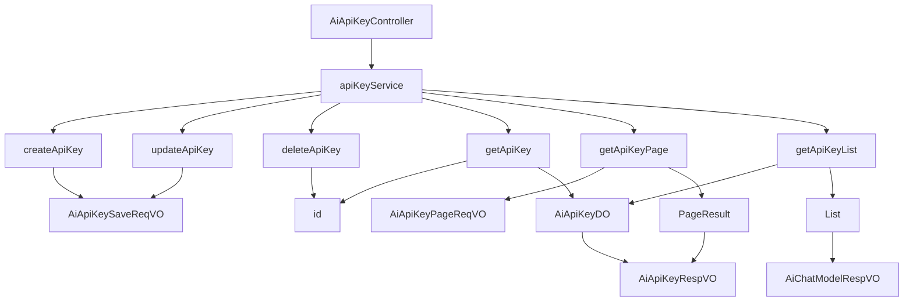

# 基础信息

|      |      |
|------|------|
| 编码语言 | .java |
| 代码路径 | yudao-module-ai/yudao-module-ai-biz/src/main/java/cn/iocoder/yudao/module/ai/controller/admin/model/AiApiKeyController.java |
| 包名 | cn.iocoder.yudao.module.ai.controller.admin.model |
| 依赖项 | ['cn.iocoder.yudao.framework.common.pojo.CommonResult', 'cn.iocoder.yudao.framework.common.pojo.PageResult', 'cn.iocoder.yudao.framework.common.util.object.BeanUtils', 'cn.iocoder.yudao.module.ai.controller.admin.model.vo.apikey.AiApiKeyPageReqVO', 'cn.iocoder.yudao.module.ai.controller.admin.model.vo.apikey.AiApiKeyRespVO', 'cn.iocoder.yudao.module.ai.controller.admin.model.vo.apikey.AiApiKeySaveReqVO', 'cn.iocoder.yudao.module.ai.controller.admin.model.vo.chatModel.AiChatModelRespVO', 'cn.iocoder.yudao.module.ai.dal.dataobject.model.AiApiKeyDO', 'cn.iocoder.yudao.module.ai.dal.dataobject.model.AiChatModelDO', 'cn.iocoder.yudao.module.ai.service.model.AiApiKeyService', 'io.swagger.v3.oas.annotations.Operation', 'io.swagger.v3.oas.annotations.Parameter', 'io.swagger.v3.oas.annotations.tags.Tag', 'jakarta.annotation.Resource', 'jakarta.validation.Valid', 'org.springframework.security.access.prepost.PreAuthorize', 'org.springframework.validation.annotation.Validated', 'org.springframework.web.bind.annotation', 'java.util.List', 'cn.iocoder.yudao.framework.common.pojo.CommonResult.success', 'cn.iocoder.yudao.framework.common.util.collection.CollectionUtils.convertList'] |
| 概述说明 | AiApiKeyController是管理后台的API密钥控制器，具备创建、更新、删除、获取单个密钥、分页获取密钥列表及简单列表功能。所有操作需相应权限，业务逻辑由AiApiKeyService处理。 |

# 说明

AiApiKeyController 是一个用于管理后台API密钥的控制器，主要负责处理与API密钥相关的各种操作。该控制器提供了创建、更新、删除、获取单个密钥、分页获取密钥列表以及获取简单列表的功能。所有操作都需要相应的权限，确保只有授权用户才能执行这些操作。业务逻辑的处理通过AiApiKeyService来完成，该服务负责具体的密钥管理和数据处理。通过这种方式，AiApiKeyController实现了对API密钥的全面管理，确保了系统的安全性和操作的规范性。

# 类列表 Class Summary

| 名称   | 类型  | 说明 |
|-------|------|-------------|
| AiApiKeyController | class | AiApiKeyController 是一个管理后台的API密钥控制器，提供创建、更新、删除、获取单个密钥、分页获取密钥列表及简单列表的功能。所有操作均需相应权限，并通过AiApiKeyService处理业务逻辑。 |


## 类 AiApiKeyController

|      |      |
|------|------|
| 访问范围 | @Tag(name = "管理后台 - AI API 密钥");@RestController;@RequestMapping("/ai/api-key");@Validated;public |
| 类型 | class |
| 名称 | AiApiKeyController |
| 说明 | AiApiKeyController 是一个管理后台的API密钥控制器，提供创建、更新、删除、获取单个密钥、分页获取密钥列表及简单列表的功能。所有操作均需相应权限，并通过AiApiKeyService处理业务逻辑。 |


### UML类图

```mermaid
classDiagram
    class AiApiKeyController {
        +AiApiKeyService apiKeyService
        +createApiKey(createReqVO: AiApiKeySaveReqVO): CommonResult~Long~
        +updateApiKey(updateReqVO: AiApiKeySaveReqVO): CommonResult~Boolean~
        +deleteApiKey(id: Long): CommonResult~Boolean~
        +getApiKey(id: Long): CommonResult~AiApiKeyRespVO~
        +getApiKeyPage(pageReqVO: AiApiKeyPageReqVO): CommonResult~PageResult~AiApiKeyRespVO~~
        +getApiKeySimpleList(): CommonResult~List~AiChatModelRespVO~~
    }

    class AiApiKeyService {
        +createApiKey(createReqVO: AiApiKeySaveReqVO): Long
        +updateApiKey(updateReqVO: AiApiKeySaveReqVO): void
        +deleteApiKey(id: Long): void
        +getApiKey(id: Long): AiApiKeyDO
        +getApiKeyPage(pageReqVO: AiApiKeyPageReqVO): PageResult~AiApiKeyDO~
        +getApiKeyList(): List~AiApiKeyDO~
    }

    class AiApiKeySaveReqVO {
        +String name
        +String apiKey
    }

    class AiApiKeyRespVO {
        +Long id
        +String name
        +String apiKey
    }

    class AiApiKeyPageReqVO {
        +Integer pageNo
        +Integer pageSize
    }

    class AiApiKeyDO {
        +Long id
        +String name
        +String apiKey
    }

    class AiChatModelRespVO {
        +Long id
        +String name
    }

    class CommonResult~T~ {
        +T data
        +Integer code
        +String message
    }

    class PageResult~T~ {
        +List~T~ list
        +Long total
    }

    AiApiKeyController --> AiApiKeyService : depends on
    AiApiKeyService --> AiApiKeyDO : uses
    AiApiKeyController --> AiApiKeySaveReqVO : uses
    AiApiKeyController --> AiApiKeyRespVO : uses
    AiApiKeyController --> AiApiKeyPageReqVO : uses
    AiApiKeyController --> AiChatModelRespVO : uses
    AiApiKeyController --> CommonResult~Long~ : returns
    AiApiKeyController --> CommonResult~Boolean~ : returns
    AiApiKeyController --> CommonResult~AiApiKeyRespVO~ : returns
    AiApiKeyController --> CommonResult~PageResult~AiApiKeyRespVO~~ : returns
    AiApiKeyController --> CommonResult~List~AiChatModelRespVO~~ : returns
    AiApiKeyService --> PageResult~AiApiKeyDO~ : returns
    AiApiKeyService --> List~AiApiKeyDO~ : returns
```

### 描述信息：
该UML类图展示了`AiApiKeyController`类与`AiApiKeyService`类之间的依赖关系，以及它们与多个VO（Value Object）和DO（Data Object）类之间的交互。`AiApiKeyController`通过调用`AiApiKeyService`的方法来处理API密钥的创建、更新、删除和查询操作，并返回相应的结果。


### 内部方法调用关系图



### 描述信息：
该图展示了`AiApiKeyController`与`apiKeyService`之间的调用关系。`apiKeyService`负责处理API密钥的创建、更新、删除、获取、分页和列表查询等操作。每个方法都通过`apiKeyService`调用相应的业务逻辑，并将结果返回给控制器。

### 字段列表 Field List

| 名称  | 类型  | 说明 |
|-------|-------|------|
| apiKeyService | AiApiKeyService | 在代码中，通过@Resource注解注入了一个名为apiKeyService的AiApiKeyService实例，用于管理和操作API密钥相关的服务。 |

### 方法列表 Method List

| 名称  | 类型  | 说明 |
|-------|-------|------|
| deleteApiKey | CommonResult<Boolean> | 该API接口用于删除API密钥，要求提供密钥编号作为参数，并需要具备删除权限。成功删除后返回布尔值true。 |
| getApiKey | CommonResult<AiApiKeyRespVO> | 该API通过GET请求获取API密钥，需提供编号参数id，且必须具有"ai:api-key:query"权限。返回结果为AiApiKeyRespVO类型的响应对象。 |
| getApiKeySimpleList | CommonResult<List<AiChatModelRespVO>> | 该代码定义了一个GET请求接口"/simple-list"，用于获取API密钥的分页列表。通过调用apiKeyService.getApiKeyList()获取数据，并将其转换为AiChatModelRespVO对象列表后返回。返回结果包含API密钥的ID和名称。 |
| createApiKey | CommonResult<Long> | 该代码片段定义了一个用于创建API密钥的POST请求接口。接口路径为"/create"，需要具备"ai:api-key:create"权限。方法接收一个有效的AiApiKeySaveReqVO请求体，调用apiKeyService.createApiKey方法创建API密钥，并返回包含创建结果的CommonResult对象。 |
| getApiKeyPage | CommonResult<PageResult<AiApiKeyRespVO>> | 该代码定义了一个GET请求接口，路径为"/page"，用于获取API密钥的分页数据。接口需要用户具有"ai:api-key:query"权限。方法接收一个有效的AiApiKeyPageReqVO对象作为请求参数，调用apiKeyService的getApiKeyPage方法获取分页结果，并将结果转换为AiApiKeyRespVO类型后返回。 |
| updateApiKey | CommonResult<Boolean> | 该代码片段描述了一个用于更新API密钥的接口。接口路径为"/update"，使用PUT请求方法。接口需要权限验证，调用者需具备"ai:api-key:update"权限。接口接收一个有效的AiApiKeySaveReqVO对象作为请求体，调用apiKeyService的updateApiKey方法进行更新，并返回操作成功的布尔值。 |


