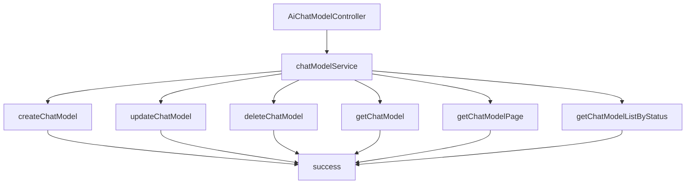

# 基础信息

|      |      |
|------|------|
| 编码语言 | .java |
| 代码路径 | yudao-module-ai/yudao-module-ai-biz/src/main/java/cn/iocoder/yudao/module/ai/controller/admin/model/AiChatModelController.java |
| 包名 | cn.iocoder.yudao.module.ai.controller.admin.model |
| 依赖项 | ['cn.iocoder.yudao.framework.common.pojo.CommonResult', 'cn.iocoder.yudao.framework.common.pojo.PageResult', 'cn.iocoder.yudao.framework.common.util.object.BeanUtils', 'cn.iocoder.yudao.module.ai.controller.admin.model.vo.chatModel.AiChatModelPageReqVO', 'cn.iocoder.yudao.module.ai.controller.admin.model.vo.chatModel.AiChatModelRespVO', 'cn.iocoder.yudao.module.ai.controller.admin.model.vo.chatModel.AiChatModelSaveReqVO', 'cn.iocoder.yudao.module.ai.dal.dataobject.model.AiChatModelDO', 'cn.iocoder.yudao.module.ai.service.model.AiChatModelService', 'io.swagger.v3.oas.annotations.Operation', 'io.swagger.v3.oas.annotations.Parameter', 'io.swagger.v3.oas.annotations.tags.Tag', 'jakarta.annotation.Resource', 'jakarta.validation.Valid', 'org.springframework.security.access.prepost.PreAuthorize', 'org.springframework.validation.annotation.Validated', 'org.springframework.web.bind.annotation', 'java.util.List', 'cn.iocoder.yudao.framework.common.pojo.CommonResult.success', 'cn.iocoder.yudao.framework.common.util.collection.CollectionUtils.convertList'] |
| 概述说明 | 该代码定义了一个管理后台的AI聊天模型控制器，具备创建、更新、删除、获取单个模型、分页查询和简单列表查询功能。所有操作均需权限校验，创建和更新通过请求体接收数据，删除和查询通过请求参数接收数据，并返回统一格式的响应结果。 |

# 说明

该代码实现了一个管理后台的AI聊天模型控制器，提供了对AI聊天模型的全面管理功能。控制器包含创建、更新、删除、获取单个模型、分页查询和简单列表查询等操作。每个操作在执行前都会进行权限校验，确保只有具备相应权限的用户才能执行这些操作。创建和更新操作通过请求体接收数据，而删除和查询操作则通过请求参数接收数据。所有操作在执行后都会返回统一格式的响应结果，以确保接口的一致性和易用性。通过这些功能，管理员可以方便地对AI聊天模型进行管理和维护。

# 类列表 Class Summary

| 名称   | 类型  | 说明 |
|-------|------|-------------|
| AiChatModelController | class | 该代码定义了一个管理后台的AI聊天模型控制器，包含创建、更新、删除、获取单个模型、分页查询和简单列表查询功能。每个操作都通过权限校验，确保只有具备相应权限的用户可以执行。创建和更新操作通过请求体接收数据，删除和查询操作通过请求参数接收数据。所有操作均返回统一格式的响应结果。 |


## 类 AiChatModelController

|      |      |
|------|------|
| 访问范围 | @Tag(name = "管理后台 - AI 聊天模型");@RestController;@RequestMapping("/ai/chat-model");@Validated;public |
| 类型 | class |
| 名称 | AiChatModelController |
| 说明 | 该代码定义了一个管理后台的AI聊天模型控制器，包含创建、更新、删除、获取单个模型、分页查询和简单列表查询功能。每个操作都通过权限校验，确保只有具备相应权限的用户可以执行。创建和更新操作通过请求体接收数据，删除和查询操作通过请求参数接收数据。所有操作均返回统一格式的响应结果。 |


### UML类图

```mermaid
classDiagram
    class AiChatModelController {
        +AiChatModelService chatModelService
        +createChatModel(AiChatModelSaveReqVO createReqVO) CommonResult~Long~
        +updateChatModel(AiChatModelSaveReqVO updateReqVO) CommonResult~Boolean~
        +deleteChatModel(Long id) CommonResult~Boolean~
        +getChatModel(Long id) CommonResult~AiChatModelRespVO~
        +getChatModelPage(AiChatModelPageReqVO pageReqVO) CommonResult~PageResult~AiChatModelRespVO~~
        +getChatModelSimpleList(Integer status) CommonResult~List~AiChatModelRespVO~~
    }

    class AiChatModelService {
        +createChatModel(AiChatModelSaveReqVO createReqVO) Long
        +updateChatModel(AiChatModelSaveReqVO updateReqVO) void
        +deleteChatModel(Long id) void
        +getChatModel(Long id) AiChatModelDO
        +getChatModelPage(AiChatModelPageReqVO pageReqVO) PageResult~AiChatModelDO~
        +getChatModelListByStatus(Integer status) List~AiChatModelDO~
    }

    class AiChatModelSaveReqVO {
        +String name
        +String model
    }

    class AiChatModelRespVO {
        +Long id
        +String name
        +String model
    }

    class AiChatModelPageReqVO {
        +Integer pageNo
        +Integer pageSize
    }

    class AiChatModelDO {
        +Long id
        +String name
        +String model
    }

    class CommonResult~T~ {
        +T data
        +Integer code
        +String message
    }

    class PageResult~T~ {
        +List~T~ list
        +Long total
    }

    AiChatModelController --> AiChatModelService : depends on
    AiChatModelService --> AiChatModelDO : depends on
    AiChatModelService --> AiChatModelSaveReqVO : depends on
    AiChatModelService --> AiChatModelPageReqVO : depends on
    AiChatModelController --> AiChatModelRespVO : depends on
    AiChatModelController --> CommonResult~Long~ : depends on
    AiChatModelController --> CommonResult~Boolean~ : depends on
    AiChatModelController --> CommonResult~AiChatModelRespVO~ : depends on
    AiChatModelController --> CommonResult~PageResult~AiChatModelRespVO~~ : depends on
    AiChatModelController --> CommonResult~List~AiChatModelRespVO~~ : depends on
    AiChatModelDO <|-- AiChatModelRespVO : inheritance
```

### 描述信息：
该UML类图展示了`AiChatModelController`类与`AiChatModelService`类之间的依赖关系，以及它们与多个数据对象（如`AiChatModelDO`、`AiChatModelSaveReqVO`等）的交互。`AiChatModelController`通过调用`AiChatModelService`的方法来处理聊天模型的创建、更新、删除和查询操作，并返回相应的结果。


### 内部方法调用关系图



### 描述信息：
该图展示了`AiChatModelController`与`chatModelService`之间的调用关系。`AiChatModelController`通过调用`chatModelService`中的方法（如`createChatModel`、`updateChatModel`等）来处理请求，并将结果通过`success`方法返回。每个方法都对应一个具体的业务操作，如创建、更新、删除和查询聊天模型。

### 字段列表 Field List

| 名称  | 类型  | 说明 |
|-------|-------|------|
| chatModelService | AiChatModelService | 在代码中，通过@Resource注解将AiChatModelService注入到当前类中，以便使用其功能。 |

### 方法列表 Method List

| 名称  | 类型  | 说明 |
|-------|-------|------|
| getChatModelPage | CommonResult<PageResult<AiChatModelRespVO>> | 该接口通过GET请求获取聊天模型的分页数据，需要具备"ai:chat-model:query"权限。接收分页请求参数，调用服务层获取分页结果，并将结果转换为响应对象后返回。 |
| deleteChatModel | CommonResult<Boolean> | 该接口用于删除聊天模型，要求提供模型的编号（id），并且调用者需具备"ai:chat-model:delete"权限。删除操作由chatModelService处理，成功后返回true。 |
| createChatModel | CommonResult<Long> | 该代码片段描述了一个通过POST请求创建聊天模型的API接口。接口路径为"/create"，需要具备"ai:chat-model:create"权限。请求体为AiChatModelSaveReqVO对象，经过验证后调用chatModelService.createChatModel方法创建模型，并返回模型ID。 |
| updateChatModel | CommonResult<Boolean> | 该代码片段描述了一个用于更新聊天模型的API接口。接口使用PUT方法，路径为"/update"，需要具备"ai:chat-model:update"权限。接收一个有效的AiChatModelSaveReqVO对象作为请求体，调用chatModelService的updateChatModel方法进行更新，并返回操作成功的布尔值。 |
| getChatModel | CommonResult<AiChatModelRespVO> | 该代码定义了一个GET请求接口，路径为"/get"，用于获取聊天模型。接口需要传入编号参数"id"，并检查用户是否具有"ai:chat-model:query"权限。通过调用chatModelService获取聊天模型数据，并将其转换为AiChatModelRespVO对象返回。 |
| getChatModelSimpleList | CommonResult<List<AiChatModelRespVO>> | 该代码定义了一个GET请求接口"/simple-list"，用于获取聊天模型列表。接口接收一个必填参数"status"，并返回一个包含聊天模型ID、名称和模型信息的响应列表。通过调用chatModelService的getChatModelListByStatus方法获取数据，并将其转换为AiChatModelRespVO对象返回。 |


