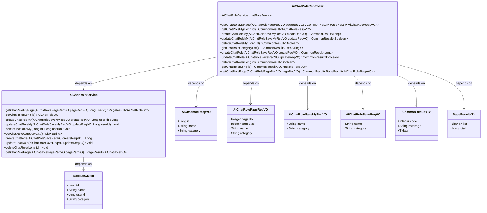
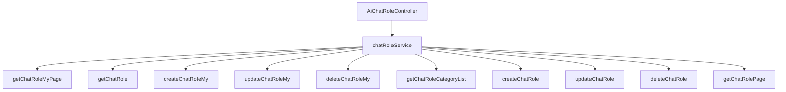

# 基础信息

|      |      |
|------|------|
| 编码语言 | .java |
| 代码路径 | yudao-module-ai/yudao-module-ai-biz/src/main/java/cn/iocoder/yudao/module/ai/controller/admin/model/AiChatRoleController.java |
| 包名 | cn.iocoder.yudao.module.ai.controller.admin.model |
| 依赖项 | ['cn.hutool.core.util.ObjUtil', 'cn.iocoder.yudao.framework.common.pojo.CommonResult', 'cn.iocoder.yudao.framework.common.pojo.PageResult', 'cn.iocoder.yudao.framework.common.util.object.BeanUtils', 'cn.iocoder.yudao.module.ai.controller.admin.model.vo.chatRole.AiChatRolePageReqVO', 'cn.iocoder.yudao.module.ai.controller.admin.model.vo.chatRole.AiChatRoleRespVO', 'cn.iocoder.yudao.module.ai.controller.admin.model.vo.chatRole.AiChatRoleSaveMyReqVO', 'cn.iocoder.yudao.module.ai.controller.admin.model.vo.chatRole.AiChatRoleSaveReqVO', 'cn.iocoder.yudao.module.ai.dal.dataobject.model.AiChatRoleDO', 'cn.iocoder.yudao.module.ai.service.model.AiChatRoleService', 'io.swagger.v3.oas.annotations.Operation', 'io.swagger.v3.oas.annotations.Parameter', 'io.swagger.v3.oas.annotations.tags.Tag', 'jakarta.annotation.Resource', 'jakarta.validation.Valid', 'org.springframework.security.access.prepost.PreAuthorize', 'org.springframework.validation.annotation.Validated', 'org.springframework.web.bind.annotation', 'java.util.List', 'cn.iocoder.yudao.framework.common.pojo.CommonResult.success', 'cn.iocoder.yudao.framework.security.core.util.SecurityFrameworkUtils.getLoginUserId'] |
| 概述说明 | AiChatRoleController 是管理后台的AI聊天角色控制器，具备分页查询、获取、创建、更新、删除聊天角色的功能，支持用户个人角色和系统角色管理，并包含权限控制和数据验证。 |

# 说明

AiChatRoleController 是一个用于管理后台的AI聊天角色控制器，主要负责处理与AI聊天角色相关的各项操作。该控制器提供了多种功能，包括分页查询、获取、创建、更新和删除聊天角色。通过这些功能，用户可以方便地管理和维护AI聊天角色。此外，该控制器支持用户个人角色管理和系统角色管理，能够根据不同的需求进行角色分配和管理。在操作过程中，控制器还涉及权限控制和数据验证，确保只有具备相应权限的用户才能执行特定操作，并且所有操作都经过严格的数据验证，以保证数据的准确性和安全性。

# 类列表 Class Summary

| 名称   | 类型  | 说明 |
|-------|------|-------------|
| AiChatRoleController | class | AiChatRoleController 是一个管理后台的AI聊天角色控制器，提供分页查询、获取、创建、更新、删除聊天角色的功能，支持用户个人角色管理和系统角色管理，涉及权限控制和数据验证。 |

## 类 AiChatRoleController

|      |      |
|------|------|
| 访问范围 | @Tag(name = "管理后台 - AI 聊天角色");@RestController;@RequestMapping("/ai/chat-role");@Validated;public |
| 类型 | class |
| 名称 | AiChatRoleController |
| 说明 | AiChatRoleController 是一个管理后台的AI聊天角色控制器，提供分页查询、获取、创建、更新、删除聊天角色的功能，支持用户个人角色管理和系统角色管理，涉及权限控制和数据验证。 |

### UML类图

### 描述信息：
该UML类图展示了`AiChatRoleController`类与`AiChatRoleService`类之间的依赖关系，以及它们与多个数据对象（如`AiChatRoleDO`、`AiChatRoleRespVO`等）的交互。`AiChatRoleController`通过调用`AiChatRoleService`的方法来处理与AI聊天角色相关的请求，并返回相应的结果。

### 内部方法调用关系图

### 描述信息：
该图展示了`AiChatRoleController`与`chatRoleService`之间的调用关系。`AiChatRoleController`通过调用`chatRoleService`中的多个方法来实现对聊天角色的管理，包括分页查询、创建、更新、删除等操作。每个方法都对应不同的业务逻辑，确保了聊天角色管理的完整性和一致性。

### 字段列表 Field List

| 名称  | 类型  | 说明 |
|-------|-------|------|
| chatRoleService | AiChatRoleService | 在代码中，通过@Resource注解将AiChatRoleService注入到当前类中，以便使用其功能。 |

### 方法列表 Method List

| 名称  | 类型  | 说明 |
|-------|-------|------|
| deleteChatRoleMy | CommonResult<Boolean> | 该接口用于删除用户自定义的聊天角色，需提供角色编号（id）作为必要参数，操作成功返回布尔值true。 |
| deleteChatRole | CommonResult<Boolean> | 该接口用于删除聊天角色，需要提供角色编号作为参数，且调用者需具备删除权限。删除操作由chatRoleService处理，成功后返回布尔值true。 |
| getChatRoleCategoryList | CommonResult<List<String>> | 该代码片段定义了一个GET请求接口，路径为"/category-list"，用于获取聊天角色的分类列表。方法返回一个包含分类列表的通用结果对象，调用了chatRoleService的getChatRoleCategoryList方法来获取数据。 |
| getChatRole | CommonResult<AiChatRoleRespVO> | 该代码定义了一个GET请求接口，路径为"/get"，用于获取聊天角色信息。接口需要传入编号参数"id"，并检查用户是否具有查询权限。通过调用chatRoleService获取聊天角色数据，并将其转换为响应对象返回。 |
| getChatRolePage | CommonResult<PageResult<AiChatRoleRespVO>> | 该代码定义了一个GET请求接口"/page"，用于获取聊天角色的分页数据。接口需要用户具有"ai:chat-role:query"权限。通过调用chatRoleService的getChatRolePage方法获取分页结果，并将结果转换为AiChatRoleRespVO对象后返回。 |
| getChatRoleMyPage | CommonResult<PageResult<AiChatRoleRespVO>> | 该代码定义了一个GET请求接口，路径为"/my-page"，用于获取当前登录用户的聊天角色分页数据。接口接收一个有效的分页请求对象，调用服务层方法获取分页结果，并将结果转换为响应对象后返回。 |
| getChatRoleMy | CommonResult<AiChatRoleRespVO> | 该方法通过GET请求获取指定编号的聊天角色信息，要求传入编号参数。首先根据编号查询聊天角色数据，然后验证当前登录用户ID与角色用户ID是否一致，若不一致返回空结果，否则将角色数据转换为响应对象并返回。 |
| updateChatRoleMy | CommonResult<Boolean> | 该代码片段定义了一个用于更新“我的”聊天角色的API接口。通过PUT请求访问路径“/update-my”，接收一个有效的请求体AiChatRoleSaveMyReqVO，并调用chatRoleService的updateChatRoleMy方法进行更新操作，最终返回成功结果。 |
| createChatRoleMy | CommonResult<Long> | 该代码片段定义了一个POST请求接口，路径为"/create-my"，用于创建用户的聊天角色。方法接收一个经过验证的请求体AiChatRoleSaveMyReqVO，并调用chatRoleService的createChatRoleMy方法，传入请求体和当前登录用户ID，返回创建的角色ID。 |
| createChatRole | CommonResult<Long> | 该代码片段定义了一个POST请求接口，路径为"/create"，用于创建聊天角色。接口需要权限验证，调用者需具备"ai:chat-role:create"权限。方法接收一个有效的AiChatRoleSaveReqVO对象作为请求体，并调用chatRoleService.createChatRole方法处理请求，返回包含角色ID的CommonResult对象。 |
| updateChatRole | CommonResult<Boolean> | 该代码片段定义了一个用于更新聊天角色的API接口，使用PUT请求方法，路径为"/update"。接口需要权限验证，调用者需具备"ai:chat-role:update"权限。接收一个有效的AiChatRoleSaveReqVO对象作为请求体，调用chatRoleService的updateChatRole方法进行更新操作，并返回操作成功的布尔值。 |

