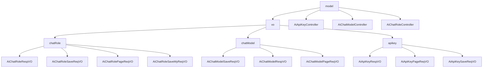

# 基础信息

|      |      |
|------|------|
| 编码语言 | .java |
| 代码路径 | yudao-module-ai/yudao-module-ai-biz/src/main/java/cn/iocoder/yudao/module/ai/controller/admin/model |
| 包名 | cn.iocoder.yudao.module.ai.controller.admin.model |
| 概述说明 | 管理后台涉及AI聊天角色、模型和API密钥的全面管理，包括创建、更新、删除、查询等操作。AI聊天角色管理包含角色编号、模型编号、角色名称等字段，用于唯一标识和配置角色。AI模型管理涉及模型编号、API秘钥编号、模型名字等字段，用于配置和状态管理。API密钥管理包含编号、名称、密钥等字段，确保密钥信息完整。所有操作需权限校验，确保系统安全性和数据准确性。 |

# 说明

管理后台的AI聊天角色和模型管理系统涉及多个关键字段和数据结构，用于详细描述和管理AI聊天角色、模型以及API密钥的信息。AI聊天角色的响应VO包含角色编号、用户编号、模型编号、模型名字、模型标识、角色名称、角色头像、角色类别、角色排序、角色描述、角色设定、是否公开、状态和创建时间等字段。这些字段用于唯一标识角色、关联用户和模型、提供角色信息和背景、控制角色显示顺序、管理角色可见性和状态，并记录角色的创建时间。新增或修改AI聊天角色的请求VO必须包含角色编号、模型编号、角色名称、角色头像（URL格式）、角色类别、角色排序、角色描述、角色设定、是否公开和状态等必填字段，确保每个角色都有完整的定义和信息。AI聊天角色的分页请求VO则包含角色名称、角色类别和是否公开字段，用于高效地进行分页查询和筛选。

AI聊天模型的响应VO包含编号、API秘钥编号、模型名字、模型标识、模型平台、排序、状态、温度参数、单条回复最大Token数量、上下文最大Message数量等字段，用于描述和管理模型的配置和状态。新增或修改模型的请求VO包含编号、API秘钥编号、模型名字、模型标识、模型平台、排序、状态等必填字段，确保每个模型都有必要的基本信息和配置。模型的分页请求VO包含模型名字、模型标识和模型平台字段，用于查询和筛选模型信息。

AI API密钥的响应VO包含编号、名称、密钥、平台、自定义API地址和状态等字段，用于描述和管理API密钥的信息。新增或修改API密钥的请求VO包含编号、名称、密钥、平台和状态等必填字段，确保密钥信息的完整性和准确性。API密钥的分页请求VO包含名称、平台和状态字段，用于分页查询和筛选密钥信息。

这些数据结构和管理流程共同构成了管理后台对AI聊天角色、模型和API密钥的全面管理，确保系统的正常运行、用户体验的优化以及信息的安全性和稳定性。AiApiKeyController、AiChatRoleController和AI聊天模型控制器分别负责处理与API密钥、AI聊天角色和AI聊天模型相关的各种操作。这些控制器提供了创建、更新、删除、获取单个实体、分页查询和简单列表查询等功能，所有操作在执行前都会进行权限校验，确保只有具备相应权限的用户才能执行这些操作。通过这些功能，管理员可以方便地对AI聊天角色、模型和API密钥进行管理和维护，确保系统的安全性和操作的规范性。

### 包内部结构视图

### 描述信息：
该图展示了`model`文件夹下的控制器与`vo`文件夹中的请求和响应对象之间的调用关系。`model`包含三个控制器，分别调用`vo`中的不同子文件夹（`chatRole`、`chatModel`、`apikey`）中的请求和响应对象。

# 文件列表 File List

| 名称   | 类型  | 说明 |
|-------|------|-------------|
| [AiChatRoleController.java](AiChatRoleController.md) | file | AiChatRoleController 是管理后台的AI聊天角色控制器，具备分页查询、获取、创建、更新、删除聊天角色的功能，支持用户个人角色和系统角色管理，并包含权限控制和数据验证。 |
| [AiChatModelController.java](AiChatModelController.md) | file | 该代码定义了一个管理后台的AI聊天模型控制器，具备创建、更新、删除、获取单个模型、分页查询和简单列表查询功能。所有操作均需权限校验，创建和更新通过请求体接收数据，删除和查询通过请求参数接收数据，并返回统一格式的响应结果。 |
| [AiApiKeyController.java](AiApiKeyController.md) | file | AiApiKeyController是管理后台的API密钥控制器，具备创建、更新、删除、获取单个密钥、分页获取密钥列表及简单列表功能。所有操作需相应权限，业务逻辑由AiApiKeyService处理。 |
| [vo](vo/_package.md) | folder | 管理后台系统涉及AI聊天角色和API密钥的详细管理，包括新增、修改、分页查询等功能。AI聊天角色管理包含角色编号、模型编号、名称、头像、描述、设定等必填字段，用于唯一标识和配置角色信息。API密钥管理涉及编号、名称、密钥、平台、状态等字段，确保密钥的安全性和可用性。分页查询功能通过名称、平台、状态等字段筛选和展示角色或密钥信息，便于高效管理。所有操作均通过特定值对象（VO）处理，确保数据的完整性和准确性。 |

