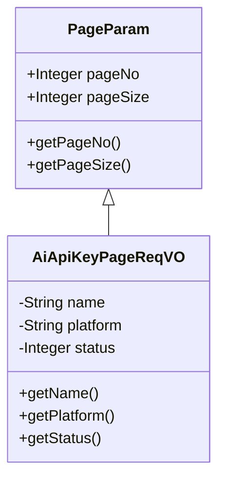
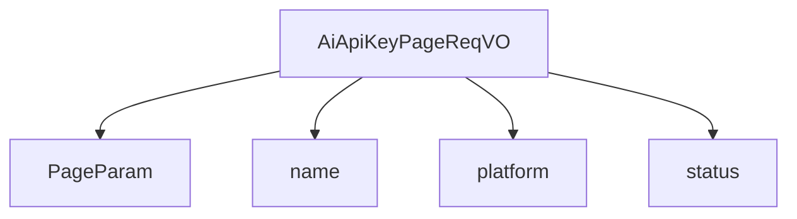

# 基础信息

|      |      |
|------|------|
| 编码语言 | .java |
| 代码路径 | yudao-module-ai/yudao-module-ai-biz/src/main/java/cn/iocoder/yudao/module/ai/controller/admin/model/vo/apikey/AiApiKeyPageReqVO.java |
| 包名 | cn.iocoder.yudao.module.ai.controller.admin.model.vo.apikey |
| 依赖项 | [None, 'java.util', 'io.swagger.v3.oas.annotations.media.Schema', 'cn.iocoder.yudao.framework.common.pojo.PageParam', 'org.springframework.format.annotation.DateTimeFormat', 'java.time.LocalDateTime', 'cn.iocoder.yudao.framework.common.util.date.DateUtils.FORMAT_YEAR_MONTH_DAY_HOUR_MINUTE_SECOND'] |
| 概述说明 | 管理后台AI API密钥分页请求VO包含名称、平台和状态三个字段，用于分页查询AI API密钥信息。名称示例为“文心一言”，平台示例为“OpenAI”，状态示例为“1”。 |

# 说明

管理后台AI API密钥分页请求VO是一个用于分页查询AI API密钥信息的数据结构，包含三个主要字段：名称、平台和状态。名称字段用于标识具体的AI服务或模型，例如“文心一言”即代表某个特定的AI服务名称。平台字段用于指明该API密钥所属的平台或供应商，例如“OpenAI”表示该密钥与OpenAI平台相关。状态字段则用于表示API密钥的当前状态，例如“1”可能代表密钥处于激活或可用状态。通过这三个字段的组合，管理后台可以高效地进行分页查询，筛选和展示符合条件的AI API密钥信息，从而实现对密钥的集中管理和监控。

# 类列表 Class Summary

| 名称   | 类型  | 说明 |
|-------|------|-------------|
| AiApiKeyPageReqVO | class | 管理后台AI API密钥分页请求VO包含名称、平台和状态三个字段，用于分页查询AI API密钥信息。名称字段示例为“文心一言”，平台字段示例为“OpenAI”，状态字段示例为“1”。 |

## 类 AiApiKeyPageReqVO

|      |      |
|------|------|
| 访问范围 | @Schema(description = "管理后台 - AI API 密钥分页 Request VO");@Data;public |
| 类型 | class |
| 名称 | AiApiKeyPageReqVO |
| 说明 | 管理后台AI API密钥分页请求VO包含名称、平台和状态三个字段，用于分页查询AI API密钥信息。名称字段示例为“文心一言”，平台字段示例为“OpenAI”，状态字段示例为“1”。 |

### UML类图

### 描述信息：
该UML类图展示了`AiApiKeyPageReqVO`类继承自`PageParam`类。`AiApiKeyPageReqVO`类包含三个私有属性：`name`、`platform`和`status`，并提供了相应的getter方法。`PageParam`类包含分页相关的属性和方法。

### 内部方法调用关系图

### 描述信息：
`AiApiKeyPageReqVO` 类继承自 `PageParam`，并包含三个属性：`name`、`platform` 和 `status`。这些属性分别用于存储API密钥的名称、平台和状态信息。该类的设计用于管理后台的AI API密钥分页请求。

### 字段列表 Field List

| 名称  | 类型  | 说明 |
|-------|-------|------|
| platform | String | 平台信息，示例为OpenAI。 |
| status | Integer | 状态字段，类型为整数，示例值为1。 |
| name | String | 名称字段，示例为“文心一言”。 |

### 方法列表 Method List

| 名称  | 类型  | 说明 |
|-------|-------|------|

