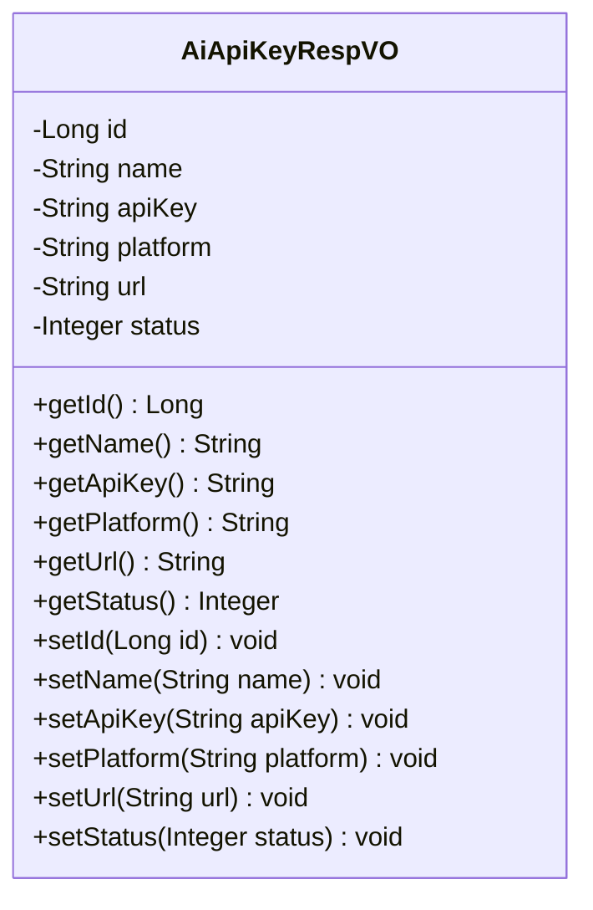
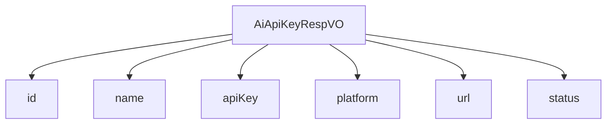

# 基础信息

|      |      |
|------|------|
| 编码语言 | .java |
| 代码路径 | yudao-module-ai/yudao-module-ai-biz/src/main/java/cn/iocoder/yudao/module/ai/controller/admin/model/vo/apikey/AiApiKeyRespVO.java |
| 包名 | cn.iocoder.yudao.module.ai.controller.admin.model.vo.apikey |
| 依赖项 | ['io.swagger.v3.oas.annotations.media.Schema', None] |
| 概述说明 | 管理后台AI API密钥响应VO包含编号、名称、密钥、平台、自定义API地址和状态等必填字段，示例值为23538、文心一言、ABC、OpenAI、https://aip.baidubce.com和1。 |

# 说明

管理后台AI API密钥响应VO是一个包含多个必填字段的数据结构，用于描述和管理AI API密钥的相关信息。该数据结构包含以下字段：编号、名称、密钥、平台、自定义API地址和状态。每个字段都是必填项，确保信息的完整性和准确性。

具体来说，编号字段用于唯一标识每个API密钥，示例值为23538。名称字段用于描述该API密钥的名称，示例值为“文心一言”。密钥字段是实际的API密钥值，示例值为“ABC”。平台字段用于指明该API密钥所属的平台，示例值为“OpenAI”。自定义API地址字段用于指定该API的调用地址，示例值为“https://aip.baidubce.com”。状态字段用于表示该API密钥的当前状态，示例值为1，可能表示启用或激活状态。

这些字段共同构成了一个完整的API密钥管理单元，确保管理员能够清晰地了解和管理每个API密钥的相关信息。通过这种方式，管理后台可以有效地监控和维护AI API的使用情况，确保系统的安全性和稳定性。

# 类列表 Class Summary

| 名称   | 类型  | 说明 |
|-------|------|-------------|
| AiApiKeyRespVO | class | 管理后台AI API密钥响应VO包含编号、名称、密钥、平台、自定义API地址和状态等字段，均为必填项，示例值分别为23538、文心一言、ABC、OpenAI、https://aip.baidubce.com和1。 |

## 类 AiApiKeyRespVO

|      |      |
|------|------|
| 访问范围 | @Schema(description = "管理后台 - AI API 密钥 Response VO");@Data;public |
| 类型 | class |
| 名称 | AiApiKeyRespVO |
| 说明 | 管理后台AI API密钥响应VO包含编号、名称、密钥、平台、自定义API地址和状态等字段，均为必填项，示例值分别为23538、文心一言、ABC、OpenAI、https://aip.baidubce.com和1。 |

### UML类图

### 描述信息
该UML类图展示了一个名为`AiApiKeyRespVO`的类，用于管理后台的AI API密钥响应信息。类中包含多个私有属性，如`id`、`name`、`apiKey`等，并提供了相应的getter和setter方法。该类用于封装AI API密钥的相关数据，并通过公共方法访问和修改这些数据。

### 内部方法调用关系图

### 描述信息：
该图展示了 `AiApiKeyRespVO` 类与其属性之间的调用关系。`AiApiKeyRespVO` 类包含了多个属性，如 `id`、`name`、`apiKey`、`platform`、`url` 和 `status`，这些属性通过 `-->` 符号与类进行关联，清晰地表示了类与属性之间的依赖关系。

### 字段列表 Field List

| 名称  | 类型  | 说明 |
|-------|-------|------|
| id | Long | 编号为必填项，示例值为23538，类型为长整型。 |
| url | String | 自定义 API 地址字段，示例为 "https://aip.baidubce.com"。 |
| apiKey | String | 密钥为必填项，示例值为"ABC"。 |
| platform | String | 平台信息为必填项，示例为OpenAI。 |
| status | Integer | 状态字段为必填项，类型为整数，示例值为1。 |
| name | String | 名称字段为必填项，示例值为“文心一言”。 |

### 方法列表 Method List

| 名称  | 类型  | 说明 |
|-------|-------|------|

