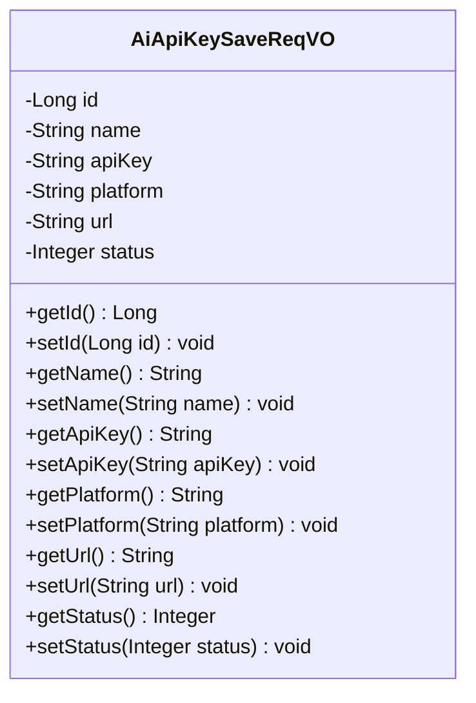
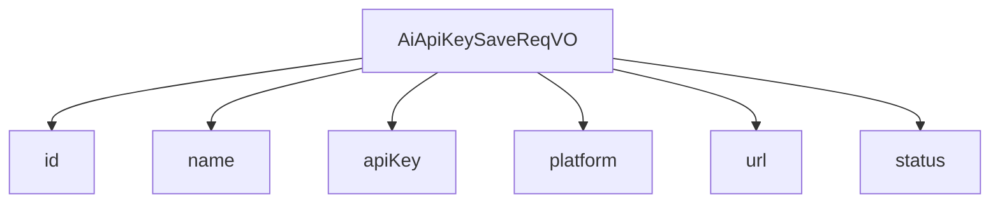

# 基础信息

|      |      |
|------|------|
| 编码语言 | .java |
| 代码路径 | yudao-module-ai/yudao-module-ai-biz/src/main/java/cn/iocoder/yudao/module/ai/controller/admin/model/vo/apikey/AiApiKeySaveReqVO.java |
| 包名 | cn.iocoder.yudao.module.ai.controller.admin.model.vo.apikey |
| 依赖项 | ['io.swagger.v3.oas.annotations.media.Schema', None, 'java.util', 'jakarta.validation.constraints'] |
| 概述说明 | 管理后台AI API密钥新增/修改请求VO包含编号、名称、密钥、平台、自定义API地址和状态字段，其中编号、名称、密钥、平台和状态为必填项，名称、密钥和平台不能为空，状态不能为null。 |

# 说明

管理后台AI API密钥的新增或修改请求通过一个特定的值对象（VO）进行处理。该VO包含多个字段，其中编号、名称、密钥、平台和状态是必填项。名称、密钥和平台字段不能为空，且状态字段不能为null。此外，VO还包含一个可选的自定义API地址字段，用于指定特定的API地址。这些字段共同构成了管理后台AI API密钥的核心信息，确保在新增或修改密钥时，所有必要的信息都被准确记录和验证。

# 类列表 Class Summary

| 名称   | 类型  | 说明 |
|-------|------|-------------|
| AiApiKeySaveReqVO | class | 管理后台AI API密钥新增/修改请求VO包含编号、名称、密钥、平台、自定义API地址和状态字段，其中编号、名称、密钥、平台和状态为必填项，名称、密钥和平台不能为空，状态不能为null。 |

## 类 AiApiKeySaveReqVO

|      |      |
|------|------|
| 访问范围 | @Schema(description = "管理后台 - AI API 密钥新增/修改 Request VO");@Data;public |
| 类型 | class |
| 名称 | AiApiKeySaveReqVO |
| 说明 | 管理后台AI API密钥新增/修改请求VO包含编号、名称、密钥、平台、自定义API地址和状态字段，其中编号、名称、密钥、平台和状态为必填项，名称、密钥和平台不能为空，状态不能为null。 |

### UML类图

### 描述信息
该UML类图展示了一个名为`AiApiKeySaveReqVO`的类，用于管理后台的AI API密钥新增或修改请求。类中包含多个私有属性，如`id`、`name`、`apiKey`等，并提供了相应的getter和setter方法。所有属性均通过注解进行了校验，确保数据的完整性和有效性。

### 内部方法调用关系图

### 描述信息：
该图展示了`AiApiKeySaveReqVO`类与其属性之间的调用关系。`AiApiKeySaveReqVO`类包含了多个属性，如`id`、`name`、`apiKey`、`platform`、`url`和`status`，这些属性通过`-->`符号与类进行关联，表示类与属性之间的依赖关系。

### 字段列表 Field List

| 名称  | 类型  | 说明 |
|-------|-------|------|
| id | Long | 编号为必填项，示例值为23538，类型为长整型。 |
| status | Integer | 状态字段为必填项，不能为空，示例值为1。 |
| platform | String | 平台字段为必填项，不能为空，示例值为OpenAI。 |
| apiKey | String | 密钥为必填项，不能为空，示例值为"ABC"。 |
| name | String | 名称字段为必填项，不能为空，示例值为“文心一言”。 |
| url | String | 自定义 API 地址，示例为 https://aip.baidubce.com，用于指定 API 的访问路径。 |

### 方法列表 Method List

| 名称  | 类型  | 说明 |
|-------|-------|------|

