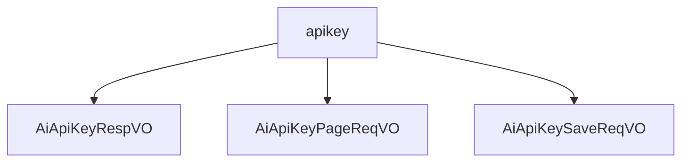

# 基础信息

|      |      |
|------|------|
| 编码语言 | .java |
| 代码路径 | yudao-module-ai/yudao-module-ai-biz/src/main/java/cn/iocoder/yudao/module/ai/controller/admin/model/vo/apikey |
| 包名 | cn.iocoder.yudao.module.ai.controller.admin.model.vo.apikey |
| 概述说明 | 管理后台AI API密钥响应VO包含编号、名称、密钥、平台、自定义API地址和状态等必填字段，用于唯一标识和管理API密钥信息。分页请求VO通过名称、平台和状态字段进行筛选查询。新增或修改请求VO要求编号、名称、密钥、平台和状态必填，自定义API地址可选，确保密钥信息的完整性和准确性，便于系统管理和监控。 |

# 说明

管理后台AI API密钥响应VO是一个用于描述和管理AI API密钥信息的数据结构，包含多个必填字段以确保信息的完整性和准确性。这些字段包括编号、名称、密钥、平台、自定义API地址和状态。编号字段用于唯一标识每个API密钥，示例值为23538。名称字段用于描述API密钥的名称，示例值为“文心一言”。密钥字段是实际的API密钥值，示例值为“ABC”。平台字段指明API密钥所属的平台，示例值为“OpenAI”。自定义API地址字段用于指定API的调用地址，示例值为“https://aip.baidubce.com”。状态字段表示API密钥的当前状态，示例值为1，可能表示启用或激活状态。这些字段共同构成了一个完整的API密钥管理单元，帮助管理员清晰地了解和管理每个API密钥的相关信息，确保系统的安全性和稳定性。

管理后台AI API密钥分页请求VO是用于分页查询AI API密钥信息的数据结构，包含名称、平台和状态三个主要字段。名称字段用于标识具体的AI服务或模型，例如“文心一言”。平台字段指明API密钥所属的平台或供应商，例如“OpenAI”。状态字段表示API密钥的当前状态，例如“1”可能代表密钥处于激活或可用状态。通过这三个字段的组合，管理后台可以高效地进行分页查询，筛选和展示符合条件的AI API密钥信息，实现对密钥的集中管理和监控。

管理后台AI API密钥的新增或修改请求通过一个特定的值对象（VO）进行处理。该VO包含多个字段，其中编号、名称、密钥、平台和状态是必填项。名称、密钥和平台字段不能为空，且状态字段不能为null。此外，VO还包含一个可选的自定义API地址字段，用于指定特定的API地址。这些字段共同构成了管理后台AI API密钥的核心信息，确保在新增或修改密钥时，所有必要的信息都被准确记录和验证。

### 包内部结构视图

### 描述信息：
该Mermaid图展示了`apikey`文件夹下的三个Java文件之间的调用关系。`apikey`文件夹包含了`AiApiKeyRespVO`、`AiApiKeyPageReqVO`和`AiApiKeySaveReqVO`三个文件，这些文件可能用于处理API密钥的响应、分页请求和保存请求。

# 文件列表 File List

| 名称   | 类型  | 说明 |
|-------|------|-------------|
| [AiApiKeySaveReqVO.java](AiApiKeySaveReqVO.md) | file | 管理后台AI API密钥新增/修改请求VO包含编号、名称、密钥、平台、自定义API地址和状态字段，其中编号、名称、密钥、平台和状态为必填项，名称、密钥和平台不能为空，状态不能为null。 |
| [AiApiKeyPageReqVO.java](AiApiKeyPageReqVO.md) | file | 管理后台AI API密钥分页请求VO包含名称、平台和状态三个字段，用于分页查询AI API密钥信息。名称示例为“文心一言”，平台示例为“OpenAI”，状态示例为“1”。 |
| [AiApiKeyRespVO.java](AiApiKeyRespVO.md) | file | 管理后台AI API密钥响应VO包含编号、名称、密钥、平台、自定义API地址和状态等必填字段，示例值为23538、文心一言、ABC、OpenAI、https://aip.baidubce.com和1。 |

