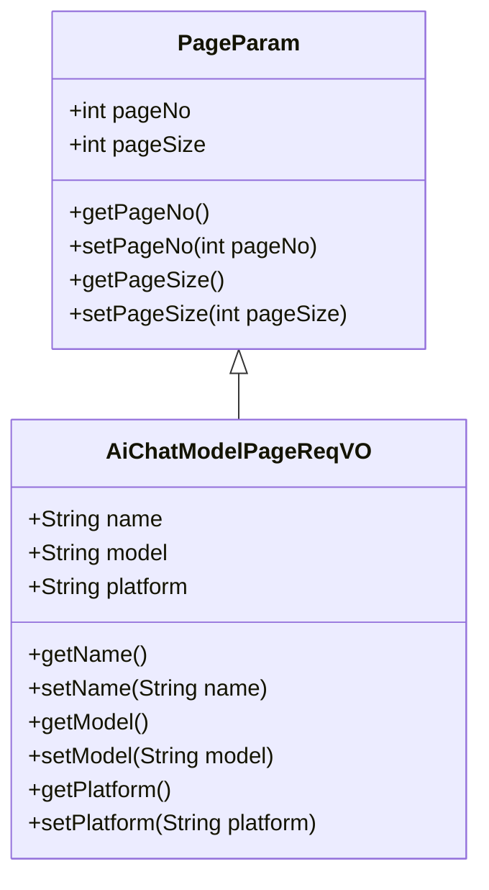
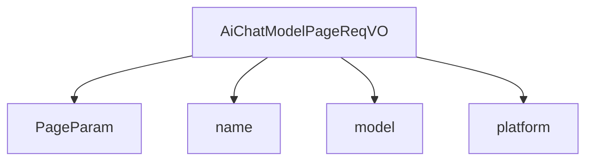

# 基础信息

|      |      |
|------|------|
| 编码语言 | .java |
| 代码路径 | yudao-module-ai/yudao-module-ai-biz/src/main/java/cn/iocoder/yudao/module/ai/controller/admin/model/vo/chatModel/AiChatModelPageReqVO.java |
| 包名 | cn.iocoder.yudao.module.ai.controller.admin.model.vo.chatModel |
| 依赖项 | [None, 'io.swagger.v3.oas.annotations.media.Schema', 'cn.iocoder.yudao.framework.common.pojo.PageParam'] |
| 概述说明 | 管理后台API聊天模型分页请求VO包含分页参数及模型名字、模型标识和模型平台三个字段，用于查询和筛选聊天模型信息。 |

# 说明

管理后台API中的聊天模型分页请求VO（值对象）主要用于查询和筛选聊天模型信息。该VO包含分页参数以及三个关键字段：模型名字、模型标识和模型平台。分页参数用于控制查询结果的显示范围和数量，确保数据能够以分页形式展示，便于用户浏览和管理。模型名字字段用于指定要查询的聊天模型的名称，帮助用户快速定位特定模型。模型标识字段用于唯一标识每个聊天模型，确保查询结果的准确性和唯一性。模型平台字段则用于指定模型所属的平台，帮助用户根据平台筛选出符合条件的聊天模型。通过这些字段的组合，用户可以根据具体需求灵活地进行查询和筛选，从而高效地获取所需的聊天模型信息。

# 类列表 Class Summary

| 名称   | 类型  | 说明 |
|-------|------|-------------|
| AiChatModelPageReqVO | class | 管理后台API聊天模型分页请求VO包含分页参数及模型名字、模型标识和模型平台三个字段，用于查询和筛选聊天模型信息。 |

## 类 AiChatModelPageReqVO

|      |      |
|------|------|
| 访问范围 | @Schema(description = "管理后台 - API 聊天模型分页 Request VO");@Data;public |
| 类型 | class |
| 名称 | AiChatModelPageReqVO |
| 说明 | 管理后台API聊天模型分页请求VO包含分页参数及模型名字、模型标识和模型平台三个字段，用于查询和筛选聊天模型信息。 |

### UML类图

### 描述信息：
该UML类图展示了`AiChatModelPageReqVO`类继承自`PageParam`类的关系。`AiChatModelPageReqVO`类包含三个属性：`name`、`model`和`platform`，分别表示模型的名字、标识和平台。每个属性都有对应的getter和setter方法。

### 内部方法调用关系图

### 描述信息：
该图展示了 `AiChatModelPageReqVO` 类与其父类 `PageParam` 以及其属性 `name`、`model` 和 `platform` 之间的调用关系。`AiChatModelPageReqVO` 继承自 `PageParam`，并包含三个属性，分别用于存储模型的名字、标识和平台信息。

### 字段列表 Field List

| 名称  | 类型  | 说明 |
|-------|-------|------|
| name | String | 模型名字字段，类型为字符串，示例值为“张三”。 |
| platform | String | 模型平台为OpenAI。 |
| model | String | 模型标识为gpt-3.5-turbo-0125。 |

### 方法列表 Method List

| 名称  | 类型  | 说明 |
|-------|-------|------|

