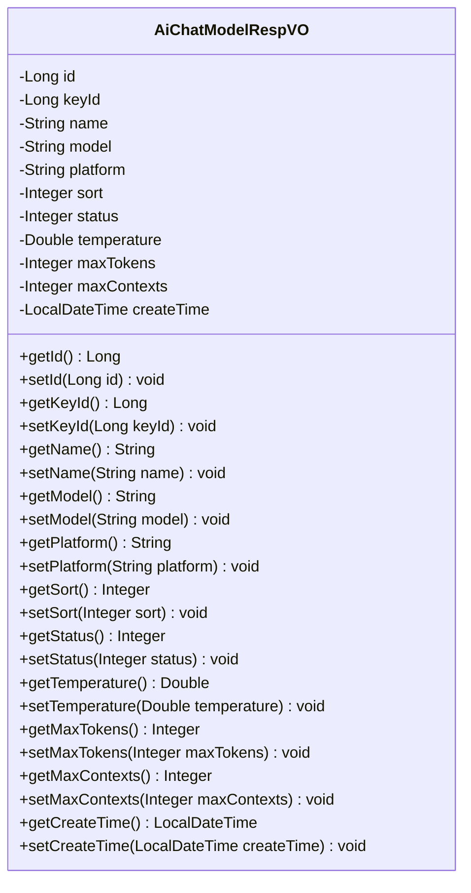
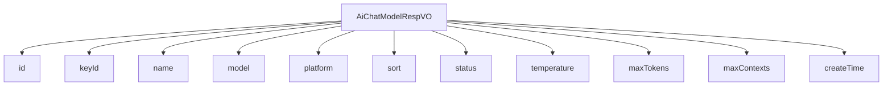

# 基础信息

|      |      |
|------|------|
| 编码语言 | .java |
| 代码路径 | yudao-module-ai/yudao-module-ai-biz/src/main/java/cn/iocoder/yudao/module/ai/controller/admin/model/vo/chatModel/AiChatModelRespVO.java |
| 包名 | cn.iocoder.yudao.module.ai.controller.admin.model.vo.chatModel |
| 依赖项 | ['io.swagger.v3.oas.annotations.media.Schema', 'lombok.Data', 'java.time.LocalDateTime'] |
| 概述说明 | 管理后台的AI聊天模型响应VO包含编号、API秘钥编号、模型名字、模型标识、模型平台、排序、状态、温度参数、单条回复的最大Token数量、上下文的最大Message数量及创建时间等关键信息。 |

# 说明

管理后台的AI聊天模型响应VO包含了多个关键信息和细节，用于描述和管理AI聊天模型的配置和状态。首先，每个模型都有一个唯一的编号，用于标识不同的模型实例。API秘钥编号用于验证和授权访问该模型的API接口。模型名字是对该模型的描述性名称，便于用户识别和选择。模型标识是模型的唯一标识符，通常用于技术层面的引用和调用。模型平台指明了该模型所依赖的技术平台或框架，例如TensorFlow、PyTorch等。

排序字段用于定义模型在列表中的显示顺序，便于用户根据优先级或使用频率进行排序。状态字段表示模型的当前状态，如启用、禁用或维护中，帮助管理员了解模型的可用性。温度参数是模型生成文本时的一个关键参数，控制生成文本的随机性和创造性，值越高生成的文本越随机，值越低则越保守和确定。

单条回复的最大Token数量限制了模型在每次响应中可以生成的Token数量，确保生成的文本长度在可控范围内。上下文的最大Message数量定义了模型在处理对话时可以保留的上下文消息数量，影响模型对对话历史的理解和响应质量。最后，创建时间记录了该模型的创建时间戳，便于追踪和管理模型的生命周期。

这些信息共同构成了管理后台对AI聊天模型的全面描述，帮助管理员有效地配置、监控和维护模型的运行状态。

# 类列表 Class Summary

| 名称   | 类型  | 说明 |
|-------|------|-------------|
| AiChatModelRespVO | class | 管理后台的AI聊天模型响应VO包含编号、API秘钥编号、模型名字、模型标识、模型平台、排序、状态、温度参数、单条回复的最大Token数量、上下文的最大Message数量及创建时间等关键信息。 |

## 类 AiChatModelRespVO

|      |      |
|------|------|
| 访问范围 | @Schema(description = "管理后台 - AI 聊天模型 Response VO");@Data;public |
| 类型 | class |
| 名称 | AiChatModelRespVO |
| 说明 | 管理后台的AI聊天模型响应VO包含编号、API秘钥编号、模型名字、模型标识、模型平台、排序、状态、温度参数、单条回复的最大Token数量、上下文的最大Message数量及创建时间等关键信息。 |

### UML类图

### 描述信息
该UML类图展示了一个名为`AiChatModelRespVO`的类，用于管理后台的AI聊天模型响应数据。类中包含多个私有属性，如`id`、`keyId`、`name`等，并提供了相应的getter和setter方法。这些方法用于访问和修改类的属性值。

### 内部方法调用关系图

### 描述信息：
该图展示了 `AiChatModelRespVO` 类与其属性之间的调用关系。`AiChatModelRespVO` 类包含了多个属性，如 `id`、`keyId`、`name` 等，每个属性都与类直接关联。这些属性用于描述 AI 聊天模型的相关信息，如模型标识、平台、状态等。

### 字段列表 Field List

| 名称  | 类型  | 说明 |
|-------|-------|------|
| maxTokens | Integer | 单条回复的最大Token数量为4096。 |
| temperature | Double | 温度参数，类型为Double，示例值为1。 |
| createTime | LocalDateTime | 创建时间是必填字段，类型为LocalDateTime。 |
| model | String | 模型标识为gpt-3.5-turbo-0125。 |
| name | String | 模型名字字段，类型为字符串，示例值为“张三”。 |
| platform | String | 模型平台，例如OpenAI，用于定义和描述所使用的技术或服务基础。 |
| maxContexts | Integer | 上下文的最大消息数量为8192。 |
| status | Integer | 状态字段，类型为整数，示例值为2。 |
| sort | Integer | 排序字段，类型为整数，示例值为1。 |
| id | Long | 编号为必填项，示例值为2630，数据类型为长整型。 |
| keyId | Long | API秘钥编号，示例值为22042，类型为长整型。 |

### 方法列表 Method List

| 名称  | 类型  | 说明 |
|-------|-------|------|

