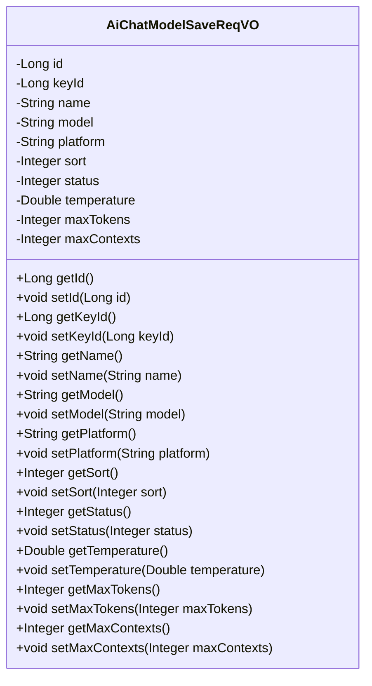
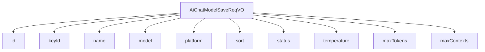

# 基础信息

|      |      |
|------|------|
| 编码语言 | .java |
| 代码路径 | yudao-module-ai/yudao-module-ai-biz/src/main/java/cn/iocoder/yudao/module/ai/controller/admin/model/vo/chatModel/AiChatModelSaveReqVO.java |
| 包名 | cn.iocoder.yudao.module.ai.controller.admin.model.vo.chatModel |
| 依赖项 | ['cn.iocoder.yudao.framework.common.enums.CommonStatusEnum', 'cn.iocoder.yudao.framework.common.validation.InEnum', 'io.swagger.v3.oas.annotations.media.Schema', None, 'jakarta.validation.constraints'] |
| 概述说明 | 管理后台API聊天模型新增/修改请求VO包含编号、API秘钥编号、模型名字、模型标识、模型平台、排序、状态、温度参数、单条回复最大Token数量、上下文最大Message数量等字段，其中API秘钥编号、模型名字、模型标识、模型平台、排序、状态为必填项。 |

# 说明

管理后台API聊天模型的新增或修改请求VO包含多个字段，用于定义和配置聊天模型的相关属性。这些字段包括编号、API秘钥编号、模型名字、模型标识、模型平台、排序、状态、温度参数、单条回复最大Token数量、上下文最大Message数量等。其中，API秘钥编号、模型名字、模型标识、模型平台、排序和状态是必填项，确保每个模型都有必要的基本信息和配置。编号用于唯一标识每个模型，API秘钥编号关联到具体的API访问权限。模型名字和模型标识用于描述和识别模型，模型平台则指定了模型运行的环境或框架。排序字段用于控制模型在列表中的显示顺序，状态字段用于启用或禁用模型。温度参数用于调整模型生成文本的随机性和创造性，单条回复最大Token数量限制了每次回复的长度，上下文最大Message数量则控制了模型在处理对话时能够参考的历史消息数量。这些字段共同构成了一个完整的API聊天模型配置，确保模型能够根据需求进行灵活的管理和调整。

# 类列表 Class Summary

| 名称   | 类型  | 说明 |
|-------|------|-------------|
| AiChatModelSaveReqVO | class | 管理后台API聊天模型新增/修改请求VO包含编号、API秘钥编号、模型名字、模型标识、模型平台、排序、状态、温度参数、单条回复最大Token数量、上下文最大Message数量等字段，其中API秘钥编号、模型名字、模型标识、模型平台、排序、状态为必填项。 |

## 类 AiChatModelSaveReqVO

|      |      |
|------|------|
| 访问范围 | @Schema(description = "管理后台 - API 聊天模型新增/修改 Request VO");@Data;public |
| 类型 | class |
| 名称 | AiChatModelSaveReqVO |
| 说明 | 管理后台API聊天模型新增/修改请求VO包含编号、API秘钥编号、模型名字、模型标识、模型平台、排序、状态、温度参数、单条回复最大Token数量、上下文最大Message数量等字段，其中API秘钥编号、模型名字、模型标识、模型平台、排序、状态为必填项。 |

### UML类图

### 描述信息：
该UML类图展示了一个名为`AiChatModelSaveReqVO`的类，用于管理后台的API聊天模型新增或修改请求。类中包含多个私有属性，如`id`、`keyId`、`name`等，并提供了相应的getter和setter方法。这些属性用于存储模型的编号、API秘钥编号、模型名称、模型标识等信息。

### 内部方法调用关系图

### 描述信息：
该图展示了 `AiChatModelSaveReqVO` 类与其属性之间的调用关系。`AiChatModelSaveReqVO` 类包含了多个属性，如 `id`、`keyId`、`name`、`model` 等，这些属性用于管理后台的 API 聊天模型新增或修改请求。每个属性都通过 `-->` 与 `AiChatModelSaveReqVO` 类关联，清晰地表示了类与属性之间的依赖关系。

### 字段列表 Field List

| 名称  | 类型  | 说明 |
|-------|-------|------|
| maxContexts | Integer | 上下文的最大Message数量为8192。 |
| temperature | Double | 温度参数，示例值为1，数据类型为Double。 |
| sort | Integer | 排序字段为必填项，不能为空，示例值为1。 |
| platform | String | 模型平台为必填项，不能为空，示例为OpenAI。 |
| id | Long | 编号为2630的ID字段，类型为长整型。 |
| name | String | 模型名字为必填项，不能为空，示例为“张三”。 |
| keyId | Long | API秘钥编号为必填项，不能为空，示例值为22042，数据类型为长整型。 |
| status | Integer | 状态字段为必填项，不能为空，需符合CommonStatusEnum枚举类中的值，示例值为1。 |
| model | String | 模型标识为必填项，不能为空，示例值为"gpt-3.5-turbo-0125"。 |
| maxTokens | Integer | 单条回复的最大Token数量为4096。 |

### 方法列表 Method List

| 名称  | 类型  | 说明 |
|-------|-------|------|

