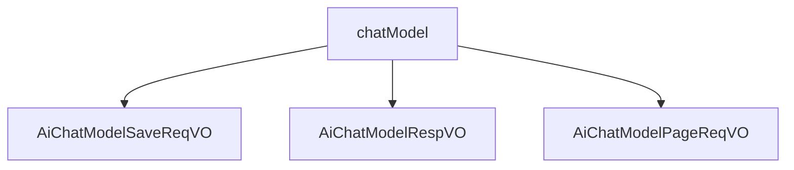

# 基础信息

|      |      |
|------|------|
| 编码语言 | .java |
| 代码路径 | yudao-module-ai/yudao-module-ai-biz/src/main/java/cn/iocoder/yudao/module/ai/controller/admin/model/vo/chatModel |
| 包名 | cn.iocoder.yudao.module.ai.controller.admin.model.vo.chatModel |
| 概述说明 | 管理后台API聊天模型配置涉及多个关键字段，包括编号、API秘钥编号、模型名字、模型标识、模型平台、排序、状态、温度参数、单条回复最大Token数量、上下文最大Message数量等。必填项为API秘钥编号、模型名字、模型标识、模型平台、排序和状态，确保模型基本信息和配置完整。温度参数控制文本生成随机性，Token数量限制回复长度，Message数量影响上下文理解。分页请求VO包含分页参数及模型名字、标识、平台，支持灵活查询和筛选。这些配置和查询机制共同支持对AI聊天模型的全面管理和调整。 |

# 说明

管理后台API聊天模型的新增或修改请求VO包含多个字段，用于定义和配置聊天模型的相关属性。这些字段包括编号、API秘钥编号、模型名字、模型标识、模型平台、排序、状态、温度参数、单条回复最大Token数量、上下文最大Message数量等。其中，API秘钥编号、模型名字、模型标识、模型平台、排序和状态是必填项，确保每个模型都有必要的基本信息和配置。编号用于唯一标识每个模型，API秘钥编号关联到具体的API访问权限。模型名字和模型标识用于描述和识别模型，模型平台则指定了模型运行的环境或框架。排序字段用于控制模型在列表中的显示顺序，状态字段用于启用或禁用模型。温度参数用于调整模型生成文本的随机性和创造性，单条回复最大Token数量限制了每次回复的长度，上下文最大Message数量则控制了模型在处理对话时能够参考的历史消息数量。这些字段共同构成了一个完整的API聊天模型配置，确保模型能够根据需求进行灵活的管理和调整。

管理后台的AI聊天模型响应VO包含了多个关键信息和细节，用于描述和管理AI聊天模型的配置和状态。每个模型都有一个唯一的编号，用于标识不同的模型实例。API秘钥编号用于验证和授权访问该模型的API接口。模型名字是对该模型的描述性名称，便于用户识别和选择。模型标识是模型的唯一标识符，通常用于技术层面的引用和调用。模型平台指明了该模型所依赖的技术平台或框架，例如TensorFlow、PyTorch等。排序字段用于定义模型在列表中的显示顺序，便于用户根据优先级或使用频率进行排序。状态字段表示模型的当前状态，如启用、禁用或维护中，帮助管理员了解模型的可用性。温度参数是模型生成文本时的一个关键参数，控制生成文本的随机性和创造性，值越高生成的文本越随机，值越低则越保守和确定。单条回复的最大Token数量限制了模型在每次响应中可以生成的Token数量，确保生成的文本长度在可控范围内。上下文的最大Message数量定义了模型在处理对话时可以保留的上下文消息数量，影响模型对对话历史的理解和响应质量。创建时间记录了该模型的创建时间戳，便于追踪和管理模型的生命周期。

管理后台API中的聊天模型分页请求VO主要用于查询和筛选聊天模型信息。该VO包含分页参数以及三个关键字段：模型名字、模型标识和模型平台。分页参数用于控制查询结果的显示范围和数量，确保数据能够以分页形式展示，便于用户浏览和管理。模型名字字段用于指定要查询的聊天模型的名称，帮助用户快速定位特定模型。模型标识字段用于唯一标识每个聊天模型，确保查询结果的准确性和唯一性。模型平台字段则用于指定模型所属的平台，帮助用户根据平台筛选出符合条件的聊天模型。通过这些字段的组合，用户可以根据具体需求灵活地进行查询和筛选，从而高效地获取所需的聊天模型信息。

### 包内部结构视图

### 描述信息：
该Mermaid图展示了`chatModel`文件夹与其内部三个Java文件之间的调用关系。`chatModel`作为父节点，分别调用了`AiChatModelSaveReqVO`、`AiChatModelRespVO`和`AiChatModelPageReqVO`三个子节点，清晰地反映了文件与文件夹之间的层级关系。

# 文件列表 File List

| 名称   | 类型  | 说明 |
|-------|------|-------------|
| [AiChatModelPageReqVO.java](AiChatModelPageReqVO.md) | file | 管理后台API聊天模型分页请求VO包含分页参数及模型名字、模型标识和模型平台三个字段，用于查询和筛选聊天模型信息。 |
| [AiChatModelRespVO.java](AiChatModelRespVO.md) | file | 管理后台的AI聊天模型响应VO包含编号、API秘钥编号、模型名字、模型标识、模型平台、排序、状态、温度参数、单条回复的最大Token数量、上下文的最大Message数量及创建时间等关键信息。 |
| [AiChatModelSaveReqVO.java](AiChatModelSaveReqVO.md) | file | 管理后台API聊天模型新增/修改请求VO包含编号、API秘钥编号、模型名字、模型标识、模型平台、排序、状态、温度参数、单条回复最大Token数量、上下文最大Message数量等字段，其中API秘钥编号、模型名字、模型标识、模型平台、排序、状态为必填项。 |

