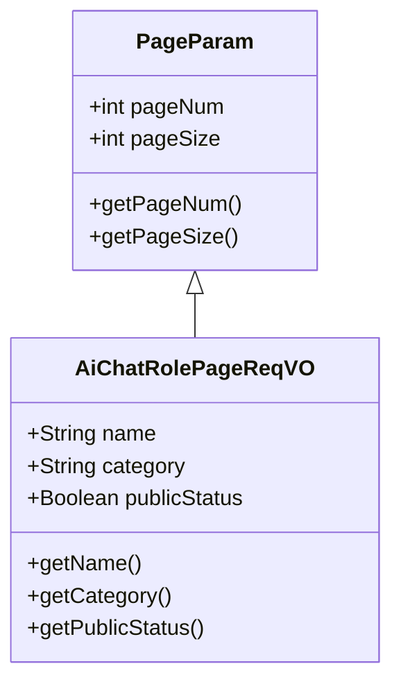
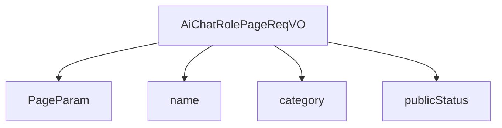

# 基础信息

|      |      |
|------|------|
| 编码语言 | .java |
| 代码路径 | yudao-module-ai/yudao-module-ai-biz/src/main/java/cn/iocoder/yudao/module/ai/controller/admin/model/vo/chatRole/AiChatRolePageReqVO.java |
| 包名 | cn.iocoder.yudao.module.ai.controller.admin.model.vo.chatRole |
| 依赖项 | [None, 'io.swagger.v3.oas.annotations.media.Schema', 'cn.iocoder.yudao.framework.common.pojo.PageParam'] |
| 概述说明 | 管理后台AI聊天角色分页请求VO包含角色名称、角色类别和是否公开三个字段，用于分页查询和筛选AI聊天角色信息。 |

# 说明

管理后台的AI聊天角色分页请求VO（值对象）用于在系统中进行分页查询和筛选AI聊天角色的相关信息。该VO包含三个主要字段：角色名称、角色类别和是否公开。角色名称字段用于指定或筛选特定的AI聊天角色名称，帮助用户快速定位所需角色。角色类别字段用于区分不同类别的AI聊天角色，例如按功能、用途或领域进行分类，以便用户根据需求筛选相关角色。是否公开字段则用于标识该角色是否对外公开，用户可以通过该字段筛选出公开或非公开的角色信息。通过这三个字段的组合，用户可以在管理后台中高效地进行分页查询和筛选操作，从而快速获取所需的AI聊天角色信息。

# 类列表 Class Summary

| 名称   | 类型  | 说明 |
|-------|------|-------------|
| AiChatRolePageReqVO | class | 管理后台AI聊天角色分页请求VO包含角色名称、角色类别和是否公开三个字段，用于分页查询和筛选AI聊天角色信息。 |

## 类 AiChatRolePageReqVO

|      |      |
|------|------|
| 访问范围 | @Schema(description = "管理后台 - AI 聊天角色分页 Request VO");@Data;public |
| 类型 | class |
| 名称 | AiChatRolePageReqVO |
| 说明 | 管理后台AI聊天角色分页请求VO包含角色名称、角色类别和是否公开三个字段，用于分页查询和筛选AI聊天角色信息。 |

### UML类图

### 描述信息：
该UML类图展示了`AiChatRolePageReqVO`类继承自`PageParam`类。`AiChatRolePageReqVO`类包含三个属性：`name`、`category`和`publicStatus`，分别表示角色名称、角色类别和是否公开。每个类都包含相应的getter方法，确保数据的可访问性。

### 内部方法调用关系图

**概述**：`AiChatRolePageReqVO` 类继承自 `PageParam`，并包含三个属性：`name`、`category` 和 `publicStatus`。这些属性分别用于存储角色名称、角色类别和是否公开的状态信息。

### 字段列表 Field List

| 名称  | 类型  | 说明 |
|-------|-------|------|
| name | String | 角色名称为李四。 |
| category | String | 角色类别用于描述角色的分类，示例为“创作”。 |
| publicStatus | Boolean | 是否公开的状态，示例值为1，数据类型为布尔型。 |

### 方法列表 Method List

| 名称  | 类型  | 说明 |
|-------|-------|------|

