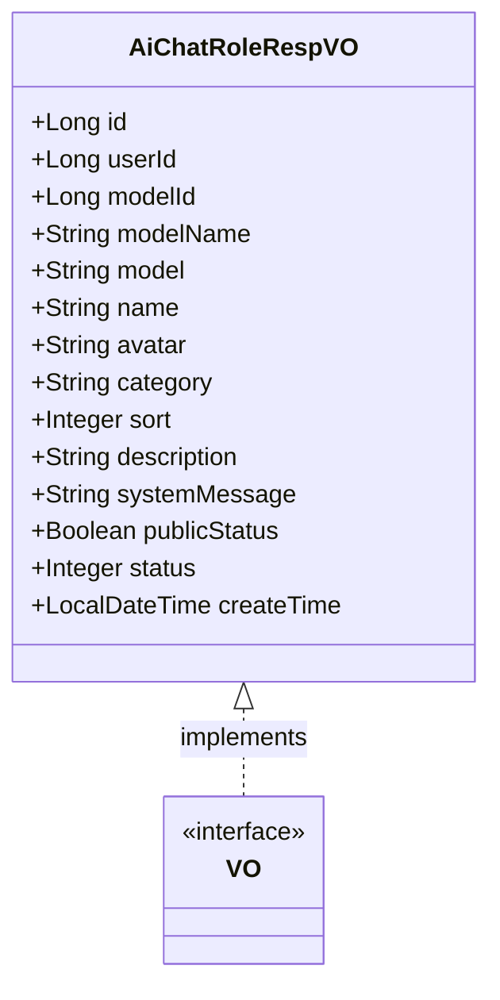
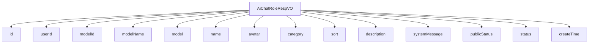

# 基础信息

|      |      |
|------|------|
| 编码语言 | .java |
| 代码路径 | yudao-module-ai/yudao-module-ai-biz/src/main/java/cn/iocoder/yudao/module/ai/controller/admin/model/vo/chatRole/AiChatRoleRespVO.java |
| 包名 | cn.iocoder.yudao.module.ai.controller.admin.model.vo.chatRole |
| 依赖项 | ['cn.iocoder.yudao.module.ai.dal.dataobject.model.AiChatModelDO', 'com.fhs.core.trans.anno.Trans', 'com.fhs.core.trans.constant.TransType', 'com.fhs.core.trans.vo.VO', 'io.swagger.v3.oas.annotations.media.Schema', 'lombok.Data', 'java.time.LocalDateTime'] |
| 概述说明 | 管理后台的AI聊天角色响应VO包含角色编号、用户编号、模型编号、模型名字、模型标识、角色名称、角色头像、角色类别、角色排序、角色描述、角色设定、是否公开、状态和创建时间等关键信息，用于详细描述和管理AI聊天角色。 |

# 说明

管理后台的AI聊天角色响应VO包含多个关键字段，用于详细描述和管理AI聊天角色的信息。这些字段包括角色编号、用户编号、模型编号、模型名字、模型标识、角色名称、角色头像、角色类别、角色排序、角色描述、角色设定、是否公开、状态和创建时间。其中，角色编号用于唯一标识每个角色，用户编号则关联到创建或管理该角色的用户。模型编号、模型名字和模型标识用于指定角色所使用的AI模型，确保角色与特定模型相关联。角色名称和角色头像为用户提供了直观的角色识别方式，而角色类别则对角色进行分类管理。角色排序字段用于控制角色在列表中的显示顺序。角色描述和角色设定提供了关于角色的详细背景和功能说明，帮助用户更好地理解和使用该角色。是否公开字段决定了角色是否对所有用户可见，状态字段则用于管理角色的启用或禁用状态。最后，创建时间记录了角色的生成时间，便于追踪和管理角色的生命周期。所有字段均为必需或可选，确保了信息的完整性和灵活性。

# 类列表 Class Summary

| 名称   | 类型  | 说明 |
|-------|------|-------------|
| AiChatRoleRespVO | class | 管理后台的AI聊天角色响应VO包含角色编号、用户编号、模型编号、模型名字、模型标识、角色名称、角色头像、角色类别、角色排序、角色描述、角色设定、是否公开、状态和创建时间等关键信息，所有字段均为必需或可选，用于描述和管理AI聊天角色的详细信息。 |

## 类 AiChatRoleRespVO

|      |      |
|------|------|
| 访问范围 | @Schema(description = "管理后台 - AI 聊天角色 Response VO");@Data;public |
| 类型 | class |
| 名称 | AiChatRoleRespVO |
| 说明 | 管理后台的AI聊天角色响应VO包含角色编号、用户编号、模型编号、模型名字、模型标识、角色名称、角色头像、角色类别、角色排序、角色描述、角色设定、是否公开、状态和创建时间等关键信息，所有字段均为必需或可选，用于描述和管理AI聊天角色的详细信息。 |

### UML类图

### 描述信息
该UML类图展示了`AiChatRoleRespVO`类的结构，该类实现了`VO`接口。`AiChatRoleRespVO`类包含多个属性，如`id`、`userId`、`modelId`等，用于管理AI聊天角色的相关信息。所有属性均为`public`，符合Mermaid的类图语法规范。

### 内部方法调用关系图

### 描述信息：
该图展示了 `AiChatRoleRespVO` 类与其属性之间的调用关系。`AiChatRoleRespVO` 类包含了多个属性，如 `id`、`userId`、`modelId` 等，这些属性通过 `-->` 符号与类进行关联。每个属性都代表了 AI 聊天角色的不同信息，如角色编号、用户编号、模型编号等。

### 字段列表 Field List

| 名称  | 类型  | 说明 |
|-------|-------|------|
| status | Integer | 状态字段，类型为整数，示例值为1。 |
| createTime | LocalDateTime | 创建时间是必填项，类型为LocalDateTime。 |
| name | String | 角色名称为必填项，示例为“李四”。 |
| category | String | 角色类别为必填项，示例值为“创作”。 |
| modelName | String | 模型名字字段，示例为“张三”，用于存储模型名称信息。 |
| id | Long | 角色编号为必填项，示例值为32746，数据类型为长整型。 |
| userId | Long | 用户编号为必填项，示例值为9442，数据类型为长整型。 |
| description | String | 角色描述为必填项，需提供具体内容，示例为“你说的对”。 |
| systemMessage | String | 角色设定信息包含一个必需的字符串属性systemMessage，用于描述系统消息。 |
| sort | Integer | 角色排序字段为必填项，类型为整数，示例值为1。 |
| publicStatus | Boolean | 该字段表示是否公开，类型为布尔值，必填项，示例值为1。 |
| model | String | 模型标识为gpt-3.5-turbo-0125。 |
| avatar | String | 角色头像字段为必填项，示例值为"https://www.iocoder.cn/1.png"。 |
| modelId | Long | 模型编号字段，示例值为17640，通过简单转换类型映射到AiChatModelDO类的name和model字段，分别对应modelName和model引用。 |

### 方法列表 Method List

| 名称  | 类型  | 说明 |
|-------|-------|------|

