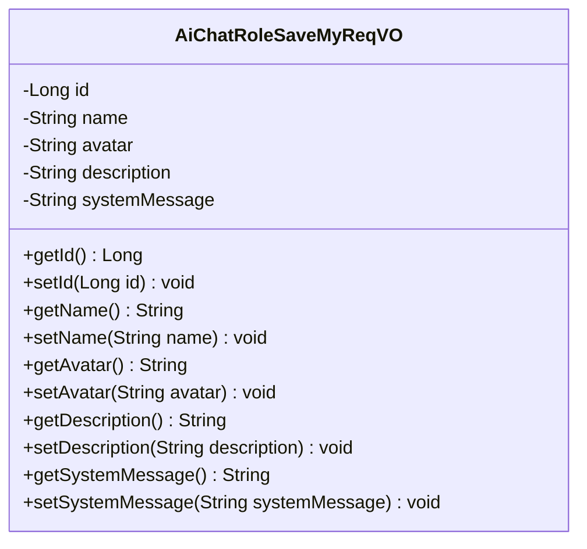
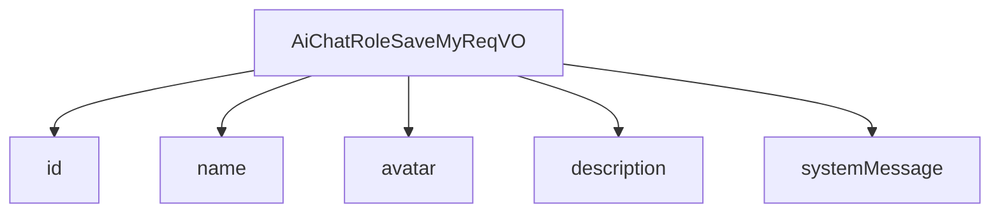

# 基础信息

|      |      |
|------|------|
| 编码语言 | .java |
| 代码路径 | yudao-module-ai/yudao-module-ai-biz/src/main/java/cn/iocoder/yudao/module/ai/controller/admin/model/vo/chatRole/AiChatRoleSaveMyReqVO.java |
| 包名 | cn.iocoder.yudao.module.ai.controller.admin.model.vo.chatRole |
| 依赖项 | ['io.swagger.v3.oas.annotations.media.Schema', 'jakarta.validation.constraints.NotEmpty', 'lombok.Data', 'org.hibernate.validator.constraints.URL'] |
| 概述说明 | 管理后台AI聊天角色新增/修改请求VO包含角色编号、名称、头像、描述和设定，其中名称、头像、描述和设定为必填项，头像需为URL格式。 |

# 说明

在管理后台系统中，AI聊天角色的新增或修改请求通过一个特定的值对象（VO）进行处理。该VO包含五个主要字段：角色编号、名称、头像、描述和设定。其中，角色编号用于唯一标识每个AI聊天角色，而名称、头像、描述和设定则是必填项，确保每个角色都有完整的定义和信息。头像字段要求输入的内容必须符合URL格式，这意味着头像图像必须通过一个有效的网络地址来引用。名称、描述和设定字段则用于详细说明角色的特征、功能和用途，帮助用户更好地理解和使用该AI聊天角色。通过这些字段的合理配置，管理后台能够有效地管理和维护AI聊天角色的信息，确保系统的正常运行和用户体验的优化。

# 类列表 Class Summary

| 名称   | 类型  | 说明 |
|-------|------|-------------|
| AiChatRoleSaveMyReqVO | class | 管理后台AI聊天角色新增/修改请求VO包含角色编号、名称、头像、描述和设定。名称、头像、描述和设定为必填项，头像需为URL格式。 |

## 类 AiChatRoleSaveMyReqVO

|      |      |
|------|------|
| 访问范围 | @Schema(description = "管理后台 - AI 聊天角色新增/修改【我的】 Request VO");@Data;public |
| 类型 | class |
| 名称 | AiChatRoleSaveMyReqVO |
| 说明 | 管理后台AI聊天角色新增/修改请求VO包含角色编号、名称、头像、描述和设定。名称、头像、描述和设定为必填项，头像需为URL格式。 |

### UML类图

### 描述信息：
该UML类图展示了一个名为`AiChatRoleSaveMyReqVO`的类，用于管理后台AI聊天角色的新增或修改请求。类中包含五个私有属性：`id`、`name`、`avatar`、`description`和`systemMessage`，并为每个属性提供了对应的getter和setter方法。

### 内部方法调用关系图

### 描述信息：
该图展示了 `AiChatRoleSaveMyReqVO` 类与其属性之间的调用关系。`AiChatRoleSaveMyReqVO` 类包含了 `id`、`name`、`avatar`、`description` 和 `systemMessage` 五个属性，这些属性通过 `-->` 符号与类进行关联，表示类对这些属性的依赖关系。

### 字段列表 Field List

| 名称  | 类型  | 说明 |
|-------|-------|------|
| description | String | 角色描述字段为必填项，不能为空，示例值为“你说的对”。 |
| name | String | 角色名称为必填项，不能为空，示例为“李四”。 |
| id | Long | 角色编号为长整型，示例值为32746。 |
| systemMessage | String | 角色设定必须为非空字符串，描述为扮演一位优秀的程序员，具备强大的逻辑思维能力，能够高效解决问题。 |
| avatar | String | 角色头像字段为必填项，必须为非空且符合URL格式的字符串，示例为"https://www.iocoder.cn/1.png"。 |

### 方法列表 Method List

| 名称  | 类型  | 说明 |
|-------|-------|------|

