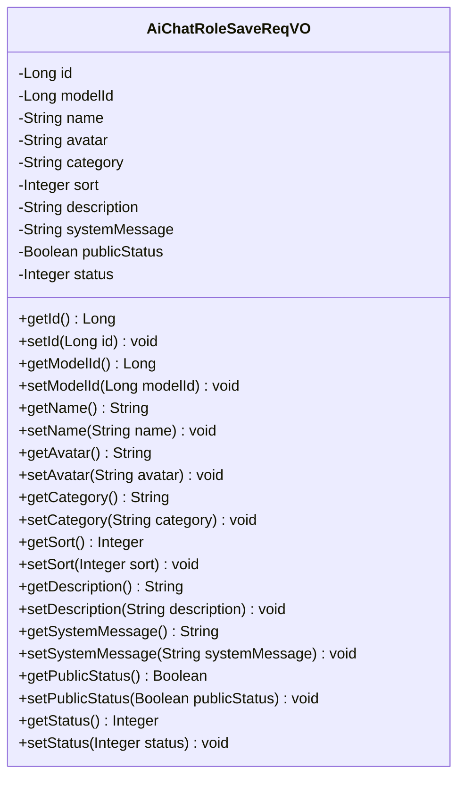
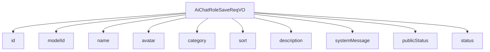

# 基础信息

|      |      |
|------|------|
| 编码语言 | .java |
| 代码路径 | yudao-module-ai/yudao-module-ai-biz/src/main/java/cn/iocoder/yudao/module/ai/controller/admin/model/vo/chatRole/AiChatRoleSaveReqVO.java |
| 包名 | cn.iocoder.yudao.module.ai.controller.admin.model.vo.chatRole |
| 依赖项 | ['cn.iocoder.yudao.framework.common.enums.CommonStatusEnum', 'cn.iocoder.yudao.framework.common.validation.InEnum', 'io.swagger.v3.oas.annotations.media.Schema', None, 'jakarta.validation.constraints', 'org.hibernate.validator.constraints.URL'] |
| 概述说明 | 管理后台AI聊天角色新增或修改请求需填写角色编号、模型编号、角色名称、角色头像（URL格式）、角色类别、角色排序、角色描述、角色设定、是否公开和状态等必填字段，所有字段均不能为空，部分字段有特定格式要求。 |

# 说明

管理后台AI聊天角色新增或修改请求需要包含多个必填字段，所有字段均不能为空。这些字段包括角色编号、模型编号、角色名称、角色头像（要求为URL格式）、角色类别、角色排序、角色描述、角色设定、是否公开和状态。每个字段都有其特定的要求和格式，确保数据的完整性和一致性。角色编号和模型编号用于唯一标识角色及其对应的模型；角色名称用于描述角色的名称；角色头像必须以URL格式提供，确保图像资源的可访问性；角色类别用于分类不同的角色；角色排序用于确定角色在列表中的显示顺序；角色描述提供了对角色背景和功能的详细说明；角色设定则进一步定义了角色的行为和特性；是否公开字段决定了角色是否对外可见；状态字段用于控制角色的启用或禁用状态。这些字段共同构成了AI聊天角色的完整信息，确保角色在系统中的有效管理和使用。

# 类列表 Class Summary

| 名称   | 类型  | 说明 |
|-------|------|-------------|
| AiChatRoleSaveReqVO | class | 管理后台AI聊天角色新增/修改请求包含以下必填字段：角色编号、模型编号、角色名称、角色头像（URL格式）、角色类别、角色排序、角色描述、角色设定、是否公开和状态。所有字段均不能为空，部分字段有特定格式要求。 |

## 类 AiChatRoleSaveReqVO

|      |      |
|------|------|
| 访问范围 | @Schema(description = "管理后台 - AI 聊天角色新增/修改 Request VO");@Data;public |
| 类型 | class |
| 名称 | AiChatRoleSaveReqVO |
| 说明 | 管理后台AI聊天角色新增/修改请求包含以下必填字段：角色编号、模型编号、角色名称、角色头像（URL格式）、角色类别、角色排序、角色描述、角色设定、是否公开和状态。所有字段均不能为空，部分字段有特定格式要求。 |

### UML类图

### 描述信息：
该UML类图展示了一个名为`AiChatRoleSaveReqVO`的类，用于管理后台AI聊天角色的新增或修改请求。类中包含多个私有属性，如角色编号、模型编号、角色名称等，并提供了相应的getter和setter方法。所有属性都通过注解进行了校验，确保数据的完整性和有效性。

### 内部方法调用关系图

### 描述信息：
该图展示了 `AiChatRoleSaveReqVO` 类与其属性之间的调用关系。`AiChatRoleSaveReqVO` 类包含了多个属性，如 `id`、`modelId`、`name` 等，每个属性都通过 `-->` 与类进行关联。这些属性用于管理后台的 AI 聊天角色新增或修改请求。

### 字段列表 Field List

| 名称  | 类型  | 说明 |
|-------|-------|------|
| category | String | 角色类别为必填项，不能为空，示例值为“创作”。 |
| modelId | Long | 模型编号字段，类型为长整型，示例值为17640。 |
| name | String | 角色名称为必填项，不能为空，示例为“李四”。 |
| id | Long | 角色编号为长整型，示例值为32746。 |
| description | String | 角色描述字段为必填项，不能为空，示例值为“你说的对”。 |
| avatar | String | 角色头像必须为非空且符合URL格式的字符串，示例为"https://www.iocoder.cn/1.png"。 |
| publicStatus | Boolean | 该字段表示是否公开，为必填项，不能为空，示例值为1，数据类型为布尔型。 |
| status | Integer | 状态字段为必填项，不能为空，且必须符合CommonStatusEnum枚举类中的值。示例值为1。 |
| systemMessage | String | 角色设定要求描述一位程序员，具备优秀编程能力和强大逻辑思维，能高效解决问题。此设定为必填项，不能为空。 |
| sort | Integer | 角色排序字段为必填项，不能为空，示例值为1。 |

### 方法列表 Method List

| 名称  | 类型  | 说明 |
|-------|-------|------|

