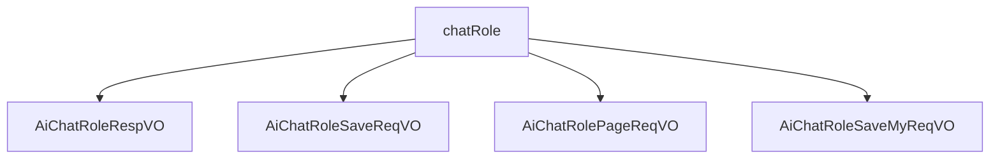

# 基础信息

|      |      |
|------|------|
| 编码语言 | .java |
| 代码路径 | yudao-module-ai/yudao-module-ai-biz/src/main/java/cn/iocoder/yudao/module/ai/controller/admin/model/vo/chatRole |
| 包名 | cn.iocoder.yudao.module.ai.controller.admin.model.vo.chatRole |
| 概述说明 | 管理后台的AI聊天角色系统包含多个关键字段，如角色编号、用户编号、模型编号、角色名称、头像、类别、排序、描述、设定、是否公开、状态和创建时间，用于唯一标识和管理角色。新增或修改请求需包含必填字段，确保数据完整性和一致性。分页请求VO通过角色名称、类别和是否公开字段进行筛选查询。所有字段共同确保角色的有效管理和使用。 |

# 说明

管理后台的AI聊天角色响应VO包含多个关键字段，用于详细描述和管理AI聊天角色的信息。这些字段包括角色编号、用户编号、模型编号、模型名字、模型标识、角色名称、角色头像、角色类别、角色排序、角色描述、角色设定、是否公开、状态和创建时间。角色编号用于唯一标识每个角色，用户编号关联到创建或管理该角色的用户。模型编号、模型名字和模型标识指定角色所使用的AI模型，确保角色与特定模型相关联。角色名称和角色头像提供直观的角色识别方式，角色类别对角色进行分类管理。角色排序控制角色在列表中的显示顺序。角色描述和角色设定提供角色的详细背景和功能说明。是否公开字段决定角色是否对所有用户可见，状态字段管理角色的启用或禁用状态。创建时间记录角色的生成时间，便于追踪和管理角色的生命周期。

管理后台AI聊天角色新增或修改请求需要包含多个必填字段，所有字段均不能为空。这些字段包括角色编号、模型编号、角色名称、角色头像（要求为URL格式）、角色类别、角色排序、角色描述、角色设定、是否公开和状态。角色编号和模型编号用于唯一标识角色及其对应的模型；角色名称描述角色的名称；角色头像必须以URL格式提供；角色类别分类不同的角色；角色排序确定角色在列表中的显示顺序；角色描述提供对角色背景和功能的详细说明；角色设定定义角色的行为和特性；是否公开字段决定角色是否对外可见；状态字段控制角色的启用或禁用状态。

管理后台的AI聊天角色分页请求VO用于在系统中进行分页查询和筛选AI聊天角色的相关信息。该VO包含三个主要字段：角色名称、角色类别和是否公开。角色名称字段用于指定或筛选特定的AI聊天角色名称；角色类别字段区分不同类别的AI聊天角色；是否公开字段标识该角色是否对外公开。通过这三个字段的组合，用户可以在管理后台中高效地进行分页查询和筛选操作。

在管理后台系统中，AI聊天角色的新增或修改请求通过一个特定的值对象（VO）进行处理。该VO包含五个主要字段：角色编号、名称、头像、描述和设定。角色编号用于唯一标识每个AI聊天角色；名称、头像、描述和设定是必填项，确保每个角色都有完整的定义和信息。头像字段要求输入的内容必须符合URL格式；名称、描述和设定字段详细说明角色的特征、功能和用途。通过这些字段的合理配置，管理后台能够有效地管理和维护AI聊天角色的信息，确保系统的正常运行和用户体验的优化。

### 包内部结构视图

### 描述信息：
该Mermaid图展示了`chatRole`文件夹下的四个Java文件之间的调用关系。`chatRole`作为父节点，分别调用了`AiChatRoleRespVO`、`AiChatRoleSaveReqVO`、`AiChatRolePageReqVO`和`AiChatRoleSaveMyReqVO`四个子节点。这些文件可能用于处理AI聊天角色的响应、保存请求、分页请求以及保存个人请求的逻辑。

# 文件列表 File List

| 名称   | 类型  | 说明 |
|-------|------|-------------|
| [AiChatRoleSaveMyReqVO.java](AiChatRoleSaveMyReqVO.md) | file | 管理后台AI聊天角色新增/修改请求VO包含角色编号、名称、头像、描述和设定，其中名称、头像、描述和设定为必填项，头像需为URL格式。 |
| [AiChatRolePageReqVO.java](AiChatRolePageReqVO.md) | file | 管理后台AI聊天角色分页请求VO包含角色名称、角色类别和是否公开三个字段，用于分页查询和筛选AI聊天角色信息。 |
| [AiChatRoleSaveReqVO.java](AiChatRoleSaveReqVO.md) | file | 管理后台AI聊天角色新增或修改请求需填写角色编号、模型编号、角色名称、角色头像（URL格式）、角色类别、角色排序、角色描述、角色设定、是否公开和状态等必填字段，所有字段均不能为空，部分字段有特定格式要求。 |
| [AiChatRoleRespVO.java](AiChatRoleRespVO.md) | file | 管理后台的AI聊天角色响应VO包含角色编号、用户编号、模型编号、模型名字、模型标识、角色名称、角色头像、角色类别、角色排序、角色描述、角色设定、是否公开、状态和创建时间等关键信息，用于详细描述和管理AI聊天角色。 |

