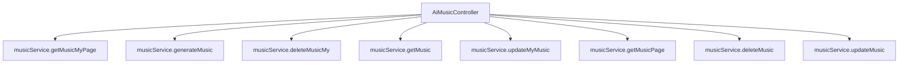

# 基础信息

|      |      |
|------|------|
| 编码语言 | .java |
| 代码路径 | yudao-module-ai/yudao-module-ai-biz/src/main/java/cn/iocoder/yudao/module/ai/controller/admin/music/AiMusicController.java |
| 包名 | cn.iocoder.yudao.module.ai.controller.admin.music |
| 依赖项 | ['cn.hutool.core.util.ObjUtil', 'cn.iocoder.yudao.framework.common.pojo.CommonResult', 'cn.iocoder.yudao.framework.common.pojo.PageResult', 'cn.iocoder.yudao.framework.common.util.object.BeanUtils', 'cn.iocoder.yudao.module.ai.controller.admin.music.vo', 'cn.iocoder.yudao.module.ai.dal.dataobject.music.AiMusicDO', 'cn.iocoder.yudao.module.ai.service.music.AiMusicService', 'io.swagger.v3.oas.annotations.Operation', 'io.swagger.v3.oas.annotations.Parameter', 'io.swagger.v3.oas.annotations.tags.Tag', 'jakarta.annotation.Resource', 'jakarta.validation.Valid', 'org.springframework.security.access.prepost.PreAuthorize', 'org.springframework.web.bind.annotation', 'java.util.List', 'cn.iocoder.yudao.framework.common.pojo.CommonResult.success', 'cn.iocoder.yudao.framework.security.core.util.SecurityFrameworkUtils.getLoginUserId'] |
| 概述说明 | 该代码实现了一个AI音乐管理后台的RESTful API，支持用户和管理员功能。用户可获取、生成、删除、修改个人音乐记录；管理员可查询、删除、更新音乐。所有操作均需权限验证，确保数据安全。 |

# 说明

该代码实现了一个AI音乐管理后台的RESTful API，主要功能涵盖了用户和管理员两方面的操作。对于普通用户，系统提供了获取个人音乐分页的功能，允许用户查看自己的音乐列表；同时，用户还可以生成新的音乐、删除已有的音乐记录，并修改音乐的标题。这些操作都经过权限验证，确保只有授权用户才能访问和修改自己的音乐数据。对于管理员用户，系统提供了更高级的功能，包括对所有音乐记录的分页查询、删除和更新操作。管理员可以查看和管理所有用户的音乐数据，同样这些操作也经过严格的权限验证，以确保数据的安全性和系统的稳定性。整体而言，该API设计合理，功能全面，能够有效支持AI音乐管理后台的日常运营需求。

# 类列表 Class Summary

| 名称   | 类型  | 说明 |
|-------|------|-------------|
| AiMusicController | class | 该代码实现了一个AI音乐管理后台的RESTful API，主要功能包括：获取用户个人音乐分页、生成音乐、删除和获取个人音乐记录、修改音乐标题；同时提供管理员权限的音乐分页查询、删除和更新功能。所有操作均通过权限验证，确保数据安全。 |


## 类 AiMusicController

|      |      |
|------|------|
| 访问范围 | @Tag(name = "管理后台 - AI 音乐");@RestController;@RequestMapping("/ai/music");public |
| 类型 | class |
| 名称 | AiMusicController |
| 说明 | 该代码实现了一个AI音乐管理后台的RESTful API，主要功能包括：获取用户个人音乐分页、生成音乐、删除和获取个人音乐记录、修改音乐标题；同时提供管理员权限的音乐分页查询、删除和更新功能。所有操作均通过权限验证，确保数据安全。 |


### UML类图

```mermaid
classDiagram
    class AiMusicController {
        +AiMusicService musicService
        +getMusicMyPage(AiMusicPageReqVO pageReqVO) CommonResult~PageResult~AiMusicRespVO~~
        +generateMusic(AiSunoGenerateReqVO reqVO) CommonResult~List~Long~~
        +deleteMusicMy(Long id) CommonResult~Boolean~
        +getMusicMy(Long id) CommonResult~AiMusicRespVO~
        +updateMy(AiMusicUpdateMyReqVO updateReqVO) CommonResult~Boolean~
        +getMusicPage(AiMusicPageReqVO pageReqVO) CommonResult~PageResult~AiMusicRespVO~~
        +deleteMusic(Long id) CommonResult~Boolean~
        +updateMusic(AiMusicUpdateReqVO updateReqVO) CommonResult~Boolean~
    }

    class AiMusicService {
        +getMusicMyPage(AiMusicPageReqVO pageReqVO, Long userId) PageResult~AiMusicDO~
        +generateMusic(Long userId, AiSunoGenerateReqVO reqVO) List~Long~
        +deleteMusicMy(Long id, Long userId) void
        +getMusic(Long id) AiMusicDO
        +updateMyMusic(AiMusicUpdateMyReqVO updateReqVO, Long userId) void
        +getMusicPage(AiMusicPageReqVO pageReqVO) PageResult~AiMusicDO~
        +deleteMusic(Long id) void
        +updateMusic(AiMusicUpdateReqVO updateReqVO) void
    }

    class AiMusicDO {
        +Long id
        +Long userId
        +String title
    }

    class AiMusicRespVO {
        +Long id
        +String title
    }

    class AiMusicPageReqVO {
        +Integer pageNo
        +Integer pageSize
    }

    class AiSunoGenerateReqVO {
        +String prompt
    }

    class AiMusicUpdateMyReqVO {
        +Long id
        +String title
    }

    class AiMusicUpdateReqVO {
        +Long id
        +String title
    }

    class CommonResult~T~ {
        +T data
        +Integer code
        +String message
    }

    class PageResult~T~ {
        +List~T~ list
        +Long total
    }

    AiMusicController --> AiMusicService : depends on
    AiMusicService --> AiMusicDO : uses
    AiMusicDO <-- AiMusicRespVO : converts to
    AiMusicPageReqVO <-- AiMusicController : uses
    AiSunoGenerateReqVO <-- AiMusicController : uses
    AiMusicUpdateMyReqVO <-- AiMusicController : uses
    AiMusicUpdateReqVO <-- AiMusicController : uses
    CommonResult~PageResult~AiMusicRespVO~~ <-- AiMusicController : returns
    CommonResult~List~Long~~ <-- AiMusicController : returns
    CommonResult~Boolean~ <-- AiMusicController : returns
    CommonResult~AiMusicRespVO~ <-- AiMusicController : returns
    PageResult~AiMusicDO~ <-- AiMusicService : returns
    PageResult~AiMusicRespVO~ <-- AiMusicController : returns
```

### 描述信息：
该UML类图展示了`AiMusicController`与`AiMusicService`之间的依赖关系，以及它们与多个数据对象（如`AiMusicDO`、`AiMusicRespVO`等）的交互。`AiMusicController`通过调用`AiMusicService`的方法来处理音乐相关的请求，并返回相应的结果。


### 内部方法调用关系图



### 描述信息：
该图展示了`AiMusicController`与`musicService`之间的调用关系。`AiMusicController`通过调用`musicService`中的多个方法来实现音乐的分页查询、生成、删除、获取、更新等功能。每个方法对应不同的业务逻辑，确保音乐管理功能的高效执行。

### 字段列表 Field List

| 名称  | 类型  | 说明 |
|-------|-------|------|
| musicService | AiMusicService | 在代码中，通过@Resource注解将AiMusicService注入到当前类中，以便使用其提供的音乐服务功能。 |

### 方法列表 Method List

| 名称  | 类型  | 说明 |
|-------|-------|------|
| getMusicPage | CommonResult<PageResult<AiMusicRespVO>> | 该代码定义了一个GET请求接口"/page"，用于获取音乐分页数据。接口需要用户具备"ai:music:query"权限，接收AiMusicPageReqVO参数并返回分页结果，结果类型为AiMusicRespVO。 |
| updateMusic | CommonResult<Boolean> | 该接口用于更新音乐信息，路径为"/update"，需要具备"ai:music:update"权限。接收一个有效的AiMusicUpdateReqVO对象作为请求体，调用musicService的updateMusic方法进行更新，并返回操作成功的布尔值。 |
| updateMy | CommonResult<Boolean> | 该接口用于修改用户个人音乐信息，目前仅支持修改音乐标题。请求参数包括必填的音乐名称（title），示例为“夜空中最亮的星”。调用该接口后，系统会更新用户音乐信息并返回操作结果。 |
| generateMusic | CommonResult<List<Long>> | 该代码片段描述了一个使用POST请求的音乐生成接口，路径为"/generate"。接口接收一个经过验证的请求体AiSunoGenerateReqVO，并调用musicService的generateMusic方法生成音乐，返回包含音乐ID列表的通用结果。 |
| getMusicMyPage | CommonResult<PageResult<AiMusicRespVO>> | 该代码定义了一个GET请求接口，路径为"/my-page"，用于获取用户个人音乐分页数据。接口接收一个有效的分页请求对象，调用音乐服务获取分页结果，并将结果转换为响应对象后返回。 |
| getMusicMy | CommonResult<AiMusicRespVO> | 该代码定义了一个GET请求接口，路径为"/get-my"，用于获取用户自己的音乐信息。接口接收一个必填参数"id"（音乐编号），并返回对应的音乐数据。如果音乐不存在或不属于当前登录用户，则返回空结果；否则，将音乐数据转换为响应对象并返回。 |
| deleteMusicMy | CommonResult<Boolean> | 该API用于删除用户个人音乐记录，请求方法为DELETE，路径为"/delete-my"，需传入音乐编号作为参数，调用服务层方法删除指定音乐记录，并返回操作结果。 |
| deleteMusic | CommonResult<Boolean> | 该代码片段定义了一个删除音乐的API接口，使用DELETE请求方法，路径为"/delete"。接口需要传入音乐编号（id）作为参数，且该参数为必填项。接口调用前会检查用户是否具有删除音乐的权限（ai:music:delete）。删除操作通过musicService执行，成功后返回布尔值true。 |


