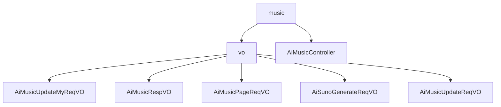

# 基础信息

|      |      |
|------|------|
| 编码语言 | .java |
| 代码路径 | yudao-module-ai/yudao-module-ai-biz/src/main/java/cn/iocoder/yudao/module/ai/controller/admin/music |
| 包名 | cn.iocoder.yudao.module.ai.controller.admin.music |
| 概述说明 | 管理后台AI音乐系统通过多个数据结构处理音乐修改、生成和查询请求，包括编号、音乐名称、状态等关键字段，确保请求的唯一性和灵活性。系统提供RESTful API，支持用户和管理员操作，如音乐生成、删除、修改及分页查询，所有操作均经过权限验证，保障数据安全。API设计全面，满足日常运营需求。 |

# 说明

管理后台AI音乐系统通过一系列数据结构支持音乐修改、生成和查询请求的处理。管理后台AI修改音乐请求VO包含编号和音乐名称两个字段，编号为必填项，确保请求的唯一性和可追溯性，音乐名称为选填项，提供灵活性。管理后台AI音乐响应VO则包含更多详细信息，如唯一编号、用户编号、音乐名称、歌词、图片地址、音频地址、视频地址、音乐状态、描述词、提示词、模型平台、模型字段、生成模式、音乐风格标签、音乐时长、是否发布、任务编号、错误信息和创建时间，这些信息共同构成完整的AI音乐生成记录。管理后台AI音乐分页请求VO用于分页查询AI音乐信息，包含用户编号、音乐名称、音乐状态、生成模式、是否发布和创建时间等字段，支持精确查询和筛选。AI音乐生成请求包含平台、生成模式（描述模式和歌词模式）、歌词提示、是否生成纯音乐、模型、音乐风格和音乐名称等关键信息，确保生成的音乐符合用户需求。管理后台AI音乐修改请求VO包含编号和是否发布两个字段，编号为必填项，示例值为15583，是否发布的示例值为true，确保每个请求有唯一标识和明确发布状态。

该代码实现了一个AI音乐管理后台的RESTful API，主要功能涵盖了用户和管理员两方面的操作。普通用户可以通过系统获取个人音乐分页，查看自己的音乐列表，并生成新的音乐、删除已有的音乐记录，以及修改音乐的标题。这些操作都经过权限验证，确保只有授权用户才能访问和修改自己的音乐数据。管理员用户则拥有更高级的功能，包括对所有音乐记录的分页查询、删除和更新操作。管理员可以查看和管理所有用户的音乐数据，这些操作同样经过严格的权限验证，以确保数据的安全性和系统的稳定性。整体而言，该API设计合理，功能全面，能够有效支持AI音乐管理后台的日常运营需求。

### 包内部结构视图

### 描述信息：
该Mermaid图展示了`music`文件夹与其子文件夹`vo`之间的关系，以及`vo`文件夹中的多个VO类文件。`AiMusicController`类直接位于`music`文件夹下，而`vo`文件夹包含了多个与音乐相关的请求和响应VO类。

# 文件列表 File List

| 名称   | 类型  | 说明 |
|-------|------|-------------|
| [AiMusicController.java](AiMusicController.md) | file | 该代码实现了一个AI音乐管理后台的RESTful API，支持用户和管理员功能。用户可获取、生成、删除、修改个人音乐记录；管理员可查询、删除、更新音乐。所有操作均需权限验证，确保数据安全。 |
| [vo](vo/_package.md) | folder | 管理后台AI涉及多个数据结构，用于处理音乐生成、修改和查询。音乐修改请求VO包含必填的编号和选填的音乐名称，确保请求的唯一性和灵活性。音乐响应VO详细记录音乐生成信息，包括编号、用户编号、音乐名称、歌词、图片地址、音频地址、视频地址、音乐状态、描述词、提示词、模型平台、模型、生成模式、音乐风格标签、音乐时长、是否发布、任务编号、错误信息和创建时间。音乐分页请求VO支持分页查询，包含用户编号、音乐名称、音乐状态、生成模式、是否发布和创建时间等字段。音乐生成请求VO要求必填平台和生成模式，可选音乐风格和名称，支持描述模式和歌词模式，用户可选择生成纯音乐。这些数据结构确保音乐生成、修改和查询的高效性和准确性。 |

