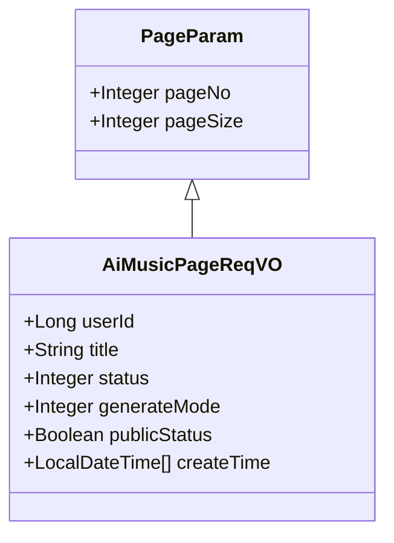
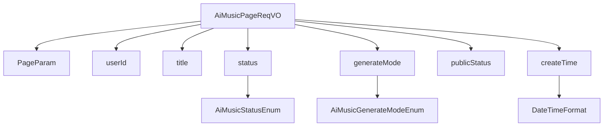

# 基础信息

|      |      |
|------|------|
| 编码语言 | .java |
| 代码路径 | yudao-module-ai/yudao-module-ai-biz/src/main/java/cn/iocoder/yudao/module/ai/controller/admin/music/vo/AiMusicPageReqVO.java |
| 包名 | cn.iocoder.yudao.module.ai.controller.admin.music.vo |
| 依赖项 | ['cn.iocoder.yudao.framework.common.pojo.PageParam', 'cn.iocoder.yudao.framework.common.validation.InEnum', 'cn.iocoder.yudao.module.ai.enums.music.AiMusicGenerateModeEnum', 'cn.iocoder.yudao.module.ai.enums.music.AiMusicStatusEnum', 'io.swagger.v3.oas.annotations.media.Schema', 'lombok.Data', 'lombok.EqualsAndHashCode', 'lombok.ToString', 'org.springframework.format.annotation.DateTimeFormat', 'java.time.LocalDateTime', 'cn.iocoder.yudao.framework.common.util.date.DateUtils.FORMAT_YEAR_MONTH_DAY_HOUR_MINUTE_SECOND'] |
| 概述说明 | 管理后台AI音乐分页请求VO包含用户编号、音乐名称、音乐状态、生成模式、是否发布及创建时间等关键字段，用于分页查询AI音乐信息。 |

# 说明

管理后台AI音乐分页请求VO是一个用于分页查询AI音乐信息的数据结构，包含了多个关键字段以支持精确查询和筛选。其中，用户编号用于标识请求音乐信息的用户身份，确保数据查询的准确性和安全性。音乐名称字段允许用户根据特定的音乐名称进行搜索，便于快速定位目标音乐。音乐状态字段用于筛选不同状态的音乐，例如已完成、生成中或失败等，帮助用户了解音乐生成进度或状态。生成模式字段则区分了音乐生成的不同方式或类型，可能包括自动生成、手动生成或其他特定模式，便于用户根据需求筛选。是否发布字段用于区分音乐是否已经对外发布，帮助用户管理已发布和未发布的音乐内容。创建时间字段记录了音乐的生成时间，支持按时间范围进行查询，便于用户根据时间顺序筛选或排序音乐信息。这些字段共同构成了一个全面的查询条件，使得管理后台能够高效、灵活地处理AI音乐的分页请求，满足用户对音乐信息的多样化需求。

# 类列表 Class Summary

| 名称   | 类型  | 说明 |
|-------|------|-------------|
| AiMusicPageReqVO | class | 管理后台AI音乐分页请求VO包含用户编号、音乐名称、音乐状态、生成模式、是否发布及创建时间等关键字段，用于分页查询AI音乐信息。 |

## 类 AiMusicPageReqVO

|      |      |
|------|------|
| 访问范围 | @Schema(description = "管理后台 - AI 音乐分页 Request VO");@Data;public |
| 类型 | class |
| 名称 | AiMusicPageReqVO |
| 说明 | 管理后台AI音乐分页请求VO包含用户编号、音乐名称、音乐状态、生成模式、是否发布及创建时间等关键字段，用于分页查询AI音乐信息。 |

### UML类图

### 描述信息：
该UML类图展示了`AiMusicPageReqVO`类继承自`PageParam`类的关系。`AiMusicPageReqVO`类包含了多个属性，如`userId`、`title`、`status`等，用于管理后台的AI音乐分页请求。`PageParam`类则提供了分页相关的属性`pageNo`和`pageSize`。

### 内部方法调用关系图

### 描述信息：
该图展示了 `AiMusicPageReqVO` 类与其相关属性和枚举类之间的调用关系。`AiMusicPageReqVO` 继承自 `PageParam`，并包含多个属性如 `userId`、`title`、`status` 等。其中 `status` 和 `generateMode` 分别与 `AiMusicStatusEnum` 和 `AiMusicGenerateModeEnum` 枚举类相关联，`createTime` 则与 `DateTimeFormat` 相关联。

### 字段列表 Field List

| 名称  | 类型  | 说明 |
|-------|-------|------|
| userId | Long | 用户编号为长整型，示例值为12212。 |
| title | String | 音乐名称字段，示例为“夜空中最亮的星”。 |
| publicStatus | Boolean | 是否发布，示例值为true，用于表示发布状态。 |
| status | Integer | 音乐状态字段，类型为整数，示例值为20，需符合AiMusicStatusEnum枚举类定义的状态值。 |
| generateMode | Integer | 生成模式由整数表示，具体值需符合AiMusicGenerateModeEnum枚举类中的定义，用于指定音乐生成的方式。 |
| createTime | LocalDateTime[] | 该代码片段定义了一个名为`createTime`的私有变量，类型为`LocalDateTime`数组，用于存储创建时间。通过`@Schema`注解描述其用途为“创建时间”，并使用`@DateTimeFormat`注解指定时间格式为“年-月-日 时:分:秒”。 |

### 方法列表 Method List

| 名称  | 类型  | 说明 |
|-------|-------|------|

