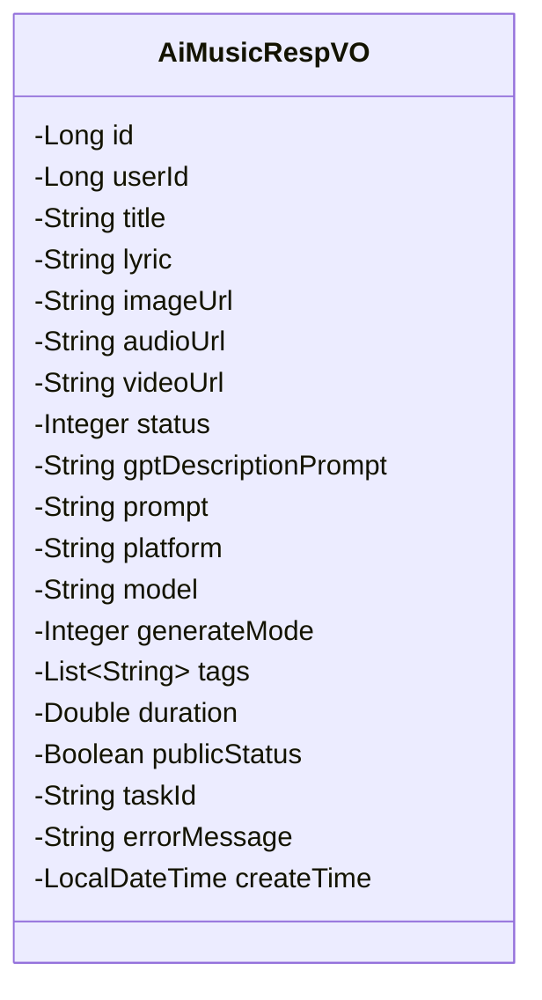

# 基础信息

|      |      |
|------|------|
| 编码语言 | .java |
| 代码路径 | yudao-module-ai/yudao-module-ai-biz/src/main/java/cn/iocoder/yudao/module/ai/controller/admin/music/vo/AiMusicRespVO.java |
| 包名 | cn.iocoder.yudao.module.ai.controller.admin.music.vo |
| 依赖项 | ['io.swagger.v3.oas.annotations.media.Schema', 'lombok.Data', 'java.time.LocalDateTime', 'java.util.List'] |
| 概述说明 | 管理后台AI音乐响应VO包含编号、用户编号、音乐名称、歌词、图片地址、音频地址、视频地址、音乐状态、描述词、提示词、模型平台、模型、生成模式、音乐风格标签、音乐时长、是否发布、任务编号、错误信息和创建时间等关键信息。 |

# 说明

管理后台AI音乐响应VO包含了多个关键信息和细节，用于全面描述AI生成的音乐内容及其相关属性。首先，该VO包含一个唯一的编号，用于标识每一条音乐记录。用户编号则标识了生成该音乐的用户。音乐名称、歌词、图片地址、音频地址和视频地址分别提供了音乐的基本信息、视觉和听觉资源。音乐状态用于表示当前音乐的生成或发布状态，描述词和提示词则提供了生成音乐时的关键词和描述信息。模型平台和模型字段指明了生成音乐所使用的AI平台和具体模型。生成模式描述了音乐生成的方式，如自动或手动。音乐风格标签则对音乐的风格进行了分类和标记。音乐时长字段记录了音乐的总时长。是否发布字段表示该音乐是否已经对外发布。任务编号用于关联生成该音乐的任务记录。错误信息字段记录了在生成过程中可能出现的错误。最后，创建时间字段记录了该音乐生成的日期和时间。这些信息共同构成了一个完整的AI音乐生成记录，便于管理和追踪。

# 类列表 Class Summary

| 名称   | 类型  | 说明 |
|-------|------|-------------|
| AiMusicRespVO | class | 管理后台AI音乐响应VO包含编号、用户编号、音乐名称、歌词、图片地址、音频地址、视频地址、音乐状态、描述词、提示词、模型平台、模型、生成模式、音乐风格标签、音乐时长、是否发布、任务编号、错误信息和创建时间等关键信息。 |

## 类 AiMusicRespVO

|      |      |
|------|------|
| 访问范围 | @Schema(description = "管理后台 - AI 音乐 Response VO");@Data;public |
| 类型 | class |
| 名称 | AiMusicRespVO |
| 说明 | 管理后台AI音乐响应VO包含编号、用户编号、音乐名称、歌词、图片地址、音频地址、视频地址、音乐状态、描述词、提示词、模型平台、模型、生成模式、音乐风格标签、音乐时长、是否发布、任务编号、错误信息和创建时间等关键信息。 |

### UML类图

### 描述信息：
该UML类图展示了一个名为`AiMusicRespVO`的类，用于表示AI音乐生成后的响应数据。类中包含多个属性，如音乐编号、用户编号、音乐名称、歌词、图片地址、音频地址、视频地址等。这些属性用于描述AI生成音乐的相关信息，并包含音乐的状态、生成模式、风格标签等。

### 内部方法调用关系图

```mermaid
graph TD
    AiMusicRespVO --> id
    AiMusicRespVO --> userId
    AiMusicRespVO --> title
    AiMusicRespVO --> lyric
    AiMusicRespVO --> imageUrl
    AiMusicRespVO --> audioUrl
    AiMusicRespVO --> videoUrl
    AiMusicRespVO --> status
    AiMusicRespVO --> gptDescriptionPrompt
    AiMusicRespVO --> prompt
    AiMusicRespVO --> platform
    AiMusicRespVO --> model
    AiMusicRespVO --> generateMode
    AiMusicRespVO --> tags
    AiMusicRespVO --> duration
    AiMusicRespVO --> publicStatus
    AiMusicRespVO --> taskId
    AiMusicRespVO --> errorMessage
    AiMusicRespVO --> createTime
```

### 描述信息：
该图展示了 `AiMusicRespVO` 类与其各个属性之间的调用关系。`AiMusicRespVO` 类包含了多个属性，如 `id`、`userId`、`title` 等，这些属性通过 `-->` 符号与类进行关联。每个属性都代表了 AI 音乐响应对象的不同信息字段，如音乐名称、歌词、音频地址等。

### 字段列表 Field List

| 名称  | 类型  | 说明 |
|-------|-------|------|
| title | String | 音乐名称是必填项，示例为“夜空中最亮的星”。 |
| lyric | String | 歌词内容示例为“oh~卖糕的”。 |
| createTime | LocalDateTime | 创建时间是必填项，数据类型为LocalDateTime。 |
| userId | Long | 用户编号为必填项，类型为长整型，示例值为12212。 |
| imageUrl | String | 图片地址字段，类型为字符串，示例值为"https://www.iocoder.cn"。 |
| model | String | 模型为必填项，示例值为"chirp-v3.5"。 |
| publicStatus | Boolean | 该字段表示是否发布，类型为布尔值，必填项，示例值为“true”。 |
| id | Long | 编号为必填项，示例值为24790，数据类型为长整型。 |
| audioUrl | String | 音频地址字段，示例为"https://www.iocoder.cn"，用于存储音频文件的URL链接。 |
| gptDescriptionPrompt | String | 该信息描述了一个字符串类型的变量gptDescriptionPrompt，用于存储描述词，示例为“一首轻快的歌曲”。 |
| tags | List<String> | 音乐风格标签用于描述音乐作品的风格特征，通常以列表形式存储多个标签，以便更全面地展示音乐的风格属性。 |
| prompt | String | 提示词要求创作一首流行歌曲，包含轻松吉他旋律，主歌描述夏日海滩的宁静，副歌节奏加快，表达对自由的向往。 |
| platform | String | 模型平台为必填项，示例为Suno。 |
| status | Integer | 音乐状态为必填项，示例值为20，数据类型为整数。 |
| errorMessage | String | 错误信息字段，用于存储和描述发生的错误情况。 |
| taskId | String | 任务编号字段，示例值为11369，用于标识特定任务。 |
| generateMode | Integer | 生成模式为必填项，示例值为1，用于描述生成模式的具体设置。 |
| duration | Double | 音乐时长描述字段，示例值为流行、爵士、朋克等音乐类型，数据类型为双精度浮点数。 |
| videoUrl | String | 视频地址字段，示例为"https://www.iocoder.cn"，用于存储视频链接。 |

### 方法列表 Method List

| 名称  | 类型  | 说明 |
|-------|-------|------|

