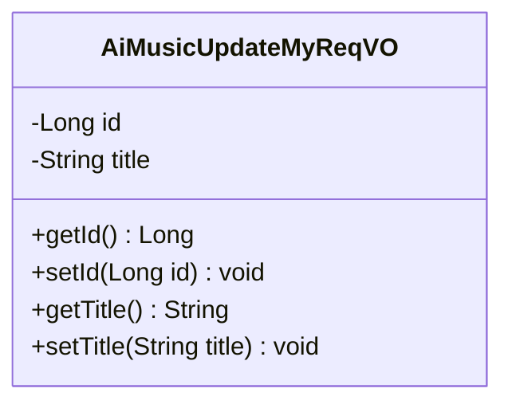
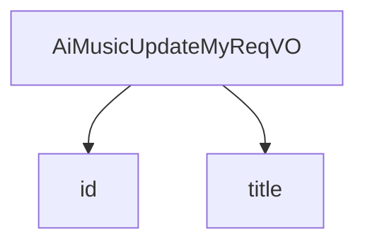

# 基础信息

|      |      |
|------|------|
| 编码语言 | .java |
| 代码路径 | yudao-module-ai/yudao-module-ai-biz/src/main/java/cn/iocoder/yudao/module/ai/controller/admin/music/vo/AiMusicUpdateMyReqVO.java |
| 包名 | cn.iocoder.yudao.module.ai.controller.admin.music.vo |
| 依赖项 | ['io.swagger.v3.oas.annotations.media.Schema', 'jakarta.validation.constraints.NotNull', 'lombok.Data'] |
| 概述说明 | 管理后台AI修改音乐请求VO包含编号和音乐名称两个字段，其中编号为必填项且不能为空，音乐名称为选填项。 |

# 说明

管理后台AI修改音乐请求VO是一个用于处理音乐修改请求的数据结构，包含两个主要字段：编号和音乐名称。其中，编号是必填项，且不能为空，这意味着每次请求都必须提供编号信息以确保请求的唯一性和可追溯性。音乐名称则是选填项，用户可以根据需要选择是否填写。这种设计使得请求VO在满足基本需求的同时，也提供了灵活性，允许用户在必要时提供额外的信息。通过这种方式，管理后台AI能够有效地处理音乐修改请求，确保数据的完整性和准确性。

# 类列表 Class Summary

| 名称   | 类型  | 说明 |
|-------|------|-------------|
| AiMusicUpdateMyReqVO | class | 管理后台AI修改音乐请求VO包含编号和音乐名称两个字段，编号为必填项且不能为空，音乐名称为选填项。 |

## 类 AiMusicUpdateMyReqVO

|      |      |
|------|------|
| 访问范围 | @Schema(description = "管理后台 - AI 修改我的音乐 Request VO");@Data;public |
| 类型 | class |
| 名称 | AiMusicUpdateMyReqVO |
| 说明 | 管理后台AI修改音乐请求VO包含编号和音乐名称两个字段，编号为必填项且不能为空，音乐名称为选填项。 |

### UML类图

### 描述信息：
该UML类图展示了一个名为`AiMusicUpdateMyReqVO`的类，用于管理后台AI修改音乐请求的数据结构。类中包含两个私有属性：`id`（编号）和`title`（音乐名称），并提供了相应的getter和setter方法用于访问和修改这些属性。

### 内部方法调用关系图

### 描述信息：
该图展示了 `AiMusicUpdateMyReqVO` 类与其属性 `id` 和 `title` 之间的调用关系。`AiMusicUpdateMyReqVO` 类包含两个主要属性：`id` 和 `title`，分别用于存储音乐的编号和名称。图中清晰地表示了类与属性之间的关联关系。

### 字段列表 Field List

| 名称  | 类型  | 说明 |
|-------|-------|------|
| title | String | 音乐名称字段，示例为“夜空中最亮的星”。 |
| id | Long | 编号为必填项，不能为空，示例值为15583。 |

### 方法列表 Method List

| 名称  | 类型  | 说明 |
|-------|-------|------|

