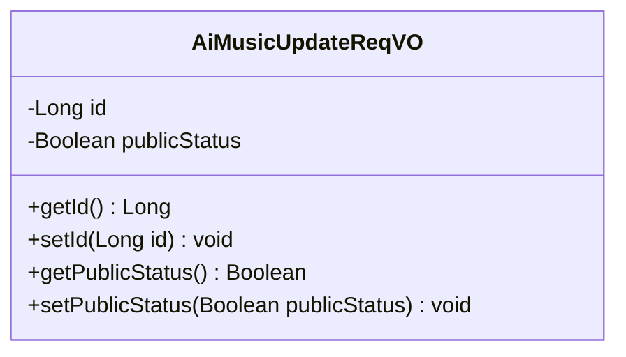
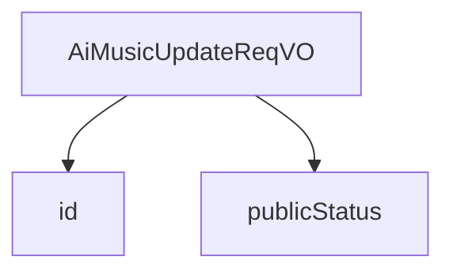

# 基础信息

|      |      |
|------|------|
| 编码语言 | .java |
| 代码路径 | yudao-module-ai/yudao-module-ai-biz/src/main/java/cn/iocoder/yudao/module/ai/controller/admin/music/vo/AiMusicUpdateReqVO.java |
| 包名 | cn.iocoder.yudao.module.ai.controller.admin.music.vo |
| 依赖项 | ['io.swagger.v3.oas.annotations.media.Schema', 'jakarta.validation.constraints.NotNull', 'lombok.Data'] |
| 概述说明 | 管理后台AI音乐修改请求VO包含两个关键字段：编号（必填，示例值15583）和是否发布（示例值true），其中编号字段不能为空。 |

# 说明

管理后台AI音乐修改请求VO包含两个关键字段：编号和是否发布。编号字段是必填项，不能为空，示例值为15583。是否发布字段的示例值为true。这两个字段共同构成了AI音乐修改请求的基本信息，确保每个请求都有唯一的标识和明确的发布状态。

# 类列表 Class Summary

| 名称   | 类型  | 说明 |
|-------|------|-------------|
| AiMusicUpdateReqVO | class | 管理后台AI音乐修改请求VO包含两个关键字段：编号（必填，示例值15583）和是否发布（示例值true）。编号字段不能为空。 |

## 类 AiMusicUpdateReqVO

|      |      |
|------|------|
| 访问范围 | @Schema(description = "管理后台 - AI 音乐修改 Request VO");@Data;public |
| 类型 | class |
| 名称 | AiMusicUpdateReqVO |
| 说明 | 管理后台AI音乐修改请求VO包含两个关键字段：编号（必填，示例值15583）和是否发布（示例值true）。编号字段不能为空。 |

### UML类图

### 描述信息：
该UML类图展示了一个名为`AiMusicUpdateReqVO`的类，用于管理后台AI音乐修改请求。类中包含两个私有属性：`id`（编号）和`publicStatus`（是否发布），并提供了相应的getter和setter方法。

### 内部方法调用关系图

### 描述信息：
该图展示了 `AiMusicUpdateReqVO` 类与其属性 `id` 和 `publicStatus` 之间的调用关系。`AiMusicUpdateReqVO` 类通过 `id` 和 `publicStatus` 两个属性来管理 AI 音乐的修改请求，其中 `id` 是必需的，而 `publicStatus` 用于标识音乐是否发布。

### 字段列表 Field List

| 名称  | 类型  | 说明 |
|-------|-------|------|
| id | Long | 编号为必填项，不能为空，示例值为15583。 |
| publicStatus | Boolean | 该字段表示发布状态，类型为布尔值，示例值为true。 |

### 方法列表 Method List

| 名称  | 类型  | 说明 |
|-------|-------|------|

