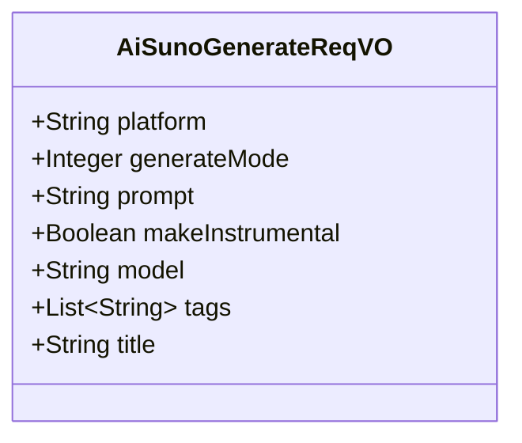
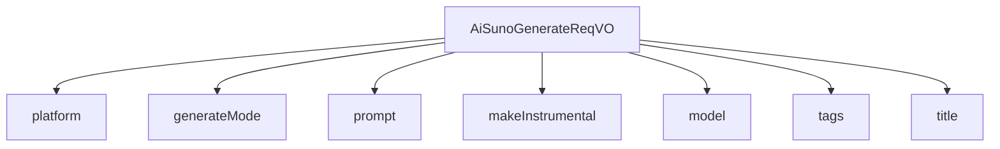

# 基础信息

|      |      |
|------|------|
| 编码语言 | .java |
| 代码路径 | yudao-module-ai/yudao-module-ai-biz/src/main/java/cn/iocoder/yudao/module/ai/controller/admin/music/vo/AiSunoGenerateReqVO.java |
| 包名 | cn.iocoder.yudao.module.ai.controller.admin.music.vo |
| 依赖项 | ['io.swagger.v3.oas.annotations.media.Schema', 'jakarta.validation.constraints.NotBlank', 'jakarta.validation.constraints.NotEmpty', 'jakarta.validation.constraints.NotNull', 'lombok.Data', 'java.util.List'] |
| 概述说明 | 管理后台AI音乐生成请求需包含平台、生成模式（描述模式或歌词模式）、歌词提示、是否纯音乐、模型（必填）、音乐风格和音乐名称（可选）。平台和生成模式为必填项。 |

# 说明

管理后台的AI音乐生成请求包含多个关键信息，其中平台和生成模式是必填项。平台指的是用户使用的系统或服务，而生成模式分为两种：描述模式和歌词模式。描述模式允许用户通过输入描述性文本来生成音乐，而歌词模式则基于用户提供的歌词提示来生成音乐音频。歌词提示是生成音乐的重要输入，用于指导AI创作与歌词内容相匹配的音乐。此外，用户可以选择是否生成纯音乐，即不含歌词的音乐作品。模型也是必填项，决定了AI生成音乐时所使用的算法和技术框架。音乐风格和音乐名称是可选项，用户可以根据需求选择特定的音乐风格（如流行、古典、摇滚等）或为生成的音乐命名。这些信息共同构成了AI音乐生成请求的核心内容，确保生成的音乐符合用户的需求和预期。

# 类列表 Class Summary

| 名称   | 类型  | 说明 |
|-------|------|-------------|
| AiSunoGenerateReqVO | class | 管理后台AI音乐生成请求包含平台、生成模式、歌词提示、是否纯音乐、模型、音乐风格和音乐名称等关键信息。平台和生成模式为必填项，生成模式分为描述模式和歌词模式。歌词提示用于生成音乐音频，模型为必填项，音乐风格和音乐名称为可选项。 |

## 类 AiSunoGenerateReqVO

|      |      |
|------|------|
| 访问范围 | @Schema(description = "管理后台 - AI 音乐生成 Request VO");@Data;public |
| 类型 | class |
| 名称 | AiSunoGenerateReqVO |
| 说明 | 管理后台AI音乐生成请求包含平台、生成模式、歌词提示、是否纯音乐、模型、音乐风格和音乐名称等关键信息。平台和生成模式为必填项，生成模式分为描述模式和歌词模式。歌词提示用于生成音乐音频，模型为必填项，音乐风格和音乐名称为可选项。 |

### UML类图

### 描述信息：
该UML类图展示了一个名为`AiSunoGenerateReqVO`的类，用于管理后台AI音乐生成的请求。类中包含多个属性，如平台、生成模式、歌词提示、是否纯音乐、模型、音乐风格和音乐名称等。这些属性用于描述生成音乐所需的参数和配置。

### 内部方法调用关系图

### 描述信息：
该图展示了 `AiSunoGenerateReqVO` 类与其属性之间的调用关系。`AiSunoGenerateReqVO` 类包含了多个属性，如 `platform`、`generateMode`、`prompt` 等，这些属性通过 `-->` 符号与类进行关联。每个属性都用于描述 AI 音乐生成请求的不同方面，如平台、生成模式、歌词提示等。

### 字段列表 Field List

| 名称  | 类型  | 说明 |
|-------|-------|------|
| platform | String | 平台字段为必填项，不能为空，示例值为"Suno"。 |
| title | String | 音乐/歌曲名称字段，示例为“夜空中最亮的星”。 |
| generateMode | Integer | 生成模式为必填项，不能为空，示例值为2，数据类型为整数。 |
| tags | List<String> | 音乐风格描述，包含多种风格标签，如流行、爵士、朋克等。 |
| model | String | 模型字段为必填项，不能为空，示例值为"chirp-v3.5"。 |
| makeInstrumental | Boolean | 该字段用于标识是否为纯音乐，示例值为“true”，表示是纯音乐。 |
| prompt | String | 该描述用于生成音乐音频的歌词提示，包含两种模式：描述模式和歌词模式。描述模式指导创作带有轻松吉他旋律的流行歌曲，分为描述夏日海滩宁静的[verse]和表达自由向往的[chorus]。歌词模式提供具体的歌词示例，分为[Verse]和[Chorus]两部分，分别描述欢快的假期氛围和对冒险的期待。 |

### 方法列表 Method List

| 名称  | 类型  | 说明 |
|-------|-------|------|

