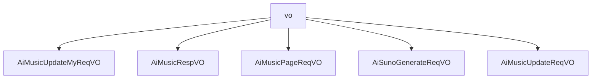

# 基础信息

|      |      |
|------|------|
| 编码语言 | .java |
| 代码路径 | yudao-module-ai/yudao-module-ai-biz/src/main/java/cn/iocoder/yudao/module/ai/controller/admin/music/vo |
| 包名 | cn.iocoder.yudao.module.ai.controller.admin.music.vo |
| 概述说明 | 管理后台AI涉及多个数据结构，用于处理音乐生成、修改和查询。音乐修改请求VO包含必填的编号和选填的音乐名称，确保请求的唯一性和灵活性。音乐响应VO详细记录音乐生成信息，包括编号、用户编号、音乐名称、歌词、图片地址、音频地址、视频地址、音乐状态、描述词、提示词、模型平台、模型、生成模式、音乐风格标签、音乐时长、是否发布、任务编号、错误信息和创建时间。音乐分页请求VO支持分页查询，包含用户编号、音乐名称、音乐状态、生成模式、是否发布和创建时间等字段。音乐生成请求VO要求必填平台和生成模式，可选音乐风格和名称，支持描述模式和歌词模式，用户可选择生成纯音乐。这些数据结构确保音乐生成、修改和查询的高效性和准确性。 |

# 说明

管理后台AI修改音乐请求VO是一个用于处理音乐修改请求的数据结构，包含两个主要字段：编号和音乐名称。编号是必填项，且不能为空，确保请求的唯一性和可追溯性；音乐名称是选填项，提供灵活性。管理后台AI音乐响应VO则包含多个关键信息，如唯一编号、用户编号、音乐名称、歌词、图片地址、音频地址、视频地址、音乐状态、描述词、提示词、模型平台、模型字段、生成模式、音乐风格标签、音乐时长、是否发布、任务编号、错误信息和创建时间，这些信息共同构成完整的AI音乐生成记录。管理后台AI音乐分页请求VO用于分页查询AI音乐信息，包含用户编号、音乐名称、音乐状态、生成模式、是否发布和创建时间等字段，支持精确查询和筛选。AI音乐生成请求包含平台、生成模式（描述模式和歌词模式）、歌词提示、是否生成纯音乐、模型、音乐风格和音乐名称等关键信息，确保生成的音乐符合用户需求。管理后台AI音乐修改请求VO包含编号和是否发布两个字段，编号为必填项，示例值为15583，是否发布的示例值为true，确保每个请求有唯一标识和明确发布状态。这些数据结构共同支持管理后台高效处理音乐修改、生成和查询请求。

### 包内部结构视图

### 描述信息：
该Mermaid图展示了`vo`文件夹下的五个Java文件之间的调用关系。`vo`作为根节点，包含了`AiMusicUpdateMyReqVO`、`AiMusicRespVO`、`AiMusicPageReqVO`、`AiSunoGenerateReqVO`和`AiMusicUpdateReqVO`五个子节点，表示这些文件都位于`vo`文件夹下，并且它们之间没有直接的调用关系，仅展示了文件与文件夹的层级关系。

# 文件列表 File List

| 名称   | 类型  | 说明 |
|-------|------|-------------|
| [AiMusicUpdateReqVO.java](AiMusicUpdateReqVO.md) | file | 管理后台AI音乐修改请求VO包含两个关键字段：编号（必填，示例值15583）和是否发布（示例值true），其中编号字段不能为空。 |
| [AiSunoGenerateReqVO.java](AiSunoGenerateReqVO.md) | file | 管理后台AI音乐生成请求需包含平台、生成模式（描述模式或歌词模式）、歌词提示、是否纯音乐、模型（必填）、音乐风格和音乐名称（可选）。平台和生成模式为必填项。 |
| [AiMusicPageReqVO.java](AiMusicPageReqVO.md) | file | 管理后台AI音乐分页请求VO包含用户编号、音乐名称、音乐状态、生成模式、是否发布及创建时间等关键字段，用于分页查询AI音乐信息。 |
| [AiMusicRespVO.java](AiMusicRespVO.md) | file | 管理后台AI音乐响应VO包含编号、用户编号、音乐名称、歌词、图片地址、音频地址、视频地址、音乐状态、描述词、提示词、模型平台、模型、生成模式、音乐风格标签、音乐时长、是否发布、任务编号、错误信息和创建时间等关键信息。 |
| [AiMusicUpdateMyReqVO.java](AiMusicUpdateMyReqVO.md) | file | 管理后台AI修改音乐请求VO包含编号和音乐名称两个字段，其中编号为必填项且不能为空，音乐名称为选填项。 |

