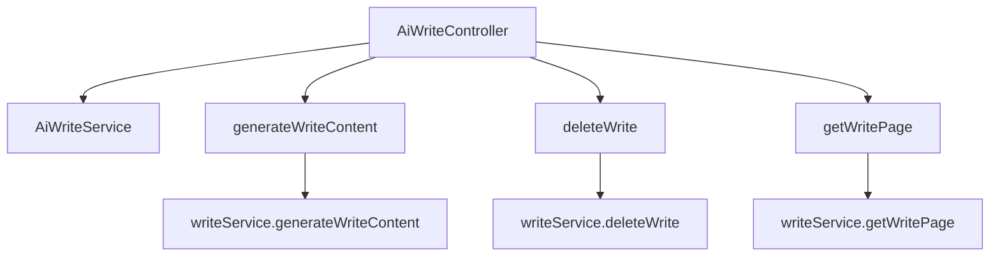

# 基础信息

|      |      |
|------|------|
| 编码语言 | .java |
| 代码路径 | yudao-module-ai/yudao-module-ai-biz/src/main/java/cn/iocoder/yudao/module/ai/controller/admin/write/AiWriteController.java |
| 包名 | cn.iocoder.yudao.module.ai.controller.admin.write |
| 依赖项 | ['cn.iocoder.yudao.framework.common.pojo.CommonResult', 'cn.iocoder.yudao.framework.common.pojo.PageResult', 'cn.iocoder.yudao.framework.common.util.object.BeanUtils', 'cn.iocoder.yudao.module.ai.controller.admin.write.vo.AiWriteGenerateReqVO', 'cn.iocoder.yudao.module.ai.controller.admin.write.vo.AiWritePageReqVO', 'cn.iocoder.yudao.module.ai.controller.admin.write.vo.AiWriteRespVO', 'cn.iocoder.yudao.module.ai.dal.dataobject.write.AiWriteDO', 'cn.iocoder.yudao.module.ai.service.write.AiWriteService', 'io.swagger.v3.oas.annotations.Operation', 'io.swagger.v3.oas.annotations.Parameter', 'io.swagger.v3.oas.annotations.tags.Tag', 'jakarta.annotation.Resource', 'jakarta.annotation.security.PermitAll', 'jakarta.validation.Valid', 'org.springframework.http.MediaType', 'org.springframework.security.access.prepost.PreAuthorize', 'org.springframework.web.bind.annotation', 'reactor.core.publisher.Flux', 'cn.iocoder.yudao.framework.common.pojo.CommonResult.success', 'cn.iocoder.yudao.framework.security.core.util.SecurityFrameworkUtils.getLoginUserId'] |
| 概述说明 | 管理后台的AI写作控制器支持流式写作生成、删除写作和获取写作分页功能。流式生成通过POST请求快速响应；删除写作需权限验证，通过DELETE请求实现；获取写作分页需权限验证，通过GET请求返回分页结果。 |

# 说明

管理后台的AI写作控制器提供了三项主要功能：流式写作生成、删除写作和获取写作分页。流式写作生成功能通过POST请求实现，能够快速响应用户的写作需求，生成内容。删除写作功能则需要权限验证，通过DELETE请求来执行，确保只有授权用户才能删除写作内容。获取写作分页功能同样需要权限验证，通过GET请求返回分页结果，方便用户浏览和管理大量的写作内容。这些功能共同构成了一个高效、安全的AI写作管理后台，满足了用户对写作内容的生成、删除和查看的需求。

# 类列表 Class Summary

| 名称   | 类型  | 说明 |
|-------|------|-------------|
| AiWriteController | class | 管理后台的AI写作控制器提供流式写作生成、删除写作和获取写作分页功能。流式生成通过POST请求实现，快速响应；删除写作需权限验证，通过DELETE请求实现；获取写作分页需权限验证，通过GET请求返回分页结果。 |


## 类 AiWriteController

|      |      |
|------|------|
| 访问范围 | @Tag(name = "管理后台 - AI 写作");@RestController;@RequestMapping("/ai/write");public |
| 类型 | class |
| 名称 | AiWriteController |
| 说明 | 管理后台的AI写作控制器提供流式写作生成、删除写作和获取写作分页功能。流式生成通过POST请求实现，快速响应；删除写作需权限验证，通过DELETE请求实现；获取写作分页需权限验证，通过GET请求返回分页结果。 |


### UML类图

```mermaid
classDiagram
    class AiWriteController {
        +AiWriteService writeService
        +generateWriteContent(AiWriteGenerateReqVO generateReqVO) Flux~CommonResult~String~~
        +deleteWrite(Long id) CommonResult~Boolean~
        +getWritePage(AiWritePageReqVO pageReqVO) CommonResult~PageResult~AiWriteRespVO~~
    }

    class AiWriteService {
        +generateWriteContent(AiWriteGenerateReqVO generateReqVO, Long userId) Flux~CommonResult~String~~
        +deleteWrite(Long id) void
        +getWritePage(AiWritePageReqVO pageReqVO) PageResult~AiWriteDO~
    }

    class AiWriteGenerateReqVO {
        +String content
        +Long userId
    }

    class AiWritePageReqVO {
        +Integer pageNo
        +Integer pageSize
    }

    class AiWriteRespVO {
        +Long id
        +String content
    }

    class AiWriteDO {
        +Long id
        +String content
    }

    class CommonResult~T~ {
        +Integer code
        +String message
        +T data
    }

    class PageResult~T~ {
        +List~T~ list
        +Long total
    }

    AiWriteController --> AiWriteService : depends on
    AiWriteController --> AiWriteGenerateReqVO : uses
    AiWriteController --> AiWritePageReqVO : uses
    AiWriteController --> AiWriteRespVO : uses
    AiWriteService --> AiWriteDO : uses
    AiWriteService --> PageResult~AiWriteDO~ : uses
    AiWriteService --> CommonResult~String~ : uses
    AiWriteService --> CommonResult~Boolean~ : uses
    AiWriteService --> CommonResult~PageResult~AiWriteRespVO~~ : uses
```

### 描述信息：
该UML类图展示了`AiWriteController`与`AiWriteService`之间的依赖关系，以及它们与多个数据对象（如`AiWriteGenerateReqVO`、`AiWritePageReqVO`、`AiWriteRespVO`等）的交互。`AiWriteController`通过调用`AiWriteService`的方法来处理AI写作的生成、删除和分页查询请求。


### 内部方法调用关系图



### 描述信息：
该图展示了`AiWriteController`类中的三个主要方法`generateWriteContent`、`deleteWrite`和`getWritePage`与`AiWriteService`之间的调用关系。每个方法都调用了`AiWriteService`中的相应方法来完成具体的业务逻辑，如生成写作内容、删除写作记录和获取写作分页数据。

### 字段列表 Field List

| 名称  | 类型  | 说明 |
|-------|-------|------|
| writeService | AiWriteService | 在代码中，通过@Resource注解注入了一个名为writeService的AiWriteService实例，用于调用相关服务功能。 |

### 方法列表 Method List

| 名称  | 类型  | 说明 |
|-------|-------|------|
| getWritePage | CommonResult<PageResult<AiWriteRespVO>> | 该代码定义了一个GET请求接口"/page"，用于获取写作分页数据。接口需要用户具备"ai:write:query"权限，接收AiWritePageReqVO参数并返回分页结果，结果类型为AiWriteRespVO。 |
| deleteWrite | CommonResult<Boolean> | 该代码定义了一个删除写作的API接口，使用DELETE方法，路径为"/delete"。接口需要传入编号(id)作为参数，且调用者需具备"ai:write:delete"权限。调用成功后返回布尔值表示删除操作的结果。 |
| generateWriteContent | Flux<CommonResult<String>> | 该接口通过POST请求处理写作生成任务，采用流式返回方式，响应速度较快。接口路径为"/generate-stream"，返回类型为Flux<CommonResult<String>>，接受一个经过验证的AiWriteGenerateReqVO对象作为请求体。使用@PermitAll注解避免SSE响应被拦截，调用writeService的generateWriteContent方法并传入当前登录用户ID进行处理。 |


