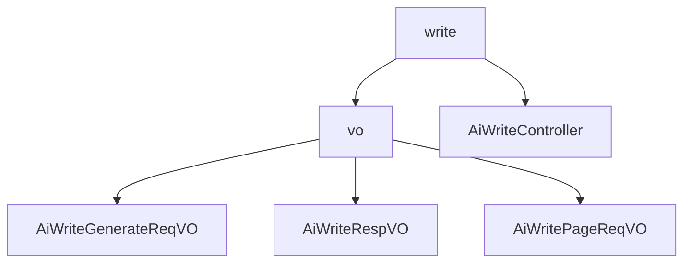

# 基础信息

|      |      |
|------|------|
| 编码语言 | .java |
| 代码路径 | yudao-module-ai/yudao-module-ai-biz/src/main/java/cn/iocoder/yudao/module/ai/controller/admin/write |
| 包名 | cn.iocoder.yudao.module.ai.controller.admin.write |
| 概述说明 | 管理后台的AI写作系统设计包括请求类、响应VO和分页请求VO，确保生成文本符合用户需求。请求类包含必填字段（写作类型、长度、格式、语气、语言）和可选字段（内容提示、原文），通过验证保证数据有效性。响应VO记录生成内容及其元数据，包含必填项（编号、用户编号、平台、模型、生成内容提示、创建时间）和可选字段（写作类型、生成内容、原文等），便于追踪和管理。分页请求VO用于分页查询，包含用户编号、写作类型、平台、创建时间等字段，支持高效查询和管理。控制器提供流式写作生成、删除写作和获取写作分页功能，满足用户生成、删除和查看写作内容的需求。 |

# 说明

管理后台的AI写作系统设计旨在提供一个高效、灵活且安全的平台，以满足用户对文本生成的需求。系统核心包括请求类设计、响应VO数据结构、分页请求VO数据结构以及控制器功能。请求类设计确保生成的文本符合用户需求，包含多个必填字段和可选字段。必填字段包括写作类型、长度、格式、语气和语言，这些字段通过枚举或非空验证确保数据的有效性和完整性。可选字段如写作内容提示和原文，为用户提供更大的灵活性，帮助AI生成更符合预期的内容。

响应VO数据结构用于记录和管理AI写作生成的内容及其相关元数据，包含必填项如编号、用户编号、平台、模型、生成内容提示和创建时间，以及其他可选字段如写作类型、生成内容、原文、长度提示词、格式提示词、语气提示词、语言提示词和错误信息。这些字段确保管理后台可以全面追踪和管理AI写作的生成过程及其结果。

分页请求VO数据结构用于分页查询AI写作记录，包含用户编号、写作类型、平台和创建时间等关键信息字段，帮助管理后台高效地进行分页查询，获取用户在不同平台上、特定时间段内、特定类型的AI写作记录。

控制器功能包括流式写作生成、删除写作和获取写作分页。流式写作生成功能通过POST请求实现，快速响应用户需求；删除写作功能通过DELETE请求执行，需权限验证；获取写作分页功能通过GET请求返回分页结果，需权限验证。这些功能共同构成了一个高效、安全的AI写作管理后台，满足用户对写作内容的生成、删除和查看的需求。

### 包内部结构视图

### 描述信息：
该Mermaid图展示了`yudao-module-ai`模块中`write`文件夹及其子文件夹`vo`之间的调用关系。`write`文件夹包含`AiWriteController`，而`vo`文件夹包含`AiWriteGenerateReqVO`、`AiWriteRespVO`和`AiWritePageReqVO`三个文件。图中清晰地展示了文件与文件夹之间的层级关系。

# 文件列表 File List

| 名称   | 类型  | 说明 |
|-------|------|-------------|
| [AiWriteController.java](AiWriteController.md) | file | 管理后台的AI写作控制器支持流式写作生成、删除写作和获取写作分页功能。流式生成通过POST请求快速响应；删除写作需权限验证，通过DELETE请求实现；获取写作分页需权限验证，通过GET请求返回分页结果。 |
| [vo](vo/_package.md) | folder | 管理后台AI写作系统设计包含请求类、响应VO和分页请求VO。请求类包括必填字段（写作类型、长度、格式、语气、语言）和可选字段（内容提示、原文），确保生成文本符合需求。响应VO记录生成内容及其元数据，包含必填项（编号、用户编号、平台、模型、提示、创建时间）和可选字段（写作类型、生成内容、原文、提示词、错误信息），用于追踪和管理生成过程。分页请求VO用于分页查询，包含用户编号、写作类型、平台、创建时间等字段，支持按用户、平台、时间范围筛选记录，便于数据管理和分析。 |

