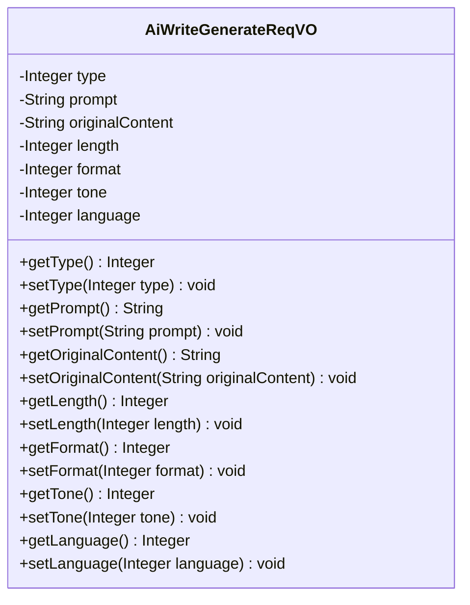
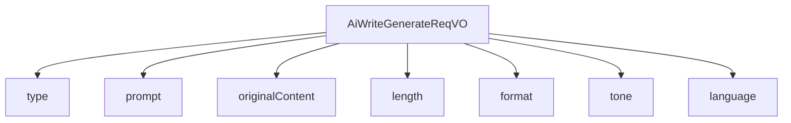

# 基础信息

|      |      |
|------|------|
| 编码语言 | .java |
| 代码路径 | yudao-module-ai/yudao-module-ai-biz/src/main/java/cn/iocoder/yudao/module/ai/controller/admin/write/vo/AiWriteGenerateReqVO.java |
| 包名 | cn.iocoder.yudao.module.ai.controller.admin.write.vo |
| 依赖项 | ['cn.iocoder.yudao.framework.common.validation.InEnum', 'cn.iocoder.yudao.module.ai.enums.write.AiWriteTypeEnum', 'io.swagger.v3.oas.annotations.media.Schema', 'jakarta.validation.constraints.NotNull', 'lombok.Data'] |
| 概述说明 | 管理后台AI写作生成请求类包含必填字段：写作类型、长度、格式、语气和语言；可选字段为写作内容提示和原文。所有字段通过枚举或非空验证确保数据有效性。 |

# 说明

管理后台的AI写作生成请求类设计包含多个必填字段和可选字段，以确保生成的文本符合用户需求。必填字段包括写作类型、长度、格式、语气和语言。写作类型用于指定生成文本的类别或用途，长度规定了文本的字数或篇幅，格式定义了文本的结构或样式，语气决定了文本的表达方式（如正式、轻松等），而语言则指定了文本使用的语种。这些必填字段通过枚举或非空验证来确保数据的有效性和完整性，避免生成不符合要求的文本。

此外，请求类还提供了两个可选字段：写作内容提示和原文。写作内容提示可以为AI提供生成文本的方向或主题，帮助生成更符合用户预期的内容。原文字段则允许用户提供参考文本，AI可以基于此进行改写或扩展。这些可选字段为用户提供了更大的灵活性，使其能够根据具体需求调整生成内容。

通过这种设计，管理后台的AI写作生成功能能够满足多样化的写作需求，同时确保生成内容的质量和准确性。

# 类列表 Class Summary

| 名称   | 类型  | 说明 |
|-------|------|-------------|
| AiWriteGenerateReqVO | class | 管理后台AI写作生成请求类包含以下必填字段：写作类型、长度、格式、语气和语言；可选字段为写作内容提示和原文。所有字段均通过枚举或非空验证确保数据有效性。 |

## 类 AiWriteGenerateReqVO

|      |      |
|------|------|
| 访问范围 | @Schema(description = "管理后台 - AI 写作生成 Request VO");@Data;public |
| 类型 | class |
| 名称 | AiWriteGenerateReqVO |
| 说明 | 管理后台AI写作生成请求类包含以下必填字段：写作类型、长度、格式、语气和语言；可选字段为写作内容提示和原文。所有字段均通过枚举或非空验证确保数据有效性。 |

### UML类图

### 描述信息：
该UML类图展示了`AiWriteGenerateReqVO`类的结构，包含了多个私有属性和对应的公共getter和setter方法。类中的属性包括写作类型、内容提示、原文、长度、格式、语气和语言等，用于管理后台的AI写作生成请求。

### 内部方法调用关系图

### 描述信息：
该图展示了`AiWriteGenerateReqVO`类与其属性之间的调用关系。`AiWriteGenerateReqVO`类包含了多个属性，如`type`、`prompt`、`originalContent`等，每个属性都通过`-->`符号与类进行关联。这些属性用于管理后台的AI写作生成请求，确保请求数据的完整性和有效性。

### 字段列表 Field List

| 名称  | 类型  | 说明 |
|-------|-------|------|
| prompt | String | 写作内容提示包括撰写田忌赛马和回复不批。 |
| format | Integer | 格式字段为必填项，类型为整数，不能为空，示例值为1。 |
| length | Integer | 描述说明了一个必需的整数类型字段“length”，该字段不能为空，且示例值为1。 |
| originalContent | String | 原文描述了一个辞职请求，关键信息包括“领导”和“辞职”，表明某人向领导提出辞职意愿。 |
| tone | Integer | 该代码片段定义了一个名为“tone”的私有整型变量，用于表示语气。该变量被标记为必需字段，不能为空，且示例值为1。 |
| language | Integer | 语言字段为必填项，不能为空，示例值为1。 |
| type | Integer | 该代码片段定义了一个名为“type”的私有整型变量，用于表示写作类型。该变量通过注解指定为必填项，且其值必须符合AiWriteTypeEnum枚举类中的定义，否则会返回错误信息“写作类型必须是 {value}”。示例值为1。 |

### 方法列表 Method List

| 名称  | 类型  | 说明 |
|-------|-------|------|

