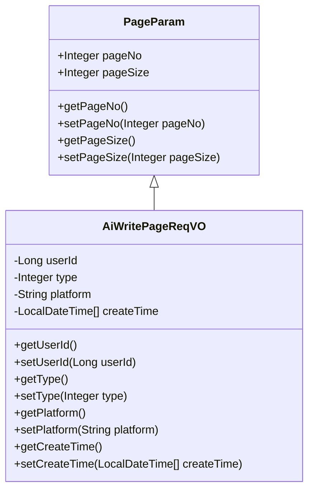
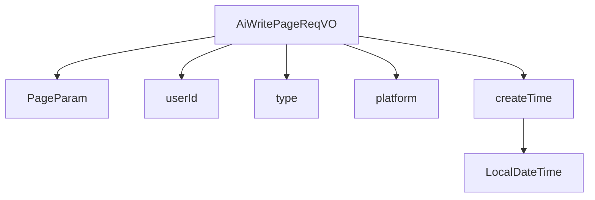

# 基础信息

|      |      |
|------|------|
| 编码语言 | .java |
| 代码路径 | yudao-module-ai/yudao-module-ai-biz/src/main/java/cn/iocoder/yudao/module/ai/controller/admin/write/vo/AiWritePageReqVO.java |
| 包名 | cn.iocoder.yudao.module.ai.controller.admin.write.vo |
| 依赖项 | ['cn.iocoder.yudao.framework.common.pojo.PageParam', 'io.swagger.v3.oas.annotations.media.Schema', 'lombok.Data', 'lombok.EqualsAndHashCode', 'lombok.ToString', 'org.springframework.format.annotation.DateTimeFormat', 'java.time.LocalDateTime', 'cn.iocoder.yudao.framework.common.util.date.DateUtils.FORMAT_YEAR_MONTH_DAY_HOUR_MINUTE_SECOND'] |
| 概述说明 | 管理后台AI写作分页请求VO包含用户编号、写作类型、平台和创建时间等关键信息，用于分页查询AI写作记录。 |

# 说明

管理后台AI写作分页请求VO是一个用于分页查询AI写作记录的数据结构，包含了多个关键信息字段。其中，用户编号用于标识具体的用户，确保查询结果与特定用户相关联。写作类型字段用于区分不同的写作任务或内容类型，帮助筛选出特定类型的写作记录。平台字段则用于指定写作记录所属的平台或系统，确保查询结果与特定平台相关。创建时间字段记录了每条写作记录的生成时间，便于按时间范围进行筛选和排序。通过这些字段的组合，管理后台可以高效地进行分页查询，获取用户在不同平台上、特定时间段内、特定类型的AI写作记录，从而实现对写作数据的全面管理和分析。

# 类列表 Class Summary

| 名称   | 类型  | 说明 |
|-------|------|-------------|
| AiWritePageReqVO | class | 管理后台AI写作分页请求VO包含用户编号、写作类型、平台和创建时间等关键信息，用于分页查询AI写作记录。 |

## 类 AiWritePageReqVO

|      |      |
|------|------|
| 访问范围 | @Schema(description = "管理后台 - AI 写作分页 Request VO");@Data;@EqualsAndHashCode(callSuper = true);@ToString(callSuper = true);public |
| 类型 | class |
| 名称 | AiWritePageReqVO |
| 说明 | 管理后台AI写作分页请求VO包含用户编号、写作类型、平台和创建时间等关键信息，用于分页查询AI写作记录。 |

### UML类图

### 描述信息：
该UML类图展示了`AiWritePageReqVO`类继承自`PageParam`类。`AiWritePageReqVO`类包含用户编号、写作类型、平台和创建时间等私有属性，并提供了相应的getter和setter方法。`PageParam`类则包含分页相关的公共属性和方法。

### 内部方法调用关系图

### 描述信息：
该图展示了 `AiWritePageReqVO` 类与其父类 `PageParam` 以及其属性 `userId`、`type`、`platform` 和 `createTime` 之间的调用关系。`createTime` 属性进一步调用了 `LocalDateTime` 类。这个类主要用于管理后台的 AI 写作分页请求。

### 字段列表 Field List

| 名称  | 类型  | 说明 |
|-------|-------|------|
| type | Integer | 写作类型，示例值为1。 |
| userId | Long | 用户编号，类型为长整型，示例值为28404。 |
| platform | String | 平台名称为TongYi，相关信息已定义在私有字符串变量中。 |
| createTime | LocalDateTime[] | 描述字段表示创建时间，使用LocalDateTime数组类型，日期时间格式为"年-月-日 时:分:秒"。 |

### 方法列表 Method List

| 名称  | 类型  | 说明 |
|-------|-------|------|

