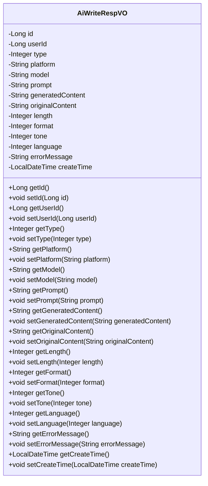
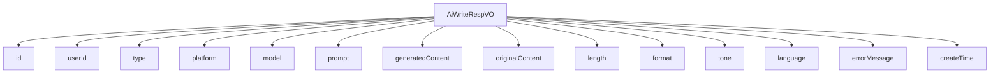

# 基础信息

|      |      |
|------|------|
| 编码语言 | .java |
| 代码路径 | yudao-module-ai/yudao-module-ai-biz/src/main/java/cn/iocoder/yudao/module/ai/controller/admin/write/vo/AiWriteRespVO.java |
| 包名 | cn.iocoder.yudao.module.ai.controller.admin.write.vo |
| 依赖项 | ['io.swagger.v3.oas.annotations.media.Schema', 'lombok.Data', 'java.time.LocalDateTime'] |
| 概述说明 | 管理后台AI写作响应VO包含编号、用户编号、平台、模型、生成内容提示和创建时间等必填项，以及写作类型、生成内容、原文、长度提示词、格式提示词、语气提示词、语言提示词和错误信息等字段。 |

# 说明

管理后台AI写作响应VO是一个包含多个字段的数据结构，用于记录和管理AI写作生成的内容及其相关元数据。该数据结构中，编号、用户编号、平台、模型、生成内容提示和创建时间是必填项，确保每条记录都有唯一标识、用户关联、生成平台、使用的模型、生成内容的提示信息以及创建时间。此外，该VO还包含其他可选字段，如写作类型、生成内容、原文、长度提示词、格式提示词、语气提示词、语言提示词和错误信息等。写作类型用于区分不同的写作任务或场景；生成内容是AI根据提示生成的具体文本；原文可能是用户提供的参考文本或输入内容；长度提示词、格式提示词、语气提示词和语言提示词则用于指导AI生成符合特定要求的文本内容；错误信息用于记录生成过程中可能出现的错误或异常情况。通过这些字段，管理后台可以全面追踪和管理AI写作的生成过程及其结果，确保内容的准确性和适用性。

# 类列表 Class Summary

| 名称   | 类型  | 说明 |
|-------|------|-------------|
| AiWriteRespVO | class | 管理后台AI写作响应VO包含编号、用户编号、写作类型、平台、模型、生成内容提示、生成内容、原文、长度提示词、格式提示词、语气提示词、语言提示词、错误信息和创建时间等字段，其中编号、用户编号、平台、模型、生成内容提示和创建时间为必填项。 |

## 类 AiWriteRespVO

|      |      |
|------|------|
| 访问范围 | @Schema(description = "管理后台 - AI 写作 Response VO");@Data;public |
| 类型 | class |
| 名称 | AiWriteRespVO |
| 说明 | 管理后台AI写作响应VO包含编号、用户编号、写作类型、平台、模型、生成内容提示、生成内容、原文、长度提示词、格式提示词、语气提示词、语言提示词、错误信息和创建时间等字段，其中编号、用户编号、平台、模型、生成内容提示和创建时间为必填项。 |

### UML类图

### 描述信息：
该UML类图展示了`AiWriteRespVO`类的结构，包含了多个私有属性和对应的公有getter和setter方法。类中的属性包括`id`、`userId`、`type`、`platform`、`model`等，用于管理AI写作的响应数据。每个属性都有对应的访问方法，确保数据的封装性和可操作性。

### 内部方法调用关系图

### 描述信息：
该图展示了`AiWriteRespVO`类与其属性之间的调用关系。`AiWriteRespVO`类包含了多个属性，如`id`、`userId`、`type`、`platform`等，每个属性都与`AiWriteRespVO`类直接关联。这些属性用于存储AI写作响应的相关信息，如用户编号、平台、模型、生成内容等。

### 字段列表 Field List

| 名称  | 类型  | 说明 |
|-------|-------|------|
| tone | Integer | 语气提示词用于指示语气类型，示例值为3。 |
| platform | String | 平台信息为必填项，示例值为“TongYi”。 |
| length | Integer | 描述字段用于提示长度，示例值为1，类型为整数。 |
| id | Long | 编号为必填项，示例值为5311，类型为长整型。 |
| type | Integer | 写作类型字段，类型为整数，示例值为1。 |
| userId | Long | 用户编号为必填项，示例值为28404，数据类型为长整型。 |
| format | Integer | 格式提示词用于指定数据的格式，示例值为2，表示特定格式类型。 |
| generatedContent | String | 生成的内容描述为“你非常不错”，示例展示了生成的文本内容。 |
| prompt | String | 生成内容提示，必填项，示例为“撰写：田忌赛马”。 |
| createTime | LocalDateTime | 该信息描述了一个必需的创建时间字段，使用LocalDateTime类型，表示必须提供的时间数据。 |
| originalContent | String | 原文内容为“真的么？”，描述了一个字符串类型的字段originalContent，用于存储原始文本信息。 |
| model | String | 模型字段为必填项，示例值为“qwen”，用于标识或指定相关模型。 |
| language | Integer | 语言提示词字段用于指定语言类型，示例值为4。 |
| errorMessage | String | 错误信息字段，用于存储错误描述。 |

### 方法列表 Method List

| 名称  | 类型  | 说明 |
|-------|-------|------|

