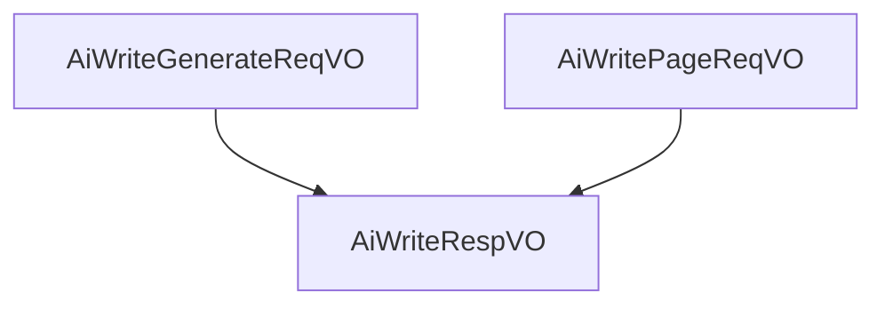

# 基础信息

|      |      |
|------|------|
| 编码语言 | .java |
| 代码路径 | yudao-module-ai/yudao-module-ai-biz/src/main/java/cn/iocoder/yudao/module/ai/controller/admin/write/vo |
| 包名 | cn.iocoder.yudao.module.ai.controller.admin.write.vo |
| 概述说明 | 管理后台AI写作系统设计包含请求类、响应VO和分页请求VO。请求类包括必填字段（写作类型、长度、格式、语气、语言）和可选字段（内容提示、原文），确保生成文本符合需求。响应VO记录生成内容及其元数据，包含必填项（编号、用户编号、平台、模型、提示、创建时间）和可选字段（写作类型、生成内容、原文、提示词、错误信息），用于追踪和管理生成过程。分页请求VO用于分页查询，包含用户编号、写作类型、平台、创建时间等字段，支持按用户、平台、时间范围筛选记录，便于数据管理和分析。 |

# 说明

管理后台的AI写作生成请求类设计旨在确保生成的文本符合用户需求，包含多个必填字段和可选字段。必填字段包括写作类型、长度、格式、语气和语言。写作类型用于指定生成文本的类别或用途，长度规定了文本的字数或篇幅，格式定义了文本的结构或样式，语气决定了文本的表达方式（如正式、轻松等），而语言则指定了文本使用的语种。这些必填字段通过枚举或非空验证来确保数据的有效性和完整性，避免生成不符合要求的文本。此外，请求类还提供了两个可选字段：写作内容提示和原文。写作内容提示可以为AI提供生成文本的方向或主题，帮助生成更符合用户预期的内容。原文字段则允许用户提供参考文本，AI可以基于此进行改写或扩展。这些可选字段为用户提供了更大的灵活性，使其能够根据具体需求调整生成内容。

管理后台AI写作响应VO是一个包含多个字段的数据结构，用于记录和管理AI写作生成的内容及其相关元数据。该数据结构中，编号、用户编号、平台、模型、生成内容提示和创建时间是必填项，确保每条记录都有唯一标识、用户关联、生成平台、使用的模型、生成内容的提示信息以及创建时间。此外，该VO还包含其他可选字段，如写作类型、生成内容、原文、长度提示词、格式提示词、语气提示词、语言提示词和错误信息等。写作类型用于区分不同的写作任务或场景；生成内容是AI根据提示生成的具体文本；原文可能是用户提供的参考文本或输入内容；长度提示词、格式提示词、语气提示词和语言提示词则用于指导AI生成符合特定要求的文本内容；错误信息用于记录生成过程中可能出现的错误或异常情况。通过这些字段，管理后台可以全面追踪和管理AI写作的生成过程及其结果，确保内容的准确性和适用性。

管理后台AI写作分页请求VO是一个用于分页查询AI写作记录的数据结构，包含了多个关键信息字段。其中，用户编号用于标识具体的用户，确保查询结果与特定用户相关联。写作类型字段用于区分不同的写作任务或内容类型，帮助筛选出特定类型的写作记录。平台字段则用于指定写作记录所属的平台或系统，确保查询结果与特定平台相关。创建时间字段记录了每条写作记录的生成时间，便于按时间范围进行筛选和排序。通过这些字段的组合，管理后台可以高效地进行分页查询，获取用户在不同平台上、特定时间段内、特定类型的AI写作记录，从而实现对写作数据的全面管理和分析。

### 包内部结构视图

### 描述信息：
该图展示了`AiWriteGenerateReqVO`和`AiWritePageReqVO`两个请求类与`AiWriteRespVO`响应类之间的调用关系。`AiWriteGenerateReqVO`和`AiWritePageReqVO`分别用于生成请求和分页请求，最终都会调用`AiWriteRespVO`来返回响应结果。

# 文件列表 File List

| 名称   | 类型  | 说明 |
|-------|------|-------------|
| [AiWritePageReqVO.java](AiWritePageReqVO.md) | file | 管理后台AI写作分页请求VO包含用户编号、写作类型、平台和创建时间等关键信息，用于分页查询AI写作记录。 |
| [AiWriteRespVO.java](AiWriteRespVO.md) | file | 管理后台AI写作响应VO包含编号、用户编号、平台、模型、生成内容提示和创建时间等必填项，以及写作类型、生成内容、原文、长度提示词、格式提示词、语气提示词、语言提示词和错误信息等字段。 |
| [AiWriteGenerateReqVO.java](AiWriteGenerateReqVO.md) | file | 管理后台AI写作生成请求类包含必填字段：写作类型、长度、格式、语气和语言；可选字段为写作内容提示和原文。所有字段通过枚举或非空验证确保数据有效性。 |

