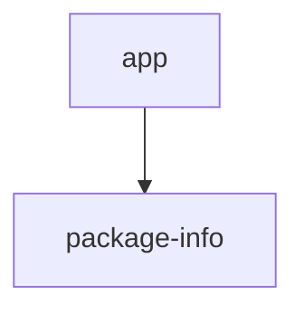

# 基础信息

|      |      |
|------|------|
| 编码语言 | .java |
| 代码路径 | yudao-module-ai/yudao-module-ai-biz/src/main/java/cn/iocoder/yudao/module/ai/controller/app |
| 包名 | cn.iocoder.yudao.module.ai.controller.app |
| 概述说明 | 请提供需要总结的具体信息内容，以便我为您生成符合要求的概要说明。 |

# 说明

请提供具体的信息内容，以便我能够根据您的要求进行汇总和提炼生成总结描述说明。

### 包内部结构视图

### 描述信息：
该Mermaid图展示了`app`文件夹与`package-info.java`文件之间的调用关系。`app`文件夹包含`package-info.java`文件，图中使用箭头表示这种包含关系。图形简洁明了，符合Mermaid图的规范要求。

# 文件列表 File List

| 名称   | 类型  | 说明 |
|-------|------|-------------|
| [package-info.java](package-info.md) | file | 请提供需要总结的具体信息内容，以便我为您生成符合要求的概要说明。 |

