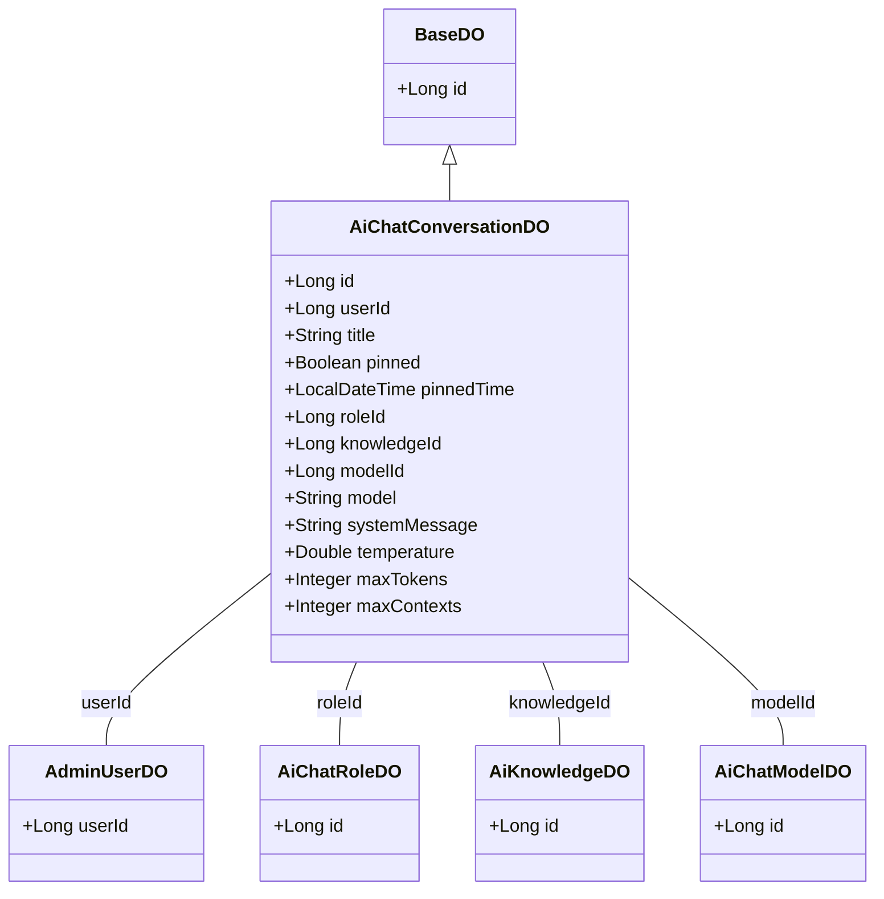
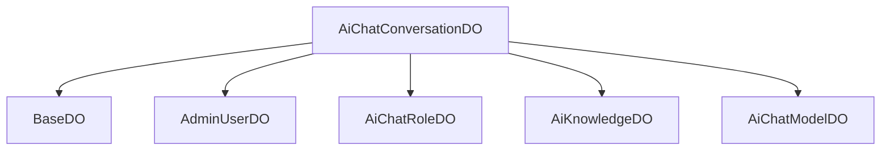

# 基础信息

|      |      |
|------|------|
| 编码语言 | .java |
| 代码路径 | yudao-module-ai/yudao-module-ai-biz/src/main/java/cn/iocoder/yudao/module/ai/dal/dataobject/chat/AiChatConversationDO.java |
| 包名 | cn.iocoder.yudao.module.ai.dal.dataobject.chat |
| 依赖项 | ['cn.iocoder.yudao.framework.mybatis.core.dataobject.BaseDO', 'cn.iocoder.yudao.module.ai.dal.dataobject.knowledge.AiKnowledgeDO', 'cn.iocoder.yudao.module.ai.dal.dataobject.model.AiChatModelDO', 'cn.iocoder.yudao.module.ai.dal.dataobject.model.AiChatRoleDO', 'com.baomidou.mybatisplus.annotation.KeySequence', 'com.baomidou.mybatisplus.annotation.TableId', 'com.baomidou.mybatisplus.annotation.TableName', None, 'java.time.LocalDateTime'] |
| 概述说明 | AiChatConversationDO类管理AI聊天对话数据，包含自增ID、用户ID、对话标题、置顶状态及时间、角色ID、知识库ID、模型ID等字段。对话配置支持角色设定、温度参数、最大Token数量、上下文最大Message数量，并允许自动生成标题和用户手动修改。 |

# 说明

AiChatConversationDO类是一个用于管理AI聊天对话数据的类，包含了多个关键字段以支持对话的全面管理。其中，自增ID用于唯一标识每条对话记录，用户ID则关联到具体的用户。对话标题可以由系统自动生成，也支持用户手动修改，以便更好地组织和识别对话内容。置顶状态及时间字段用于标记用户是否将某条对话置顶，并记录置顶的时间。角色ID、知识库ID和模型ID分别关联到对话中使用的角色、知识库和模型，确保对话内容的个性化和专业性。此外，标志字段可能用于存储其他与对话相关的状态或属性。

在对话配置方面，AiChatConversationDO类支持角色设定，允许用户选择不同的角色进行对话。温度参数用于控制生成文本的随机性和创造性，数值越高生成的文本越多样化。最大Token数量限制了单次生成文本的长度，而上下文最大Message数量则控制了对话历史记录的长度，确保对话的连贯性和效率。这些配置项共同作用，使得AiChatConversationDO类能够灵活地适应不同的对话场景和需求，提供个性化的聊天体验。

# 类列表 Class Summary

| 名称   | 类型  | 说明 |
|-------|------|-------------|
| AiChatConversationDO | class | AiChatConversationDO类用于管理AI聊天对话数据，包含自增ID、用户ID、对话标题、置顶状态及时间、角色ID、知识库ID、模型ID及标志等字段。对话配置包括角色设定、温度参数、最大Token数量和上下文最大Message数量，支持自动生成标题和用户手动修改。 |

## 类 AiChatConversationDO

|      |      |
|------|------|
| 访问范围 | @TableName("ai_chat_conversation");@KeySequence("ai_chat_conversation_seq") // 用于 Oracle、PostgreSQL、Kingbase、DB2、H2 数据库的主键自增。如果是 MySQL 等数据库，可不写。;@Data;@EqualsAndHashCode(callSuper = true);@Builder;@NoArgsConstructor;@AllArgsConstructor;public |
| 类型 | class |
| 名称 | AiChatConversationDO |
| 说明 | AiChatConversationDO类用于管理AI聊天对话数据，包含自增ID、用户ID、对话标题、置顶状态及时间、角色ID、知识库ID、模型ID及标志等字段。对话配置包括角色设定、温度参数、最大Token数量和上下文最大Message数量，支持自动生成标题和用户手动修改。 |

### UML类图

### 描述信息：
该UML类图展示了`AiChatConversationDO`类及其与`BaseDO`、`AdminUserDO`、`AiChatRoleDO`、`AiKnowledgeDO`和`AiChatModelDO`类之间的关系。`AiChatConversationDO`继承自`BaseDO`，并与其他类通过关联关系连接，表示对话记录与用户、角色、知识库和模型的关联。

### 内部方法调用关系图

### 描述信息：
`AiChatConversationDO` 类继承自 `BaseDO`，并与多个其他类（如 `AdminUserDO`、`AiChatRoleDO`、`AiKnowledgeDO` 和 `AiChatModelDO`）通过字段关联。这些关联关系用于表示用户、角色、知识库和模型之间的调用关系，确保数据的一致性和完整性。

### 字段列表 Field List

| 名称  | 类型  | 说明 |
|-------|-------|------|
| temperature | Double | 温度数据为双精度浮点数类型。 |
| model | String | private String model; 定义了一个私有的字符串类型变量 model。 |
| roleId | Long | 角色ID为长整型数据，用于唯一标识系统中的角色。 |
| userId | Long | 用户ID为长整型数据。 |
| modelId | Long | 模型ID为长整型数据，用于唯一标识模型。 |
| systemMessage | String | 系统消息为私有字符串类型，用于存储或传递系统相关信息。 |
| knowledgeId | Long | 知识库中存储的唯一标识符，用于区分和检索特定知识条目。 |
| maxContexts | Integer | 该信息描述了一个私有整数类型的变量maxContexts，用于存储最大上下文数量。 |
| title | String | private String title; 是一个Java类的私有成员变量，用于存储标题信息。 |
| pinnedTime | LocalDateTime | private LocalDateTime pinnedTime; 表示一个私有的LocalDateTime类型的变量pinnedTime，用于存储日期和时间信息。 |
| maxTokens | Integer | private Integer maxTokens; 表示一个私有的整型变量，用于存储最大令牌数。 |
| TITLE_DEFAULT = "新对话" | String | public static final String TITLE_DEFAULT = "新对话" 定义了一个常量字符串，表示默认的对话标题为“新对话”。 |
| id | Long | 概要说明：该代码片段定义了一个私有长整型变量id，并使用@TableId注解标记，通常用于标识数据库表的主键字段。 |
| pinned | Boolean | pinned是一个布尔类型的私有变量，用于表示某个对象是否被固定或置顶。 |

### 方法列表 Method List

| 名称  | 类型  | 说明 |
|-------|-------|------|

