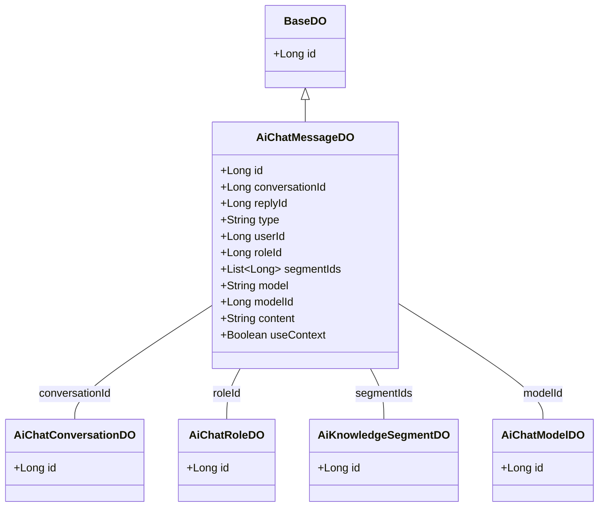
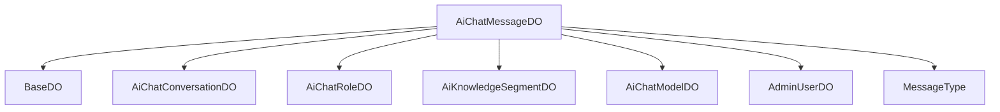

# 基础信息

|      |      |
|------|------|
| 编码语言 | .java |
| 代码路径 | yudao-module-ai/yudao-module-ai-biz/src/main/java/cn/iocoder/yudao/module/ai/dal/dataobject/chat/AiChatMessageDO.java |
| 包名 | cn.iocoder.yudao.module.ai.dal.dataobject.chat |
| 依赖项 | ['cn.iocoder.yudao.framework.mybatis.core.dataobject.BaseDO', 'cn.iocoder.yudao.module.ai.dal.dataobject.knowledge.AiKnowledgeSegmentDO', 'cn.iocoder.yudao.module.ai.dal.dataobject.model.AiChatModelDO', 'cn.iocoder.yudao.module.ai.dal.dataobject.model.AiChatRoleDO', 'com.baomidou.mybatisplus.annotation.KeySequence', 'com.baomidou.mybatisplus.annotation.TableField', 'com.baomidou.mybatisplus.annotation.TableId', 'com.baomidou.mybatisplus.annotation.TableName', 'com.baomidou.mybatisplus.extension.handlers.JacksonTypeHandler', None, 'org.springframework.ai.chat.messages.MessageType', 'java.util.List'] |
| 概述说明 | AiChatMessageDO类用于存储聊天记录，包含id、conversationId、replyId、type、userId、roleId、segmentIds、model、modelId、content及useContext等字段，并关联多个相关实体类。 |

# 说明

AiChatMessageDO类是一个用于存储聊天记录的数据对象类，包含了多个关键字段以全面记录聊天信息。该类的主要字段包括唯一标识符id，用于唯一标识每条聊天记录；对话编号conversationId，用于标识该消息所属的对话；回复消息编号replyId，用于标识该消息是对哪条消息的回复；消息类型type，用于区分消息的类型，如文本、图片等；用户编号userId，用于标识发送该消息的用户；角色编号roleId，用于标识用户在对话中的角色；段落编号数组segmentIds，用于标识该消息所属的段落或上下文片段；模型标志model，用于标识生成该消息所使用的模型类型；模型编号modelId，用于标识具体的模型实例；聊天内容content，用于存储消息的具体内容；以及是否携带上下文useContext，用于标识该消息是否携带了上下文信息。此外，AiChatMessageDO类还关联了多个相关实体类，以便更好地管理和处理聊天记录数据。通过这些字段和关联关系，AiChatMessageDO类能够全面、详尽地记录和管理聊天过程中的各种信息。

# 类列表 Class Summary

| 名称   | 类型  | 说明 |
|-------|------|-------------|
| AiChatMessageDO | class | AiChatMessageDO类用于存储聊天记录，包含唯一标识符id、对话编号conversationId、回复消息编号replyId、消息类型type、用户编号userId、角色编号roleId、段落编号数组segmentIds、模型标志model、模型编号modelId、聊天内容content及是否携带上下文useContext等字段，关联多个相关实体类。 |

## 类 AiChatMessageDO

|      |      |
|------|------|
| 访问范围 | @TableName("ai_chat_message");@KeySequence("ai_chat_conversation_seq") // 用于 Oracle、PostgreSQL、Kingbase、DB2、H2 数据库的主键自增。如果是 MySQL 等数据库，可不写。;@Data;@EqualsAndHashCode(callSuper = true);@Builder;@NoArgsConstructor;@AllArgsConstructor;public |
| 类型 | class |
| 名称 | AiChatMessageDO |
| 说明 | AiChatMessageDO类用于存储聊天记录，包含唯一标识符id、对话编号conversationId、回复消息编号replyId、消息类型type、用户编号userId、角色编号roleId、段落编号数组segmentIds、模型标志model、模型编号modelId、聊天内容content及是否携带上下文useContext等字段，关联多个相关实体类。 |

### UML类图

### 描述信息：
该UML类图展示了`AiChatMessageDO`类及其相关类的关系。`AiChatMessageDO`继承自`BaseDO`，并与其他类如`AiChatConversationDO`、`AiChatRoleDO`、`AiKnowledgeSegmentDO`和`AiChatModelDO`通过关联关系连接。每个类都包含必要的属性和方法，确保类图的完整性和准确性。

### 内部方法调用关系图

### 描述信息：
该图展示了 `AiChatMessageDO` 类与其他类之间的调用关系。`AiChatMessageDO` 继承自 `BaseDO`，并关联了多个其他类，如 `AiChatConversationDO`、`AiChatRoleDO`、`AiKnowledgeSegmentDO`、`AiChatModelDO` 和 `AdminUserDO`。此外，它还使用了 `MessageType` 枚举类来定义消息类型。这些调用关系清晰地映射了类之间的依赖关系。

### 字段列表 Field List

| 名称  | 类型  | 说明 |
|-------|-------|------|
| modelId | Long | 模型ID为长整型数据。 |
| userId | Long | 用户ID为长整型数据，用于唯一标识用户。 |
| roleId | Long | 角色ID为长整型数据，用于唯一标识系统中的角色。 |
| type | String | 该信息描述了一个私有字符串变量，变量名为"type"。 |
| conversationId | Long | private Long conversationId; 表示一个私有的长整型变量 conversationId，用于存储对话的唯一标识符。 |
| id | Long | 概要说明：该代码片段定义了一个私有长整型变量id，并使用@TableId注解标记，表明该变量是表的主键标识符。 |
| useContext | Boolean | 该信息表明是否使用上下文（useContext），其类型为布尔值（Boolean），用于决定是否在特定场景中应用上下文功能。 |
| content | String | private String content; 是一个Java类中的私有字符串变量声明，用于存储字符串类型的数据，且该变量只能在声明它的类内部访问。 |
| replyId | Long | replyId 是一个长整型私有变量，用于存储回复的唯一标识符。 |
| model | String | private String model; 定义了一个私有的字符串类型变量model，用于存储模型信息。 |
| segmentIds | List<Long> | 该代码片段定义了一个私有字段`segmentIds`，其类型为`List<Long>`，并使用`@TableField`注解指定了类型处理器为`JacksonTypeHandler.class`，用于处理该字段的序列化和反序列化。 |

### 方法列表 Method List

| 名称  | 类型  | 说明 |
|-------|-------|------|

