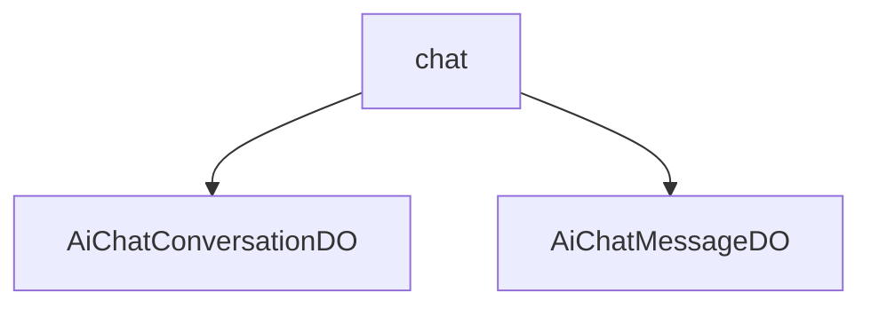

# 基础信息

|      |      |
|------|------|
| 编码语言 | .java |
| 代码路径 | yudao-module-ai/yudao-module-ai-biz/src/main/java/cn/iocoder/yudao/module/ai/dal/dataobject/chat |
| 包名 | cn.iocoder.yudao.module.ai.dal.dataobject.chat |
| 概述说明 | AiChatConversationDO类管理AI聊天对话数据，包含自增ID、用户ID、对话标题、置顶状态及时间、角色ID、知识库ID、模型ID等字段，支持角色设定、温度参数、最大Token数量、上下文最大Message数量等配置，提供个性化聊天体验。AiChatMessageDO类存储聊天记录，包含id、conversationId、replyId、type、userId、roleId、segmentIds、model、modelId、content、useContext等字段，全面记录和管理聊天信息。 |

# 说明

AiChatConversationDO类是一个用于管理AI聊天对话数据的类，包含了多个关键字段以支持对话的全面管理。该类通过自增ID唯一标识每条对话记录，并通过用户ID关联到具体用户。对话标题可由系统自动生成或用户手动修改，以便更好地组织和识别对话内容。置顶状态及时间字段用于标记用户是否将某条对话置顶，并记录置顶时间。角色ID、知识库ID和模型ID分别关联到对话中使用的角色、知识库和模型，确保对话内容的个性化和专业性。标志字段可能用于存储其他与对话相关的状态或属性。在对话配置方面，AiChatConversationDO类支持角色设定，允许用户选择不同角色进行对话。温度参数控制生成文本的随机性和创造性，数值越高生成的文本越多样化。最大Token数量限制单次生成文本的长度，上下文最大Message数量控制对话历史记录的长度，确保对话的连贯性和效率。这些配置项共同作用，使得AiChatConversationDO类能够灵活适应不同对话场景和需求，提供个性化聊天体验。

AiChatMessageDO类是一个用于存储聊天记录的数据对象类，包含了多个关键字段以全面记录聊天信息。该类的主要字段包括唯一标识符id，用于唯一标识每条聊天记录；对话编号conversationId，用于标识该消息所属的对话；回复消息编号replyId，用于标识该消息是对哪条消息的回复；消息类型type，用于区分消息的类型，如文本、图片等；用户编号userId，用于标识发送该消息的用户；角色编号roleId，用于标识用户在对话中的角色；段落编号数组segmentIds，用于标识该消息所属的段落或上下文片段；模型标志model，用于标识生成该消息所使用的模型类型；模型编号modelId，用于标识具体的模型实例；聊天内容content，用于存储消息的具体内容；以及是否携带上下文useContext，用于标识该消息是否携带了上下文信息。此外，AiChatMessageDO类还关联了多个相关实体类，以便更好地管理和处理聊天记录数据。通过这些字段和关联关系，AiChatMessageDO类能够全面、详尽地记录和管理聊天过程中的各种信息。

### 包内部结构视图

### 描述信息：
该Mermaid图展示了`chat`文件夹与其中的两个Java文件`AiChatConversationDO.java`和`AiChatMessageDO.java`之间的层级关系。`chat`文件夹包含了这两个数据对象文件，分别用于处理聊天对话和聊天消息的数据存储与操作。

# 文件列表 File List

| 名称   | 类型  | 说明 |
|-------|------|-------------|
| [AiChatMessageDO.java](AiChatMessageDO.md) | file | AiChatMessageDO类用于存储聊天记录，包含id、conversationId、replyId、type、userId、roleId、segmentIds、model、modelId、content及useContext等字段，并关联多个相关实体类。 |
| [AiChatConversationDO.java](AiChatConversationDO.md) | file | AiChatConversationDO类管理AI聊天对话数据，包含自增ID、用户ID、对话标题、置顶状态及时间、角色ID、知识库ID、模型ID等字段。对话配置支持角色设定、温度参数、最大Token数量、上下文最大Message数量，并允许自动生成标题和用户手动修改。 |

