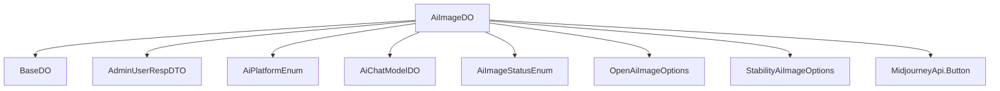

# 基础信息

|      |      |
|------|------|
| 编码语言 | .java |
| 代码路径 | yudao-module-ai/yudao-module-ai-biz/src/main/java/cn/iocoder/yudao/module/ai/dal/dataobject/image/AiImageDO.java |
| 包名 | cn.iocoder.yudao.module.ai.dal.dataobject.image |
| 依赖项 | ['cn.iocoder.yudao.framework.ai.core.model.midjourney.api.MidjourneyApi', 'cn.iocoder.yudao.framework.mybatis.core.dataobject.BaseDO', 'cn.iocoder.yudao.module.ai.dal.dataobject.model.AiChatModelDO', 'cn.iocoder.yudao.module.ai.enums.image.AiImageStatusEnum', 'cn.iocoder.yudao.module.system.api.user.dto.AdminUserRespDTO', 'com.baomidou.mybatisplus.annotation.KeySequence', 'com.baomidou.mybatisplus.annotation.TableField', 'com.baomidou.mybatisplus.annotation.TableId', 'com.baomidou.mybatisplus.annotation.TableName', 'com.baomidou.mybatisplus.extension.handlers.JacksonTypeHandler', 'lombok.Data', 'org.springframework.ai.openai.OpenAiImageOptions', 'org.springframework.ai.stabilityai.api.StabilityAiImageOptions', 'java.time.LocalDateTime', 'java.util.List', 'java.util.Map'] |
| 概述说明 | AiImageDO类管理AI生成图像数据，包含编号、用户编号、提示词、平台、模型、图片尺寸、生成状态、完成时间、错误信息、图片地址、公开状态、绘制参数、按钮信息和任务编号等字段，支持多种数据库主键自增，适用于不同AI平台和模型。 |

# 说明

AiImageDO类是一个用于管理AI生成图像数据的类，包含了多个关键字段以全面记录和管理图像生成的相关信息。该类的主要字段包括编号、用户编号、提示词、平台、模型、图片尺寸、生成状态、完成时间、错误信息、图片地址、公开状态、绘制参数、按钮信息和任务编号等。编号字段用于唯一标识每张生成的图像，用户编号则关联到生成该图像的用户。提示词字段记录了生成图像时使用的关键词或描述，平台和模型字段分别标识了生成图像所使用的AI平台和具体模型。图片尺寸字段记录了生成图像的宽度和高度，生成状态字段用于标识图像生成过程中的状态，如进行中、已完成或失败。完成时间字段记录了图像生成完成的时间，错误信息字段则用于存储生成过程中可能出现的错误信息。图片地址字段存储了生成图像的存储位置或访问链接，公开状态字段标识了该图像是否公开可见。绘制参数字段记录了生成图像时使用的具体参数设置，按钮信息字段可能用于存储与图像相关的操作按钮信息，任务编号字段则关联到生成该图像的具体任务。此外，AiImageDO类支持多种数据库主键自增功能，适用于不同AI平台和模型，具有较高的灵活性和扩展性。

# 类列表 Class Summary

| 名称   | 类型  | 说明 |
|-------|------|-------------|
| AiImageDO | class | AiImageDO类用于管理AI生成的图像数据，包含编号、用户编号、提示词、平台、模型、图片尺寸、生成状态、完成时间、错误信息、图片地址、公开状态、绘制参数、按钮信息和任务编号等字段。支持多种数据库主键自增，适用于不同AI平台和模型。 |


## 类 AiImageDO

|      |      |
|------|------|
| 访问范围 | @TableName(value = "ai_image", autoResultMap = true);@KeySequence("ai_image_seq") // 用于 Oracle、PostgreSQL、Kingbase、DB2、H2 数据库的主键自增。如果是 MySQL 等数据库，可不写。;@Data;public |
| 类型 | class |
| 名称 | AiImageDO |
| 说明 | AiImageDO类用于管理AI生成的图像数据，包含编号、用户编号、提示词、平台、模型、图片尺寸、生成状态、完成时间、错误信息、图片地址、公开状态、绘制参数、按钮信息和任务编号等字段。支持多种数据库主键自增，适用于不同AI平台和模型。 |


### UML类图

```mermaid
classDiagram
    class BaseDO {
        +getId() Long
        +setId(Long id) void
    }

    class AiImageDO {
        -id: Long
        -userId: Long
        -prompt: String
        -platform: String
        -model: String
        -width: Integer
        -height: Integer
        -status: Integer
        -finishTime: LocalDateTime
        -errorMessage: String
        -picUrl: String
        -publicStatus: Boolean
        -options: Map~String, Object~
        -buttons: List~MidjourneyApi.Button~
        -taskId: String
        +getId() Long
        +setId(Long id) void
        +getUserId() Long
        +setUserId(Long userId) void
        +getPrompt() String
        +setPrompt(String prompt) void
        +getPlatform() String
        +setPlatform(String platform) void
        +getModel() String
        +setModel(String model) void
        +getWidth() Integer
        +setWidth(Integer width) void
        +getHeight() Integer
        +setHeight(Integer height) void
        +getStatus() Integer
        +setStatus(Integer status) void
        +getFinishTime() LocalDateTime
        +setFinishTime(LocalDateTime finishTime) void
        +getErrorMessage() String
        +setErrorMessage(String errorMessage) void
        +getPicUrl() String
        +setPicUrl(String picUrl) void
        +getPublicStatus() Boolean
        +setPublicStatus(Boolean publicStatus) void
        +getOptions() Map~String, Object~
        +setOptions(Map~String, Object~ options) void
        +getButtons() List~MidjourneyApi.Button~
        +setButtons(List~MidjourneyApi.Button~ buttons) void
        +getTaskId() String
        +setTaskId(String taskId) void
    }

    class AdminUserRespDTO {
        +getId() Long
    }

    class AiChatModelDO {
        +getModel() String
    }

    class OpenAiImageOptions {
        +getOptions() Map~String, Object~
    }

    class StabilityAiImageOptions {
        +getOptions() Map~String, Object~
    }

    class MidjourneyApi {
        class Button {
            +getButton() String
        }
    }

    BaseDO <|-- AiImageDO
    AiImageDO ..> AdminUserRespDTO : 关联
    AiImageDO ..> AiChatModelDO : 冗余
    AiImageDO ..> OpenAiImageOptions : 依赖
    AiImageDO ..> StabilityAiImageOptions : 依赖
    AiImageDO ..> MidjourneyApi.Button : 依赖
```

### 描述：
该UML类图展示了`AiImageDO`类及其与多个相关类的关系。`AiImageDO`继承自`BaseDO`，并关联了`AdminUserRespDTO`、`AiChatModelDO`、`OpenAiImageOptions`、`StabilityAiImageOptions`以及`MidjourneyApi.Button`等类。每个类都包含必要的属性和方法，确保了类图的完整性和准确性。


### 内部方法调用关系图



### 描述信息：
该图展示了 `AiImageDO` 类与其他类或枚举之间的调用关系。`AiImageDO` 继承自 `BaseDO`，并关联了多个外部类如 `AdminUserRespDTO`、`AiPlatformEnum`、`AiChatModelDO` 等。此外，它还使用了 `OpenAiImageOptions` 和 `StabilityAiImageOptions` 来处理不同平台的参数，并通过 `MidjourneyApi.Button` 处理按钮信息。

### 字段列表 Field List

| 名称  | 类型  | 说明 |
|-------|-------|------|
| platform | String | 平台信息为私有字符串类型。 |
| userId | Long | 用户ID为长整型数据，用于唯一标识用户。 |
| height | Integer | height 是一个私有的整数类型变量，用于存储高度值。 |
| status | Integer | 状态码为整型，用于表示系统或操作的当前状态。 |
| taskId | String | 任务ID为私有字符串类型变量，用于唯一标识任务。 |
| width | Integer | 该信息描述了一个私有整数类型的变量，变量名为width。 |
| model | String | private String model; 定义了一个私有的字符串类型变量model，用于存储模型信息。 |
| prompt | String | 该信息包含一个私有字符串变量“prompt”，用于存储提示内容。 |
| finishTime | LocalDateTime | finishTime 是一个 LocalDateTime 类型的私有变量，用于存储完成时间。 |
| errorMessage | String | private String errorMessage; 定义了一个私有的字符串类型变量errorMessage，用于存储错误信息。 |
| publicStatus | Boolean | private Boolean publicStatus; 表示一个私有的布尔类型变量，用于存储公开状态的信息。 |
| picUrl | String | 该信息描述了一个私有字符串变量，变量名为`picUrl`，用于存储图片的URL地址。 |
| id | Long | 在代码中，`@TableId`注解用于标识实体类的主键字段，`private Long id;`表示该字段为长整型的主键。 |
| options | Map<String, Object> | 该代码片段定义了一个名为`options`的私有变量，类型为`Map<String, Object>`，并使用`@TableField`注解指定了`JacksonTypeHandler`作为类型处理器，用于处理该字段的序列化和反序列化。 |
| buttons | List<MidjourneyApi.Button> | 该代码片段定义了一个私有变量`buttons`，其类型为`List<MidjourneyApi.Button>`，并使用`@TableField`注解指定了类型处理器为`JacksonTypeHandler.class`，用于处理该字段的序列化和反序列化。 |

### 方法列表 Method List

| 名称  | 类型  | 说明 |
|-------|-------|------|


