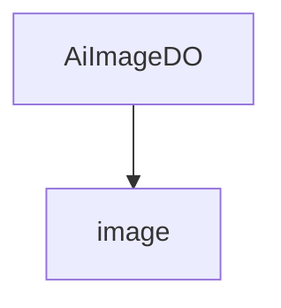

# 基础信息

|      |      |
|------|------|
| 编码语言 | .java |
| 代码路径 | yudao-module-ai/yudao-module-ai-biz/src/main/java/cn/iocoder/yudao/module/ai/dal/dataobject/image |
| 包名 | cn.iocoder.yudao.module.ai.dal.dataobject.image |
| 概述说明 | AiImageDO类管理AI生成图像数据，包含编号、用户编号、提示词、平台、模型、图片尺寸、生成状态、完成时间、错误信息、图片地址、公开状态、绘制参数、按钮信息和任务编号等字段，支持多种数据库主键自增，适用于不同AI平台和模型。 |

# 说明

AiImageDO类是一个用于管理AI生成图像数据的类，包含了多个关键字段以全面记录和管理图像生成的相关信息。该类的主要字段包括编号、用户编号、提示词、平台、模型、图片尺寸、生成状态、完成时间、错误信息、图片地址、公开状态、绘制参数、按钮信息和任务编号等。编号字段用于唯一标识每张生成的图像，用户编号则关联到生成该图像的用户。提示词字段记录了生成图像时使用的关键词或描述，平台和模型字段分别标识了生成图像所使用的AI平台和具体模型。图片尺寸字段记录了生成图像的宽度和高度，生成状态字段用于标识图像生成过程中的状态，如进行中、已完成或失败。完成时间字段记录了图像生成完成的时间，错误信息字段则用于存储生成过程中可能出现的错误信息。图片地址字段存储了生成图像的存储位置或访问链接，公开状态字段标识了该图像是否公开可见。绘制参数字段记录了生成图像时使用的具体参数设置，按钮信息字段可能用于存储与图像相关的操作按钮信息，任务编号字段则关联到生成该图像的具体任务。此外，AiImageDO类支持多种数据库主键自增功能，适用于不同AI平台和模型，具有较高的灵活性和扩展性。

### 包内部结构视图

### 描述信息：
该Mermaid图展示了`AiImageDO.java`文件与`image`文件夹之间的调用关系。`AiImageDO.java`文件位于`image`文件夹内，表示`AiImageDO`类属于`image`模块的一部分。图中清晰地展示了文件与文件夹之间的层级关系。

# 文件列表 File List

| 名称   | 类型  | 说明 |
|-------|------|-------------|
| [AiImageDO.java](AiImageDO.md) | file | AiImageDO类管理AI生成图像数据，包含编号、用户编号、提示词、平台、模型、图片尺寸、生成状态、完成时间、错误信息、图片地址、公开状态、绘制参数、按钮信息和任务编号等字段，支持多种数据库主键自增，适用于不同AI平台和模型。 |

