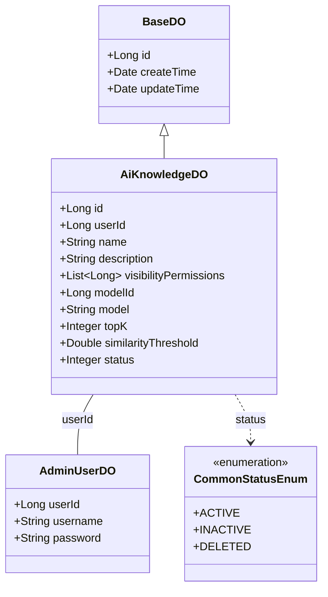
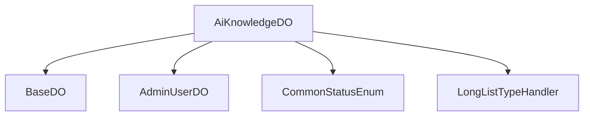

# 基础信息

|      |      |
|------|------|
| 编码语言 | .java |
| 代码路径 | yudao-module-ai/yudao-module-ai-biz/src/main/java/cn/iocoder/yudao/module/ai/dal/dataobject/knowledge/AiKnowledgeDO.java |
| 包名 | cn.iocoder.yudao.module.ai.dal.dataobject.knowledge |
| 依赖项 | ['cn.iocoder.yudao.framework.common.enums.CommonStatusEnum', 'cn.iocoder.yudao.framework.mybatis.core.dataobject.BaseDO', 'cn.iocoder.yudao.framework.mybatis.core.type.LongListTypeHandler', 'com.baomidou.mybatisplus.annotation.KeySequence', 'com.baomidou.mybatisplus.annotation.TableField', 'com.baomidou.mybatisplus.annotation.TableId', 'com.baomidou.mybatisplus.annotation.TableName', 'lombok.Data', 'java.util.List'] |
| 概述说明 | AiKnowledgeDO类用于表示知识库信息，包含编号、用户编号、知识库名称、描述、可见权限、嵌入模型编号、模型标识、topK值、相似度阈值和状态等字段。可见权限为-1时表示所有人可见，否则为特定用户编号。状态字段引用CommonStatusEnum枚举。 |

# 说明

AiKnowledgeDO类是一个用于表示知识库信息的类，包含了多个字段来描述知识库的属性和配置。其中，编号字段用于唯一标识每个知识库实例。用户编号字段表示该知识库所属的用户，用于区分不同用户的知识库。知识库名称字段用于存储知识库的名称，便于用户识别和管理。描述字段提供了对知识库的详细说明，帮助用户了解其内容和用途。

可见权限字段用于控制知识库的访问权限，当该字段的值为-1时，表示该知识库对所有用户可见；否则，该字段的值表示特定用户的编号，只有该用户才能访问该知识库。嵌入模型编号字段用于标识与该知识库关联的嵌入模型，嵌入模型通常用于将知识库中的内容转化为向量表示，以便进行相似度计算等操作。模型标识字段进一步指定了嵌入模型的具体类型或版本。

topK值字段用于设置在进行相似度搜索时返回的最相关结果的数量。相似度阈值字段则用于设定一个阈值，只有当搜索结果与查询的相似度超过该阈值时，才会被返回。这两个字段共同决定了知识库在搜索和匹配时的精度和范围。

状态字段引用了CommonStatusEnum枚举，用于表示知识库的当前状态。该枚举可能包含诸如“启用”、“禁用”、“待审核”等状态，帮助用户了解知识库的可用性和管理状态。通过这些字段的组合，AiKnowledgeDO类能够全面描述和管理知识库的各个方面，确保其在不同场景下的有效使用。

# 类列表 Class Summary

| 名称   | 类型  | 说明 |
|-------|------|-------------|
| AiKnowledgeDO | class | AiKnowledgeDO类用于表示知识库信息，包含编号、用户编号、知识库名称、描述、可见权限、嵌入模型编号、模型标识、topK值、相似度阈值和状态等字段。可见权限为-1时表示所有人可见，否则为特定用户编号。状态字段引用CommonStatusEnum枚举。 |

## 类 AiKnowledgeDO

|      |      |
|------|------|
| 访问范围 | @TableName(value = "ai_knowledge", autoResultMap = true);@KeySequence("ai_knowledge_seq") // 用于 Oracle、PostgreSQL、Kingbase、DB2、H2 数据库的主键自增。如果是 MySQL 等数据库，可不写。;@Data;public |
| 类型 | class |
| 名称 | AiKnowledgeDO |
| 说明 | AiKnowledgeDO类用于表示知识库信息，包含编号、用户编号、知识库名称、描述、可见权限、嵌入模型编号、模型标识、topK值、相似度阈值和状态等字段。可见权限为-1时表示所有人可见，否则为特定用户编号。状态字段引用CommonStatusEnum枚举。 |

### UML类图

### 描述
该UML类图展示了`AiKnowledgeDO`类继承自`BaseDO`，并包含多个属性如`id`、`userId`、`name`等。`AiKnowledgeDO`与`AdminUserDO`通过`userId`关联，并且依赖于`CommonStatusEnum`枚举类来表示状态。

### 内部方法调用关系图

### 描述信息：
`AiKnowledgeDO` 类继承自 `BaseDO`，并关联了 `AdminUserDO` 类的 `userId` 字段。此外，`AiKnowledgeDO` 使用了 `CommonStatusEnum` 枚举类来管理状态，并通过 `LongListTypeHandler` 处理 `visibilityPermissions` 字段的列表类型数据。这些类和方法之间的调用关系清晰地展示了 `AiKnowledgeDO` 的结构和依赖关系。

### 字段列表 Field List

| 名称  | 类型  | 说明 |
|-------|-------|------|
| userId | Long | 用户ID为长整型数据，用于唯一标识用户。 |
| name | String | 概要说明：该信息表示一个私有字符串类型的变量，变量名为“name”。 |
| id | Long | 在代码中定义了一个私有长整型变量id，并使用@TableId注解标记该变量作为表的主键。 |
| model | String | private String model; 定义了一个私有的字符串类型变量 model。 |
| modelId | Long | 模型ID为长整型，用于唯一标识模型。 |
| description | String | private String description; 表示一个私有的字符串类型变量，用于存储描述信息。 |
| status | Integer | 概要说明：该信息描述了一个私有整数类型的变量，名为status，用于表示某种状态或状态码。 |
| similarityThreshold | Double | 该信息涉及一个私有双精度浮点数变量，名为similarityThreshold，用于设定相似度的阈值。 |
| topK | Integer | topK 是一个私有的整数类型变量，用于存储或表示某个数值的上限或排名前K的值。 |
| visibilityPermissions | List<Long> | 该代码片段定义了一个名为`visibilityPermissions`的私有变量，类型为`List<Long>`，并使用`@TableField`注解指定了类型处理器为`LongListTypeHandler.class`，用于处理长整型列表的数据库映射。 |

### 方法列表 Method List

| 名称  | 类型  | 说明 |
|-------|-------|------|

