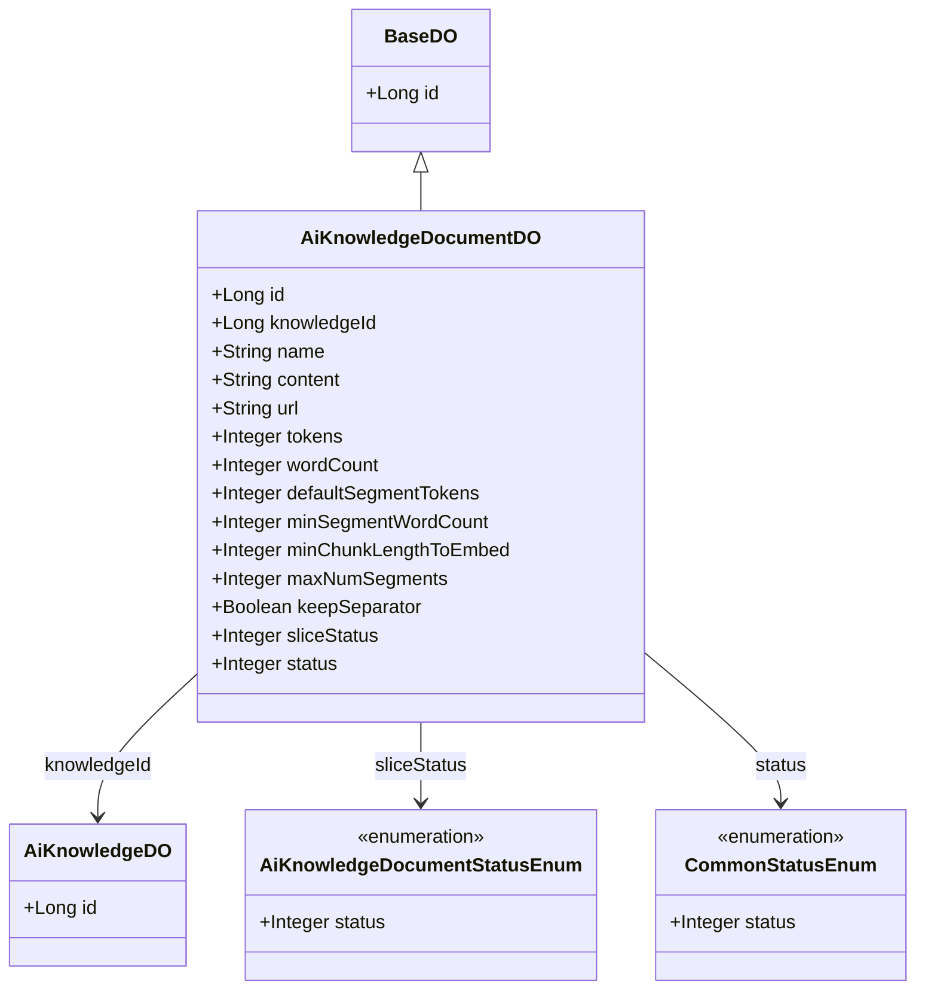
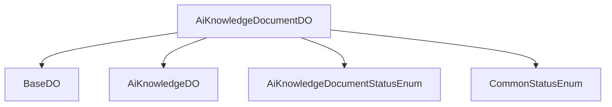

# 基础信息

|      |      |
|------|------|
| 编码语言 | .java |
| 代码路径 | yudao-module-ai/yudao-module-ai-biz/src/main/java/cn/iocoder/yudao/module/ai/dal/dataobject/knowledge/AiKnowledgeDocumentDO.java |
| 包名 | cn.iocoder.yudao.module.ai.dal.dataobject.knowledge |
| 依赖项 | ['cn.iocoder.yudao.framework.common.enums.CommonStatusEnum', 'cn.iocoder.yudao.framework.mybatis.core.dataobject.BaseDO', 'cn.iocoder.yudao.module.ai.enums.knowledge.AiKnowledgeDocumentStatusEnum', 'com.baomidou.mybatisplus.annotation.KeySequence', 'com.baomidou.mybatisplus.annotation.TableId', 'com.baomidou.mybatisplus.annotation.TableName', 'lombok.Data'] |
| 概述说明 | AiKnowledgeDocumentDO类用于表示知识库文档，包含编号、知识库编号、文件名称、内容、文件URL、文档token数量、文档字符数等字段。自定义分段参数包括目标token数、最小字符数、最小块长度、最大块数、是否保留分隔符等。文档状态和切片状态分别由CommonStatusEnum和AiKnowledgeDocumentStatusEnum枚举类定义。 |

# 说明

AiKnowledgeDocumentDO类是一个用于表示知识库文档的数据对象，包含了多个关键字段以描述文档的属性和状态。这些字段包括文档的编号、所属知识库的编号、文件的名称、文档的内容、文件的URL、文档的token数量以及文档的字符数等。通过这些字段，可以全面了解文档的基本信息和内容结构。

此外，该类还支持自定义分段参数，以便对文档进行灵活的分段处理。这些分段参数包括目标token数、最小字符数、最小块长度、最大块数以及是否保留分隔符等。通过这些参数，用户可以根据具体需求对文档进行分段，从而更好地适应不同的应用场景。

文档的状态和切片状态分别由两个枚举类定义：CommonStatusEnum和AiKnowledgeDocumentStatusEnum。这些枚举类用于表示文档的不同状态，例如文档的创建、更新、删除等操作状态，以及文档切片的状态，如切片是否完成、是否有效等。通过这两个枚举类，可以清晰地管理文档的生命周期和切片过程。

总的来说，AiKnowledgeDocumentDO类提供了一个全面的框架，用于管理和处理知识库文档，支持自定义分段和状态管理，适用于各种知识库文档的处理需求。

# 类列表 Class Summary

| 名称   | 类型  | 说明 |
|-------|------|-------------|
| AiKnowledgeDocumentDO | class | AiKnowledgeDocumentDO类用于表示知识库文档，包含编号、知识库编号、文件名称、内容、文件URL、文档token数量、文档字符数等字段。自定义分段参数包括目标token数、最小字符数、最小块长度、最大块数、是否保留分隔符等。文档状态和切片状态分别由枚举类CommonStatusEnum和AiKnowledgeDocumentStatusEnum定义。 |

## 类 AiKnowledgeDocumentDO

|      |      |
|------|------|
| 访问范围 | @TableName(value = "ai_knowledge_document");@KeySequence("ai_knowledge_document_seq") // 用于 Oracle、PostgreSQL、Kingbase、DB2、H2 数据库的主键自增。如果是 MySQL 等数据库，可不写。;@Data;public |
| 类型 | class |
| 名称 | AiKnowledgeDocumentDO |
| 说明 | AiKnowledgeDocumentDO类用于表示知识库文档，包含编号、知识库编号、文件名称、内容、文件URL、文档token数量、文档字符数等字段。自定义分段参数包括目标token数、最小字符数、最小块长度、最大块数、是否保留分隔符等。文档状态和切片状态分别由枚举类CommonStatusEnum和AiKnowledgeDocumentStatusEnum定义。 |

### UML类图

### 描述信息：
该UML类图展示了`AiKnowledgeDocumentDO`类继承自`BaseDO`，并包含多个属性如`id`、`knowledgeId`、`name`等。`AiKnowledgeDocumentDO`类与`AiKnowledgeDO`类通过`knowledgeId`关联，并与枚举类`AiKnowledgeDocumentStatusEnum`和`CommonStatusEnum`通过`sliceStatus`和`status`关联。

### 内部方法调用关系图

### 描述信息：
`AiKnowledgeDocumentDO` 类继承自 `BaseDO`，并关联了 `AiKnowledgeDO` 类。此外，它还使用了 `AiKnowledgeDocumentStatusEnum` 和 `CommonStatusEnum` 枚举类来表示文档的切片状态和通用状态。这些类之间的关系通过调用关系图清晰地展示出来。

### 字段列表 Field List

| 名称  | 类型  | 说明 |
|-------|-------|------|
| sliceStatus | Integer | sliceStatus为私有整型变量，用于表示切片状态。 |
| tokens | Integer | 该信息描述了一个私有整数类型的变量，变量名为tokens。 |
| knowledgeId | Long | 知识库ID为长整型，用于唯一标识知识库中的条目。 |
| keepSeparator | Boolean | private Boolean keepSeparator; 是一个布尔类型的私有变量，用于控制是否保留分隔符。 |
| name | String | 该信息表示一个私有的字符串类型变量，变量名为"name"。 |
| url | String | 该信息包含一个私有字符串变量，变量名为url，用于存储URL地址。 |
| defaultSegmentTokens | Integer | private Integer defaultSegmentTokens; 是一个私有整型变量，用于存储默认的分段标记数量。 |
| minChunkLengthToEmbed | Integer | 该字段表示嵌入处理的最小块长度，用于确定数据块在嵌入过程中所需的最小长度。 |
| status | Integer | 概要说明：该信息描述了一个私有的整数类型变量status，用于表示某种状态或状态码。 |
| minSegmentWordCount | Integer | minSegmentWordCount 是一个私有整数变量，用于设置或获取最小分段单词数量。 |
| content | String | private String content; 是一个Java类中的私有字符串变量声明，用于存储内容数据。 |
| wordCount | Integer | 概要说明：该信息涉及一个私有整数类型的变量wordCount，用于存储单词数量。 |
| id | Long | 在Java类中，使用`@TableId`注解标记一个`private Long id`字段，表示该字段是数据库表的主键。 |
| maxNumSegments | Integer | 该信息描述了一个私有整数类型的变量，名为maxNumSegments，用于存储最大分段数量。 |

### 方法列表 Method List

| 名称  | 类型  | 说明 |
|-------|-------|------|

