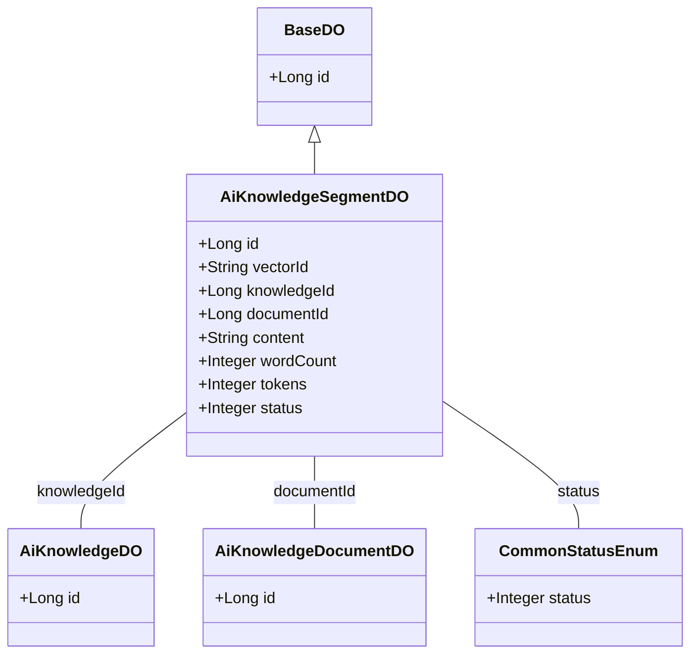
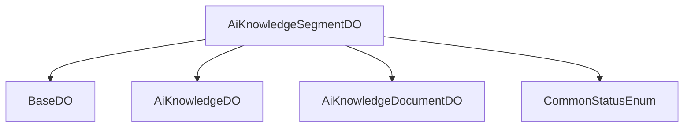

# 基础信息

|      |      |
|------|------|
| 编码语言 | .java |
| 代码路径 | yudao-module-ai/yudao-module-ai-biz/src/main/java/cn/iocoder/yudao/module/ai/dal/dataobject/knowledge/AiKnowledgeSegmentDO.java |
| 包名 | cn.iocoder.yudao.module.ai.dal.dataobject.knowledge |
| 依赖项 | ['cn.iocoder.yudao.framework.common.enums.CommonStatusEnum', 'cn.iocoder.yudao.framework.mybatis.core.dataobject.BaseDO', 'com.baomidou.mybatisplus.annotation.KeySequence', 'com.baomidou.mybatisplus.annotation.TableId', 'com.baomidou.mybatisplus.annotation.TableName', 'lombok.Data'] |
| 概述说明 | AiKnowledgeSegmentDO类用于表示知识片段，包含编号、向量库编号、知识库编号、文档编号、切片内容、字符数、token数量和状态等字段。知识库编号关联AiKnowledgeDO，文档编号关联AiKnowledgeDocumentDO，状态使用CommonStatusEnum枚举。 |

# 说明

AiKnowledgeSegmentDO类是一个用于表示知识片段的数据结构，包含了多个关键字段以详细描述每个知识片段的信息。该类的主要字段包括编号、向量库编号、知识库编号、文档编号、切片内容、字符数、token数量和状态等。其中，编号用于唯一标识每个知识片段；向量库编号和知识库编号分别关联到向量库和知识库，表明该片段所属的存储位置和知识体系；文档编号则关联到具体的文档，表示该片段来源于哪个文档。切片内容字段存储了知识片段的具体文本内容，字符数和token数量则分别记录了该片段的字符长度和token数量，便于后续处理和分析。状态字段使用CommonStatusEnum枚举来表示该知识片段的当前状态，如是否可用、是否已处理等。通过这些字段，AiKnowledgeSegmentDO类能够全面且详尽地描述和管理知识片段的相关信息。

# 类列表 Class Summary

| 名称   | 类型  | 说明 |
|-------|------|-------------|
| AiKnowledgeSegmentDO | class | AiKnowledgeSegmentDO类用于表示知识片段，包含编号、向量库编号、知识库编号、文档编号、切片内容、字符数、token数量和状态等字段。知识库编号关联AiKnowledgeDO，文档编号关联AiKnowledgeDocumentDO，状态使用CommonStatusEnum枚举。 |

## 类 AiKnowledgeSegmentDO

|      |      |
|------|------|
| 访问范围 | @TableName(value = "ai_knowledge_segment");@KeySequence("ai_knowledge_segment_seq") // 用于 Oracle、PostgreSQL、Kingbase、DB2、H2 数据库的主键自增。如果是 MySQL 等数据库，可不写。;@Data;public |
| 类型 | class |
| 名称 | AiKnowledgeSegmentDO |
| 说明 | AiKnowledgeSegmentDO类用于表示知识片段，包含编号、向量库编号、知识库编号、文档编号、切片内容、字符数、token数量和状态等字段。知识库编号关联AiKnowledgeDO，文档编号关联AiKnowledgeDocumentDO，状态使用CommonStatusEnum枚举。 |

### UML类图

### 描述信息：
该UML类图展示了`AiKnowledgeSegmentDO`类继承自`BaseDO`，并与`AiKnowledgeDO`、`AiKnowledgeDocumentDO`和`CommonStatusEnum`类之间存在关联关系。`AiKnowledgeSegmentDO`类包含多个属性，如`knowledgeId`、`documentId`和`status`，分别与其他类关联。

### 内部方法调用关系图

### 描述信息：
`AiKnowledgeSegmentDO` 类继承自 `BaseDO`，并与 `AiKnowledgeDO` 和 `AiKnowledgeDocumentDO` 类通过 `knowledgeId` 和 `documentId` 字段进行关联。此外，`status` 字段使用了 `CommonStatusEnum` 枚举类来表示状态。该图展示了类之间的调用关系和依赖。

### 字段列表 Field List

| 名称  | 类型  | 说明 |
|-------|-------|------|
| vectorId | String | private String vectorId; 定义了一个私有的字符串类型变量vectorId，用于存储向量标识符。 |
| knowledgeId | Long | 知识库ID为长整型，用于唯一标识知识库中的条目。 |
| content | String | private String content; 是一个Java类中的私有字符串变量声明，用于存储字符串类型的数据，确保数据封装和安全性。 |
| FIELD_KNOWLEDGE_ID = "knowledgeId" | String | public static final String FIELD_KNOWLEDGE_ID = "knowledgeId"; 定义了一个常量字符串字段，表示知识ID的字段名。 |
| id | Long | 在Java类中，使用`@TableId`注解标记一个`private Long id`字段，表示该字段是数据库表的主键。 |
| documentId | Long | 文档ID为长整型数值，用于唯一标识文档。 |
| wordCount | Integer | 概要说明：该信息涉及一个私有整数类型的变量wordCount，用于存储单词数量。 |
| status | Integer | 概要说明：该信息描述了一个私有的整数类型变量，名为status，用于表示某种状态或状态码。 |
| tokens | Integer | 该信息描述了一个名为`tokens`的私有整数类型变量。 |

### 方法列表 Method List

| 名称  | 类型  | 说明 |
|-------|-------|------|

