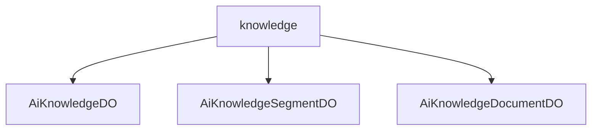

# 基础信息

|      |      |
|------|------|
| 编码语言 | .java |
| 代码路径 | yudao-module-ai/yudao-module-ai-biz/src/main/java/cn/iocoder/yudao/module/ai/dal/dataobject/knowledge |
| 包名 | cn.iocoder.yudao.module.ai.dal.dataobject.knowledge |
| 概述说明 | AiKnowledgeDO类用于描述知识库信息，包含编号、用户编号、名称、描述、可见权限、嵌入模型编号、模型标识、topK值、相似度阈值和状态等字段，全面管理知识库属性和配置。AiKnowledgeSegmentDO类表示知识片段，包含编号、向量库编号、知识库编号、文档编号、切片内容、字符数、token数量和状态等字段，详细描述知识片段信息。AiKnowledgeDocumentDO类表示知识库文档，包含编号、知识库编号、文件名称、内容、URL、token数量、字符数及自定义分段参数，支持文档分段和状态管理，适用于各种文档处理需求。 |

# 说明

AiKnowledgeDO类是一个用于表示知识库信息的类，包含了多个字段来描述知识库的属性和配置。其中，编号字段用于唯一标识每个知识库实例，用户编号字段表示该知识库所属的用户，知识库名称字段用于存储知识库的名称，描述字段提供了对知识库的详细说明。可见权限字段用于控制知识库的访问权限，当值为-1时表示对所有用户可见，否则表示仅特定用户可访问。嵌入模型编号字段标识与该知识库关联的嵌入模型，模型标识字段进一步指定嵌入模型的具体类型或版本。topK值字段设置相似度搜索时返回的最相关结果数量，相似度阈值字段设定搜索结果与查询的相似度阈值。状态字段引用CommonStatusEnum枚举，表示知识库的当前状态，如“启用”、“禁用”等。

AiKnowledgeSegmentDO类用于表示知识片段的数据结构，包含编号、向量库编号、知识库编号、文档编号、切片内容、字符数、token数量和状态等字段。编号唯一标识每个知识片段，向量库编号和知识库编号关联到向量库和知识库，文档编号关联到具体文档。切片内容字段存储知识片段的具体文本内容，字符数和token数量记录片段的字符长度和token数量。状态字段使用CommonStatusEnum枚举表示知识片段的当前状态，如是否可用、是否已处理等。

AiKnowledgeDocumentDO类用于表示知识库文档的数据对象，包含文档编号、所属知识库编号、文件名称、文档内容、文件URL、文档token数量、文档字符数等字段。该类支持自定义分段参数，如目标token数、最小字符数、最小块长度、最大块数以及是否保留分隔符等，以便对文档进行灵活分段处理。文档状态和切片状态分别由CommonStatusEnum和AiKnowledgeDocumentStatusEnum枚举类定义，用于表示文档的创建、更新、删除等操作状态以及切片的状态，如切片是否完成、是否有效等。

总的来说，AiKnowledgeDO类、AiKnowledgeSegmentDO类和AiKnowledgeDocumentDO类共同构成了一个全面的知识库管理系统，能够详细描述和管理知识库、知识片段和文档的各个方面，支持灵活的访问控制、嵌入模型配置、相似度搜索、分段处理以及状态管理，适用于各种知识库应用场景。

### 包内部结构视图

### 描述信息：
该Mermaid图展示了`knowledge`文件夹下的三个Java文件之间的层级关系。`knowledge`文件夹包含了`AiKnowledgeDO.java`、`AiKnowledgeSegmentDO.java`和`AiKnowledgeDocumentDO.java`三个文件，这些文件都与AI知识管理相关，分别用于处理知识、知识片段和知识文档的数据对象。

# 文件列表 File List

| 名称   | 类型  | 说明 |
|-------|------|-------------|
| [AiKnowledgeDocumentDO.java](AiKnowledgeDocumentDO.md) | file | AiKnowledgeDocumentDO类用于表示知识库文档，包含编号、知识库编号、文件名称、内容、文件URL、文档token数量、文档字符数等字段。自定义分段参数包括目标token数、最小字符数、最小块长度、最大块数、是否保留分隔符等。文档状态和切片状态分别由CommonStatusEnum和AiKnowledgeDocumentStatusEnum枚举类定义。 |
| [AiKnowledgeSegmentDO.java](AiKnowledgeSegmentDO.md) | file | AiKnowledgeSegmentDO类用于表示知识片段，包含编号、向量库编号、知识库编号、文档编号、切片内容、字符数、token数量和状态等字段。知识库编号关联AiKnowledgeDO，文档编号关联AiKnowledgeDocumentDO，状态使用CommonStatusEnum枚举。 |
| [AiKnowledgeDO.java](AiKnowledgeDO.md) | file | AiKnowledgeDO类用于表示知识库信息，包含编号、用户编号、知识库名称、描述、可见权限、嵌入模型编号、模型标识、topK值、相似度阈值和状态等字段。可见权限为-1时表示所有人可见，否则为特定用户编号。状态字段引用CommonStatusEnum枚举。 |

