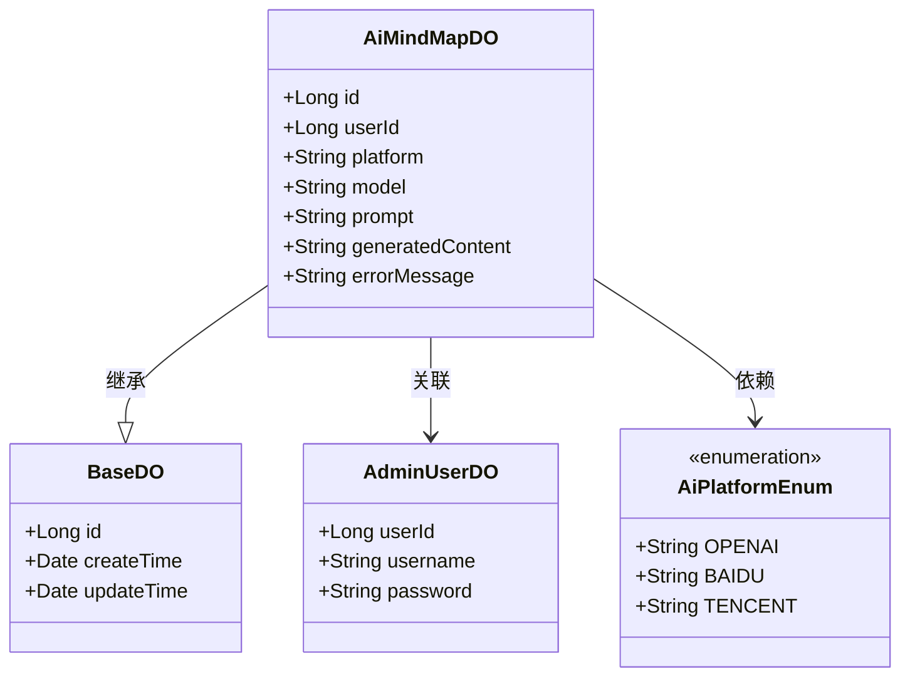
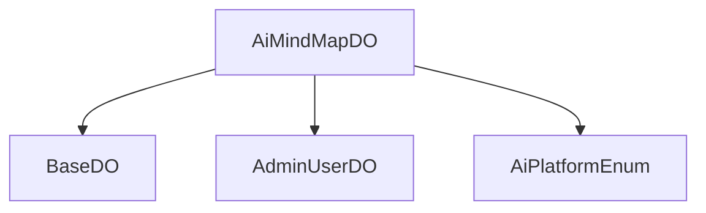

# 基础信息

|      |      |
|------|------|
| 编码语言 | .java |
| 代码路径 | yudao-module-ai/yudao-module-ai-biz/src/main/java/cn/iocoder/yudao/module/ai/dal/dataobject/mindmap/AiMindMapDO.java |
| 包名 | cn.iocoder.yudao.module.ai.dal.dataobject.mindmap |
| 依赖项 | ['cn.iocoder.yudao.framework.ai.core.enums.AiPlatformEnum', 'cn.iocoder.yudao.framework.mybatis.core.dataobject.BaseDO', 'com.baomidou.mybatisplus.annotation.KeySequence', 'com.baomidou.mybatisplus.annotation.TableId', 'com.baomidou.mybatisplus.annotation.TableName', 'lombok.Data'] |
| 概述说明 | AiMindMapDO类用于存储AI思维导图数据，包含编号、用户编号、平台、模型、生成内容提示、生成内容和错误信息等字段。用户编号与AdminUserDO的userId关联，平台字段使用AiPlatformEnum枚举。 |

# 说明

AiMindMapDO类是一个用于表示AI思维导图数据的类，包含了多个关键字段以全面描述思维导图的相关信息。该类的主要字段包括编号、用户编号、平台、模型、生成内容提示、生成内容和错误信息等。其中，编号用于唯一标识每个思维导图实例，用户编号则关联到AdminUserDO类的userId字段，用于标识生成该思维导图的用户。平台字段使用AiPlatformEnum枚举类型，表示生成思维导图所使用的AI平台。模型字段用于指定生成思维导图时所使用的具体AI模型。生成内容提示字段记录了用户在生成思维导图时提供的提示信息，而生成内容字段则存储了AI根据提示生成的最终思维导图内容。错误信息字段用于记录在生成过程中可能出现的错误或异常情况，以便进行后续的调试和处理。通过这些字段，AiMindMapDO类能够全面、详尽地描述AI思维导图的生成过程及其相关数据。

# 类列表 Class Summary

| 名称   | 类型  | 说明 |
|-------|------|-------------|
| AiMindMapDO | class | AiMindMapDO类用于表示AI思维导图数据，包含编号、用户编号、平台、模型、生成内容提示、生成内容和错误信息等字段。用户编号关联AdminUserDO的userId字段，平台字段使用AiPlatformEnum枚举。 |

## 类 AiMindMapDO

|      |      |
|------|------|
| 访问范围 | @TableName(value = "ai_mind_map");@KeySequence("ai_mind_map_seq") // 用于 Oracle、PostgreSQL、Kingbase、DB2、H2 数据库的主键自增。如果是 MySQL 等数据库，可不写。;@Data;public |
| 类型 | class |
| 名称 | AiMindMapDO |
| 说明 | AiMindMapDO类用于表示AI思维导图数据，包含编号、用户编号、平台、模型、生成内容提示、生成内容和错误信息等字段。用户编号关联AdminUserDO的userId字段，平台字段使用AiPlatformEnum枚举。 |

### UML类图

### 描述信息：
该UML类图展示了`AiMindMapDO`类继承自`BaseDO`，并关联了`AdminUserDO`类，依赖`AiPlatformEnum`枚举类。`AiMindMapDO`类包含多个属性，如`id`、`userId`、`platform`等，用于存储AI思维导图的相关信息。

### 内部方法调用关系图

### 描述信息：
`AiMindMapDO` 类继承自 `BaseDO`，并包含与 `AdminUserDO` 和 `AiPlatformEnum` 的关联关系。`AiMindMapDO` 类用于存储与 AI 思维导图相关的数据，包括用户编号、平台、模型、生成内容提示、生成的内容以及错误信息等字段。

### 字段列表 Field List

| 名称  | 类型  | 说明 |
|-------|-------|------|
| platform | String | 平台信息未公开，具体细节未提供。 |
| userId | Long | 用户ID为长整型数据，用于唯一标识用户。 |
| model | String | private String model; 定义了一个私有的字符串类型变量 model。 |
| errorMessage | String | private String errorMessage; 是一个私有字符串变量，用于存储错误信息。 |
| prompt | String | 该信息描述了一个私有字符串变量，名为"prompt"，用于存储或处理特定的文本数据。 |
| id | Long | 在代码中，`@TableId`注解用于标识实体类的主键字段，`private Long id;`表示该主键字段为长整型且私有。 |
| generatedContent | String | 该信息描述了一个私有字符串变量`generatedContent`，用于存储生成的内容。关键点包括变量的私有性、数据类型为字符串，以及其用途为存储生成的内容。 |

### 方法列表 Method List

| 名称  | 类型  | 说明 |
|-------|-------|------|

