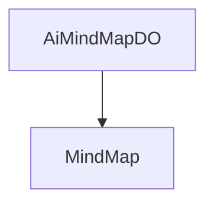

# 基础信息

|      |      |
|------|------|
| 编码语言 | .java |
| 代码路径 | yudao-module-ai/yudao-module-ai-biz/src/main/java/cn/iocoder/yudao/module/ai/dal/dataobject/mindmap |
| 包名 | cn.iocoder.yudao.module.ai.dal.dataobject.mindmap |
| 概述说明 | AiMindMapDO类用于存储AI思维导图数据，包含编号、用户编号、平台、模型、生成内容提示、生成内容和错误信息等字段。用户编号与AdminUserDO的userId关联，平台字段使用AiPlatformEnum枚举。 |

# 说明

AiMindMapDO类是一个用于表示AI思维导图数据的类，包含了多个关键字段以全面描述思维导图的相关信息。该类的主要字段包括编号、用户编号、平台、模型、生成内容提示、生成内容和错误信息等。其中，编号用于唯一标识每个思维导图实例，用户编号则关联到AdminUserDO类的userId字段，用于标识生成该思维导图的用户。平台字段使用AiPlatformEnum枚举类型，表示生成思维导图所使用的AI平台。模型字段用于指定生成思维导图时所使用的具体AI模型。生成内容提示字段记录了用户在生成思维导图时提供的提示信息，而生成内容字段则存储了AI根据提示生成的最终思维导图内容。错误信息字段用于记录在生成过程中可能出现的错误或异常情况，以便进行后续的调试和处理。通过这些字段，AiMindMapDO类能够全面、详尽地描述AI思维导图的生成过程及其相关数据。

### 包内部结构视图

### 描述信息：
该Mermaid图展示了`AiMindMapDO`类与`MindMap`文件夹之间的调用关系。`AiMindMapDO`类位于`mindmap`文件夹中，表示该类与`MindMap`文件夹有直接的关联。图形简洁明了，便于理解类与文件夹之间的关系。

# 文件列表 File List

| 名称   | 类型  | 说明 |
|-------|------|-------------|
| [AiMindMapDO.java](AiMindMapDO.md) | file | AiMindMapDO类用于存储AI思维导图数据，包含编号、用户编号、平台、模型、生成内容提示、生成内容和错误信息等字段。用户编号与AdminUserDO的userId关联，平台字段使用AiPlatformEnum枚举。 |

