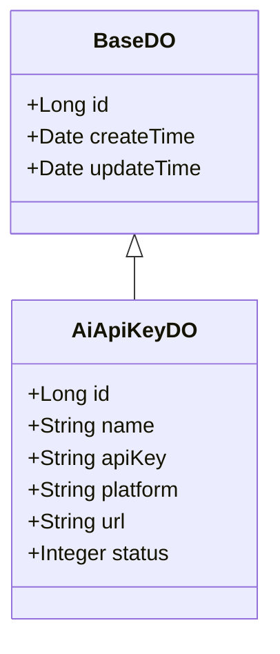
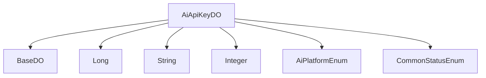

# 基础信息

|      |      |
|------|------|
| 编码语言 | .java |
| 代码路径 | yudao-module-ai/yudao-module-ai-biz/src/main/java/cn/iocoder/yudao/module/ai/dal/dataobject/model/AiApiKeyDO.java |
| 包名 | cn.iocoder.yudao.module.ai.dal.dataobject.model |
| 依赖项 | ['cn.iocoder.yudao.framework.ai.core.enums.AiPlatformEnum', 'cn.iocoder.yudao.framework.common.enums.CommonStatusEnum', 'cn.iocoder.yudao.framework.mybatis.core.dataobject.BaseDO', 'com.baomidou.mybatisplus.annotation.KeySequence', 'com.baomidou.mybatisplus.annotation.TableId', 'com.baomidou.mybatisplus.annotation.TableName', None] |
| 概述说明 | AiApiKeyDO类继承BaseDO，包含编号、名称、密钥、平台、API地址和状态等属性，其中平台和状态分别引用AiPlatformEnum和CommonStatusEnum枚举。该类使用Lombok注解生成构造器、getter/setter等方法，适用于多种数据库的主键自增。 |

# 说明

AiApiKeyDO类是一个继承自BaseDO的类，主要用于管理API密钥的相关信息。该类包含多个属性，包括编号、名称、密钥、平台、API地址和状态等。其中，编号用于唯一标识每个API密钥实例，名称用于描述该密钥的用途或来源，密钥则是实际的API访问凭证。平台属性引用了AiPlatformEnum枚举，用于标识该API密钥所属的平台或服务提供商。API地址属性存储了与该密钥关联的API访问端点。状态属性引用了CommonStatusEnum枚举，用于表示该API密钥的当前状态，如启用、禁用等。

为了简化代码编写，AiApiKeyDO类使用了Lombok注解，自动生成了构造器、getter和setter等方法。这些注解减少了手动编写样板代码的工作量，提高了开发效率。此外，该类设计时考虑了多种数据库的兼容性，支持主键自增功能，确保在不同数据库系统中都能正常使用。

总的来说，AiApiKeyDO类是一个结构清晰、功能全面的数据对象类，适用于管理和操作API密钥的相关信息，同时通过Lombok注解和数据库兼容性设计，提升了代码的可维护性和扩展性。

# 类列表 Class Summary

| 名称   | 类型  | 说明 |
|-------|------|-------------|
| AiApiKeyDO | class | AiApiKeyDO类继承BaseDO，包含编号、名称、密钥、平台、API地址和状态等属性。平台和状态分别引用AiPlatformEnum和CommonStatusEnum枚举。类使用Lombok注解生成构造器、getter/setter等方法，适用于多种数据库的主键自增。 |

## 类 AiApiKeyDO

|      |      |
|------|------|
| 访问范围 | @TableName("ai_api_key");@KeySequence("ai_chat_conversation_seq") // 用于 Oracle、PostgreSQL、Kingbase、DB2、H2 数据库的主键自增。如果是 MySQL 等数据库，可不写。;@Data;@EqualsAndHashCode(callSuper = true);@Builder;@NoArgsConstructor;@AllArgsConstructor;public |
| 类型 | class |
| 名称 | AiApiKeyDO |
| 说明 | AiApiKeyDO类继承BaseDO，包含编号、名称、密钥、平台、API地址和状态等属性。平台和状态分别引用AiPlatformEnum和CommonStatusEnum枚举。类使用Lombok注解生成构造器、getter/setter等方法，适用于多种数据库的主键自增。 |

### UML类图

### 描述信息：
该UML类图展示了`AiApiKeyDO`类继承自`BaseDO`类的关系。`AiApiKeyDO`类包含多个属性，如`id`、`name`、`apiKey`等，用于存储API密钥的相关信息。`BaseDO`类提供了基础的字段如`id`、`createTime`和`updateTime`，用于记录创建和更新时间。

### 内部方法调用关系图

### 描述信息：
该图展示了 `AiApiKeyDO` 类与其他类或枚举之间的调用关系。`AiApiKeyDO` 继承自 `BaseDO`，并使用了 `Long`、`String` 和 `Integer` 等基本数据类型。此外，它还引用了 `AiPlatformEnum` 和 `CommonStatusEnum` 枚举类来定义平台和状态。

### 字段列表 Field List

| 名称  | 类型  | 说明 |
|-------|-------|------|
| platform | String | 平台信息为私有字符串类型。 |
| name | String | 该信息表示一个私有的字符串类型变量，变量名为name。 |
| status | Integer | 概要说明：该信息涉及一个私有整数类型的变量，名为status，用于表示某种状态或状态码。 |
| url | String | private String url; 声明了一个私有的字符串类型变量，用于存储URL地址。 |
| id | Long | 在Java类中，使用`@TableId`注解标记一个`private Long id`字段，表示该字段是数据库表的主键。 |
| apiKey | String | 概要说明：该信息涉及一个私有字符串变量apiKey，用于存储API密钥，通常用于身份验证或访问控制。 |

### 方法列表 Method List

| 名称  | 类型  | 说明 |
|-------|-------|------|

