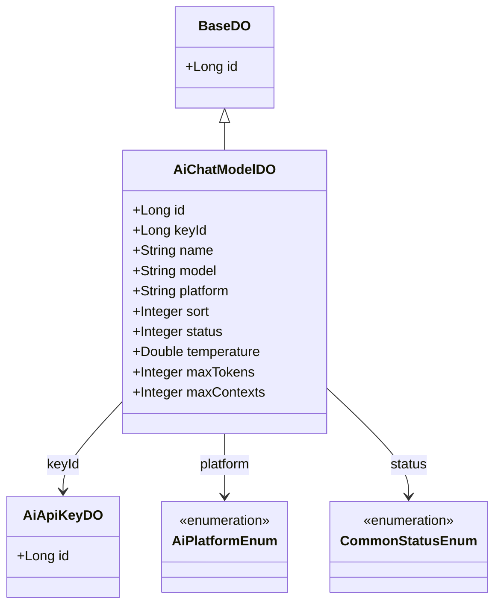
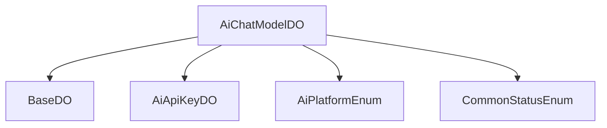

# 基础信息

|      |      |
|------|------|
| 编码语言 | .java |
| 代码路径 | yudao-module-ai/yudao-module-ai-biz/src/main/java/cn/iocoder/yudao/module/ai/dal/dataobject/model/AiChatModelDO.java |
| 包名 | cn.iocoder.yudao.module.ai.dal.dataobject.model |
| 依赖项 | ['cn.iocoder.yudao.framework.ai.core.enums.AiPlatformEnum', 'cn.iocoder.yudao.framework.common.enums.CommonStatusEnum', 'cn.iocoder.yudao.framework.mybatis.core.dataobject.BaseDO', 'com.baomidou.mybatisplus.annotation.KeySequence', 'com.baomidou.mybatisplus.annotation.TableId', 'com.baomidou.mybatisplus.annotation.TableName', None] |
| 概述说明 | AiChatModelDO类继承自BaseDO，包含编号、API秘钥编号、模型名称、模型标志、平台、排序值、状态等字段，并配置了温度参数、单条回复的最大Token数量和上下文的最大Message数量。使用Lombok注解简化代码，支持多种数据库的主键自增。 |

# 说明

AiChatModelDO类是一个继承自BaseDO的类，主要用于管理和存储与AI聊天模型相关的数据。该类包含多个字段，包括编号、API秘钥编号、模型名称、模型标志、平台、排序值和状态等。这些字段用于唯一标识和描述每个AI聊天模型的属性和配置。

在对话配置方面，AiChatModelDO类提供了温度参数、单条回复的最大Token数量和上下文的最大Message数量等设置。温度参数用于控制生成文本的随机性和创造性，单条回复的最大Token数量限制了每次回复的长度，而上下文的最大Message数量则决定了模型在生成回复时可以参考的历史消息数量。

为了简化代码的编写和维护，AiChatModelDO类使用了Lombok注解。Lombok是一个Java库，通过注解自动生成常见的代码，如getter和setter方法，从而减少了样板代码的数量。此外，该类还支持多种数据库的主键自增功能，这意味着在不同的数据库系统中，主键可以自动递增，确保每条记录的唯一性。

总的来说，AiChatModelDO类是一个功能全面的数据对象类，用于管理AI聊天模型的配置和状态，同时通过Lombok注解和数据库主键自增的支持，提高了代码的简洁性和可维护性。

# 类列表 Class Summary

| 名称   | 类型  | 说明 |
|-------|------|-------------|
| AiChatModelDO | class | AiChatModelDO类继承自BaseDO，包含编号、API秘钥编号、模型名称、模型标志、平台、排序值、状态等字段。对话配置包括温度参数、单条回复的最大Token数量和上下文的最大Message数量。类使用了Lombok注解简化代码，支持多种数据库的主键自增。 |

## 类 AiChatModelDO

|      |      |
|------|------|
| 访问范围 | @TableName("ai_chat_model");@KeySequence("ai_chat_model_seq") // 用于 Oracle、PostgreSQL、Kingbase、DB2、H2 数据库的主键自增。如果是 MySQL 等数据库，可不写。;@Data;@EqualsAndHashCode(callSuper = true);@Builder;@NoArgsConstructor;@AllArgsConstructor;public |
| 类型 | class |
| 名称 | AiChatModelDO |
| 说明 | AiChatModelDO类继承自BaseDO，包含编号、API秘钥编号、模型名称、模型标志、平台、排序值、状态等字段。对话配置包括温度参数、单条回复的最大Token数量和上下文的最大Message数量。类使用了Lombok注解简化代码，支持多种数据库的主键自增。 |

### UML类图

### 描述信息：
该UML类图展示了`AiChatModelDO`类继承自`BaseDO`，并包含多个属性如`id`、`keyId`、`name`等。`AiChatModelDO`类与`AiApiKeyDO`类通过`keyId`属性关联，并与枚举类`AiPlatformEnum`和`CommonStatusEnum`关联。

### 内部方法调用关系图

### 描述信息：
该图展示了`AiChatModelDO`类与其他类或枚举之间的关系。`AiChatModelDO`继承自`BaseDO`，并关联了`AiApiKeyDO`、`AiPlatformEnum`和`CommonStatusEnum`。这些关系通过`-->`箭头清晰地表示出来，展示了类之间的调用和依赖关系。

### 字段列表 Field List

| 名称  | 类型  | 说明 |
|-------|-------|------|
| platform | String | 平台类型为私有字符串。 |
| keyId | Long | keyId 是一个长整型私有变量。 |
| model | String | private String model; 定义了一个私有的字符串类型变量 model。 |
| temperature | Double | 温度数据，类型为双精度浮点数。 |
| status | Integer | 概要说明：该信息涉及一个私有整数类型的变量，名为“status”，用于表示某种状态或状态码。 |
| sort | Integer | private Integer sort; 表示一个私有的整数类型变量sort，用于存储排序相关的数值。 |
| maxContexts | Integer | 该信息描述了一个私有整数类型的变量，名为maxContexts，用于存储最大上下文数量。 |
| id | Long | 概要说明：该代码片段定义了一个私有长整型变量id，并使用@TableId注解标记，通常用于标识数据库表的主键字段。 |
| name | String | 该信息表示一个私有的字符串类型变量，变量名为name。 |
| maxTokens | Integer | private Integer maxTokens; 定义了一个私有的整型变量maxTokens，用于存储最大令牌数的值。 |

### 方法列表 Method List

| 名称  | 类型  | 说明 |
|-------|-------|------|

