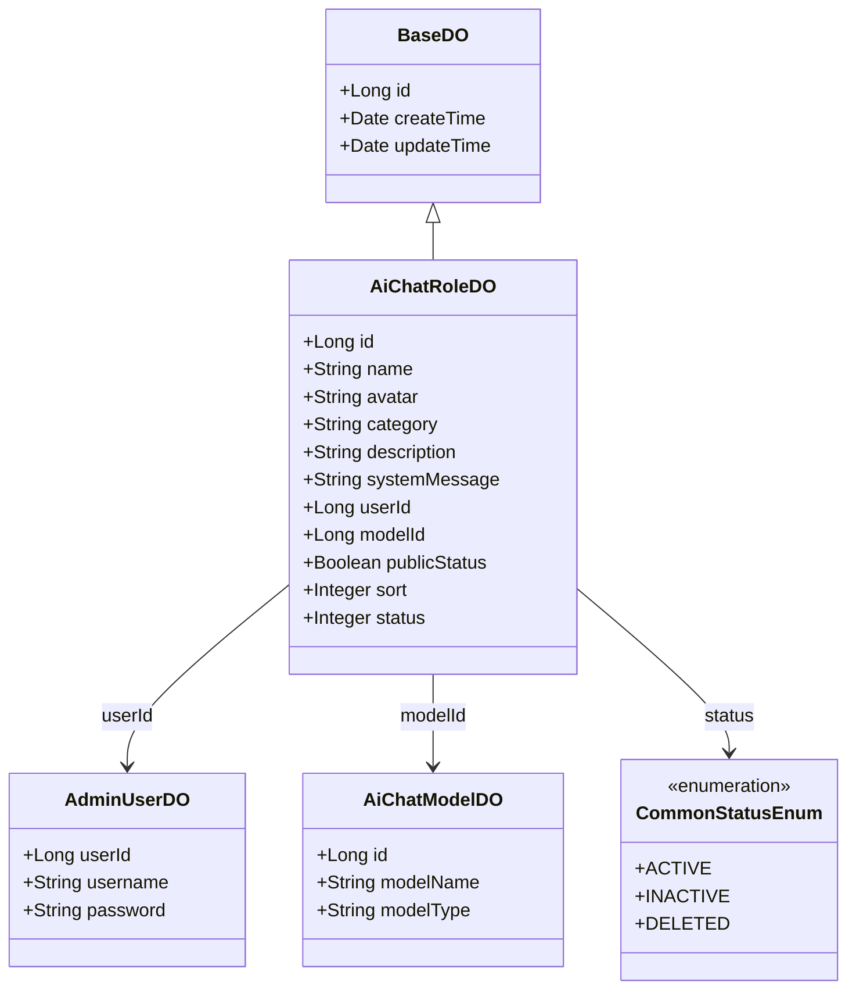
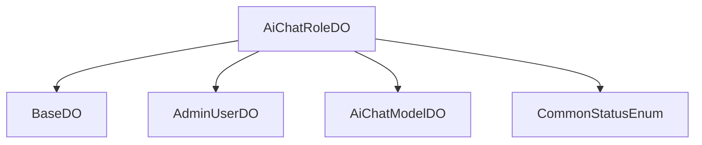

# 基础信息

|      |      |
|------|------|
| 编码语言 | .java |
| 代码路径 | yudao-module-ai/yudao-module-ai-biz/src/main/java/cn/iocoder/yudao/module/ai/dal/dataobject/model/AiChatRoleDO.java |
| 包名 | cn.iocoder.yudao.module.ai.dal.dataobject.model |
| 依赖项 | ['cn.iocoder.yudao.framework.common.enums.CommonStatusEnum', 'cn.iocoder.yudao.framework.mybatis.core.dataobject.BaseDO', 'com.baomidou.mybatisplus.annotation.KeySequence', 'com.baomidou.mybatisplus.annotation.TableId', 'com.baomidou.mybatisplus.annotation.TableName', None] |
| 概述说明 | AiChatRoleDO类定义AI聊天角色，包含编号、名称、头像、分类、描述、设定、用户编号、模型编号、公开状态、排序值和状态等属性。公开状态分为管理员创建（公开）和个人创建（私有），状态由CommonStatusEnum枚举定义。 |

# 说明

AiChatRoleDO类是一个用于定义AI聊天角色的数据结构，包含了多个关键属性来描述角色的各个方面。首先，该类包含一个编号属性，用于唯一标识每个角色。其次，名称属性用于定义角色的名称，便于用户识别和区分不同的角色。头像属性则用于存储角色的图像信息，通常用于在用户界面中展示角色的形象。分类属性用于对角色进行分类管理，便于用户根据不同的类别查找和使用角色。描述属性提供了对角色背景、功能或特点的详细说明，帮助用户更好地理解角色的用途。设定属性则用于存储角色的具体配置或参数，可能包括对话风格、语言偏好等。

此外，AiChatRoleDO类还包含用户编号和模型编号两个属性。用户编号用于标识创建或拥有该角色的用户，而模型编号则用于关联该角色所使用的AI模型。公开状态属性用于定义角色的可见性，分为管理员创建的公开角色和个人创建的私有角色。公开角色对所有用户可见，而私有角色仅对创建者或特定用户可见。排序值属性用于控制角色在列表中的显示顺序，便于用户根据优先级或使用频率进行排序。最后，状态属性由CommonStatusEnum枚举定义，用于表示角色的当前状态，如启用、禁用等，便于系统管理和用户操作。

综上所述，AiChatRoleDO类通过多个属性全面定义了AI聊天角色的各个方面，包括基本信息、分类、描述、配置、用户关联、可见性、排序和状态等，为AI聊天系统的角色管理提供了灵活且详细的支持。

# 类列表 Class Summary

| 名称   | 类型  | 说明 |
|-------|------|-------------|
| AiChatRoleDO | class | AiChatRoleDO类用于定义AI聊天角色，包含编号、名称、头像、分类、描述、设定、用户编号、模型编号、公开状态、排序值和状态等属性。公开状态分为管理员创建（公开）和个人创建（私有），状态由CommonStatusEnum枚举定义。 |

## 类 AiChatRoleDO

|      |      |
|------|------|
| 访问范围 | @TableName(value = "ai_chat_role", autoResultMap = true);@KeySequence("ai_chat_role_seq") // 用于 Oracle、PostgreSQL、Kingbase、DB2、H2 数据库的主键自增。如果是 MySQL 等数据库，可不写。;@Data;@EqualsAndHashCode(callSuper = true);@Builder;@NoArgsConstructor;@AllArgsConstructor;public |
| 类型 | class |
| 名称 | AiChatRoleDO |
| 说明 | AiChatRoleDO类用于定义AI聊天角色，包含编号、名称、头像、分类、描述、设定、用户编号、模型编号、公开状态、排序值和状态等属性。公开状态分为管理员创建（公开）和个人创建（私有），状态由CommonStatusEnum枚举定义。 |

### UML类图

### 描述信息：
该UML类图展示了`AiChatRoleDO`类继承自`BaseDO`，并与其他类如`AdminUserDO`、`AiChatModelDO`和`CommonStatusEnum`存在关联关系。`AiChatRoleDO`类包含多个属性，如角色名称、头像、描述等，并通过`userId`和`modelId`分别关联到`AdminUserDO`和`AiChatModelDO`类。状态属性`status`与枚举类`CommonStatusEnum`关联。

### 内部方法调用关系图

### 描述信息：
该图展示了`AiChatRoleDO`类与其他类之间的调用关系。`AiChatRoleDO`继承自`BaseDO`，并通过`userId`字段关联到`AdminUserDO`，通过`modelId`字段关联到`AiChatModelDO`，并通过`status`字段关联到`CommonStatusEnum`枚举类。这些关系清晰地映射了类之间的依赖和调用。

### 字段列表 Field List

| 名称  | 类型  | 说明 |
|-------|-------|------|
| systemMessage | String | 系统消息为私有字符串类型。 |
| name | String | 该信息描述了一个私有字符串类型的变量，变量名为"name"。 |
| category | String | 该信息包含一个私有字符串变量，名为"category"，用于存储类别信息。 |
| sort | Integer | 概要说明：该信息涉及一个私有整数类型的变量，名为“sort”。 |
| description | String | private String description; 是一个Java类中的私有字符串变量声明，用于存储描述信息。 |
| userId | Long | 用户ID为长整型数据。 |
| id | Long | 在代码中定义了一个私有长整型变量id，并使用@TableId注解标记该变量。 |
| publicStatus | Boolean | private Boolean publicStatus; 表示一个私有的布尔类型变量，用于存储公开状态的信息。 |
| avatar | String | 概要说明：该信息涉及一个私有字符串变量，名为“avatar”，用于存储与用户或实体相关的头像信息。 |
| modelId | Long | 模型ID为长整型数据，用于唯一标识模型。 |
| status | Integer | private Integer status; 表示一个私有的整型状态变量，用于存储状态信息。 |

### 方法列表 Method List

| 名称  | 类型  | 说明 |
|-------|-------|------|

