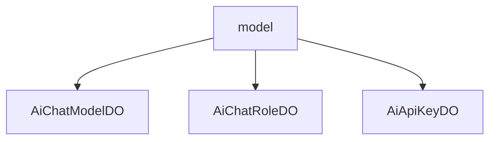

# 基础信息

|      |      |
|------|------|
| 编码语言 | .java |
| 代码路径 | yudao-module-ai/yudao-module-ai-biz/src/main/java/cn/iocoder/yudao/module/ai/dal/dataobject/model |
| 包名 | cn.iocoder.yudao.module.ai.dal.dataobject.model |
| 概述说明 | AiChatModelDO类继承自BaseDO，用于管理AI聊天模型数据，包含编号、API秘钥编号、模型名称等字段，支持温度参数、最大Token数量等对话配置，使用Lombok注解简化代码，支持数据库主键自增。AiChatRoleDO类定义AI聊天角色，包含编号、名称、头像、分类等属性，支持用户编号、模型编号关联，公开状态、排序值和状态管理。AiApiKeyDO类继承自BaseDO，管理API密钥信息，包含编号、名称、密钥等属性，使用Lombok注解，支持数据库主键自增，提升代码可维护性。 |

# 说明

AiChatModelDO类、AiChatRoleDO类和AiApiKeyDO类分别用于管理AI聊天模型、AI聊天角色和API密钥的相关信息。AiChatModelDO类继承自BaseDO，主要用于存储和管理AI聊天模型的数据，包含编号、API秘钥编号、模型名称、模型标志、平台、排序值和状态等字段。此外，该类还提供了温度参数、单条回复的最大Token数量和上下文的最大Message数量等对话配置参数，用于控制生成文本的随机性、回复长度和参考历史消息数量。为了简化代码编写，该类使用了Lombok注解，自动生成getter和setter方法，并支持多种数据库的主键自增功能，确保数据唯一性。

AiChatRoleDO类用于定义AI聊天角色的数据结构，包含编号、名称、头像、分类、描述、设定、用户编号、模型编号、公开状态、排序值和状态等属性。这些属性用于唯一标识角色、定义角色名称、存储角色图像、分类管理角色、提供角色描述、配置角色参数、关联用户和模型、控制角色可见性、排序角色列表以及表示角色状态。公开状态属性区分了管理员创建的公开角色和个人创建的私有角色，而状态属性由CommonStatusEnum枚举定义，便于系统管理和用户操作。

AiApiKeyDO类继承自BaseDO，主要用于管理API密钥的相关信息，包含编号、名称、密钥、平台、API地址和状态等属性。编号用于唯一标识每个API密钥实例，名称描述密钥用途，密钥是实际的API访问凭证，平台属性引用AiPlatformEnum枚举标识所属平台，API地址存储关联的API访问端点，状态属性引用CommonStatusEnum枚举表示密钥的当前状态。该类同样使用Lombok注解简化代码编写，并支持多种数据库的主键自增功能，确保在不同数据库系统中正常使用。

综上所述，这三个类分别通过详细的属性和配置管理AI聊天模型、角色和API密钥，同时通过Lombok注解和数据库兼容性设计，提高了代码的简洁性、可维护性和扩展性。

### 包内部结构视图

### 描述信息：
该Mermaid图展示了`model`文件夹与其中的三个Java文件`AiChatModelDO.java`、`AiChatRoleDO.java`和`AiApiKeyDO.java`之间的层级关系。`model`文件夹包含了这三个数据对象文件，分别用于处理AI聊天模型、AI聊天角色和AI API密钥的相关数据。

# 文件列表 File List

| 名称   | 类型  | 说明 |
|-------|------|-------------|
| [AiApiKeyDO.java](AiApiKeyDO.md) | file | AiApiKeyDO类继承BaseDO，包含编号、名称、密钥、平台、API地址和状态等属性，其中平台和状态分别引用AiPlatformEnum和CommonStatusEnum枚举。该类使用Lombok注解生成构造器、getter/setter等方法，适用于多种数据库的主键自增。 |
| [AiChatRoleDO.java](AiChatRoleDO.md) | file | AiChatRoleDO类定义AI聊天角色，包含编号、名称、头像、分类、描述、设定、用户编号、模型编号、公开状态、排序值和状态等属性。公开状态分为管理员创建（公开）和个人创建（私有），状态由CommonStatusEnum枚举定义。 |
| [AiChatModelDO.java](AiChatModelDO.md) | file | AiChatModelDO类继承自BaseDO，包含编号、API秘钥编号、模型名称、模型标志、平台、排序值、状态等字段，并配置了温度参数、单条回复的最大Token数量和上下文的最大Message数量。使用Lombok注解简化代码，支持多种数据库的主键自增。 |

